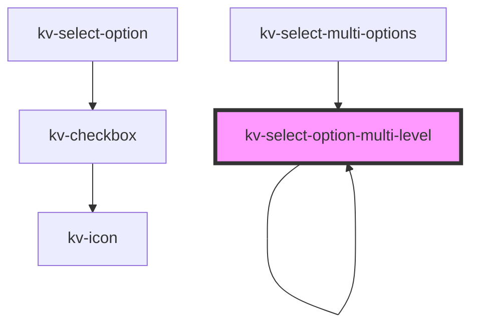

# kv-select-option-multi-level

<!-- Auto Generated Below -->

## Properties

| Property          | Attribute | Description                                                           | Type                        | Default     |
| ----------------- | --------- | --------------------------------------------------------------------- | --------------------------- | ----------- |
| `level`           | `level`   | (required) The level depth at which the option is rendered            | `number`                    | `0`         |
| `option`          | --        | (required) The option to render                                       | `ISelectMultiOption`        | `undefined` |
| `selectedOptions` | --        | (required) The selected options used to calculate the state of levels | `{ [x: string]: boolean; }` | `{}`        |

## Events

| Event                    | Description                                             | Type                                                                                 |
| ------------------------ | ------------------------------------------------------- | ------------------------------------------------------------------------------------ |
| `optionLevelStateChange` | Emitted when a level's state changes                    | `CustomEvent<ELevelState.Indeterminate \| ELevelState.None \| ELevelState.Selected>` |
| `optionSelected`         | Emitted when an option is selected (levels are ignored) | `CustomEvent<{ [x: string]: boolean; }>`                                             |

## Dependencies

### Used by

 - [kv-select-multi-options](../select-multi-options)
 - [kv-select-option-multi-level](.)

### Depends on

- [kv-select-option](../select-option)
- [kv-select-option-multi-level](.)

### Graph

----------------------------------------------

