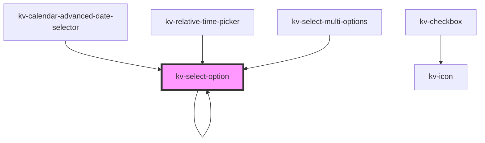

# _<kv-select-option>_

<!-- Auto Generated Below -->


## Usage

### Angular

```html
<!-- With all properties (only label and value are mandatory) -->
<kv-select-option
	label="Option 1"
	value="option1"
	selected=true
	togglable=false>
</kv-select-option>
```


### React

```tsx
import React from 'react';
import { KvSelectOption } from '@kelvininc/react-ui-components';
export const KvSelectOptionExample: React.FC = () => (
  <>
	{/*-- With all properties (only label and value are mandatory) --*/}
	<KvSelectOption
		label="Option 1"
		link="option1"
		selected={false}
		togglable={true}
		>
	</KvSelectOption>
  </>
);
```


## Properties

| Property             | Attribute     | Description                                                                   | Type                                                                       | Default     |
| -------------------- | ------------- | ----------------------------------------------------------------------------- | -------------------------------------------------------------------------- | ----------- |
| `description`        | `description` | (optional) Description of the item displayed on the left                      | `string`                                                                   | `undefined` |
| `disabled`           | `disabled`    | (optional) If `true` the item is disabled                                     | `boolean`                                                                  | `false`     |
| `highlighted`        | `highlighted` | (optional) If `true` the item is highlighted                                  | `boolean`                                                                  | `false`     |
| `label` _(required)_ | `label`       | (required) The text to display on the item                                    | `string`                                                                   | `undefined` |
| `level`              | `level`       | (optional) The level depth at which the option is rendered                    | `number`                                                                   | `0`         |
| `options`            | --            | (optional) The children items of this option                                  | `{ [x: string]: ISelectOption; }`                                          | `{}`        |
| `selectable`         | `selectable`  | (optional) If `false` the item is only for presenting and cannot be selected. | `boolean`                                                                  | `true`      |
| `selected`           | `selected`    | (optional) If `true` the item is selected                                     | `boolean`                                                                  | `false`     |
| `state`              | `state`       | (optional) The toggle button state                                            | `EToggleState.Indeterminate \| EToggleState.None \| EToggleState.Selected` | `undefined` |
| `togglable`          | `togglable`   | (optional) If `true` the item is togglable                                    | `boolean`                                                                  | `false`     |
| `value` _(required)_ | `value`       | (required) The item value                                                     | `string`                                                                   | `undefined` |


## Events

| Event          | Description                              | Type                  |
| -------------- | ---------------------------------------- | --------------------- |
| `itemSelected` | Emitted when the user clicks on the item | `CustomEvent<string>` |


## Shadow Parts

| Part                      | Description                    |
| ------------------------- | ------------------------------ |
| `"checkbox"`              | The option's checkbox          |
| `"label"`                 | The option's label             |
| `"option-container"`      | The option's container         |
| `"select-option-content"` | The option's content container |


## CSS Custom Properties

| Name                                        | Description                                              |
| ------------------------------------------- | -------------------------------------------------------- |
| `--select-option-background-color`          | Select option background color.                          |
| `--select-option-background-color-hover`    | Select option background color when hovered.             |
| `--select-option-background-color-selected` | Select option background color when selected.            |
| `--select-option-flex-alignment`            | The alignment of items within the component's container. |
| `--select-option-height`                    | Select option height.                                    |
| `--select-option-label-color`               | Select option label color.                               |
| `--select-option-label-color-selected`      | Select option label color when selected.                 |
| `--select-option-transition-duration`       | Select option transition time.                           |


## Dependencies

### Used by

 - [kv-calendar-advanced-date-selector](../calendar-advanced-date-selector)
 - [kv-relative-time-picker](../relative-time-picker)
 - [kv-select-multi-options](../select-multi-options)
 - [kv-select-option](.)

### Depends on

- [kv-checkbox](../checkbox)
- [kv-select-option](.)

### Graph


----------------------------------------------


