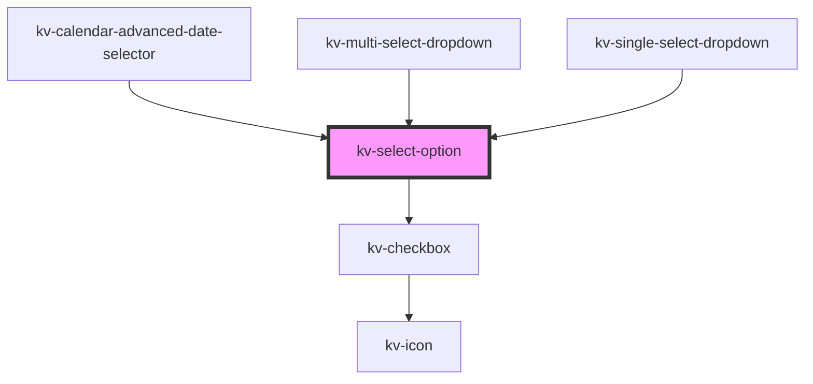

# _<kv-select-option>_

<!-- Auto Generated Below -->


## Usage

### Angular

```html
<!-- With all properties (only label and value are mandatory) -->
<kv-select-option
	label="Option 1"
	value="option1"
	selected=true
	togglable=false>
</kv-select-option>
```


### React

```tsx
import React from 'react';
import { KvSelectOption } from '@kelvininc/react-ui-components';
export const KvSelectOptionExample: React.FC = () => (
  <>
	{/*-- With all properties (only label and value are mandatory) --*/}
	<KvSelectOption
		label="Option 1"
		link="option1"
		selected={false}
		togglable={true}
		>
	</KvSelectOption>
  </>
);
```


## Properties

| Property             | Attribute   | Description                                 | Type      | Default     |
| -------------------- | ----------- | ------------------------------------------- | --------- | ----------- |
| `disabled`           | `disabled`  | (optional) If `true` the item is disabled   | `boolean` | `false`     |
| `label` _(required)_ | `label`     | (required) The text to display on the item  | `string`  | `undefined` |
| `selected`           | `selected`  | (optional) If `true` the item is selected   | `boolean` | `false`     |
| `togglable`          | `togglable` | (optional)  If `true` the item is togglable | `boolean` | `false`     |
| `value` _(required)_ | `value`     | (required) The item value                   | `string`  | `undefined` |


## Events

| Event          | Description                              | Type                  |
| -------------- | ---------------------------------------- | --------------------- |
| `itemSelected` | Emitted when the user clicks on the item | `CustomEvent<string>` |


## CSS Custom Properties

| Name                                        | Description                                              |
| ------------------------------------------- | -------------------------------------------------------- |
| `--select-option-background-color`          | Select option background color.                          |
| `--select-option-background-color-hover`    | Select option background color when hovered.             |
| `--select-option-background-color-selected` | Select option background color when selected.            |
| `--select-option-flex-alignment`            | The alignment of items within the component's container. |
| `--select-option-height`                    | Select option height.                                    |
| `--select-option-label-color`               | Select option label color.                               |
| `--select-option-label-color-selected`      | Select option label color when selected.                 |
| `--select-option-transition-duration`       | Select option transition time.                           |


## Dependencies

### Used by

 - [kv-calendar-advanced-date-selector](../calendar-advanced-date-selector)
 - [kv-multi-select-dropdown](../multi-select-dropdown)
 - [kv-single-select-dropdown](../single-select-dropdown)

### Depends on

- [kv-checkbox](../checkbox)

### Graph


----------------------------------------------


