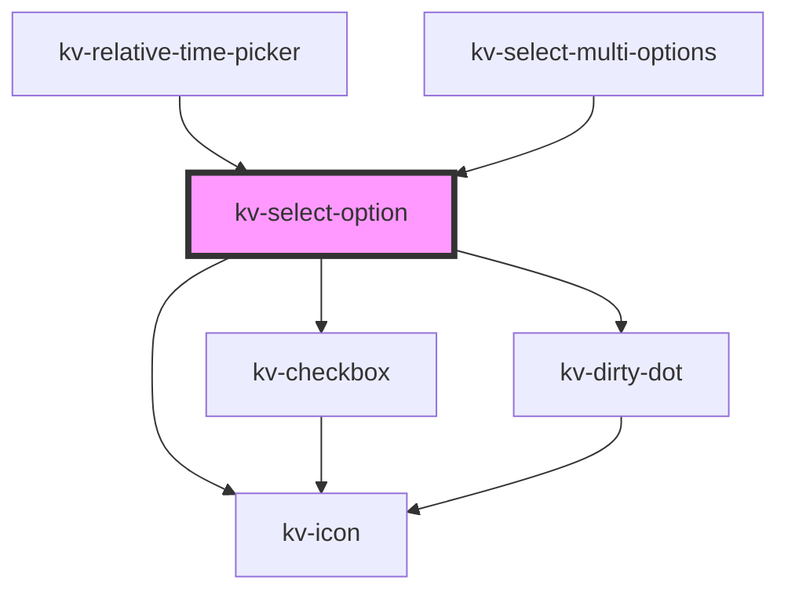

# _<kv-select-option>_

<!-- Auto Generated Below -->


## Usage

### React

```tsx
import React from 'react';
import { KvSelectOption } from '@kelvininc/react-ui-components';
export const KvSelectOptionExample: React.FC = () => (
  <>
	{/*-- With all properties (only label and value are mandatory) --*/}
	<KvSelectOption
		label="Option 1"
		link="option1"
		selected={false}
		togglable={true}
		>
	</KvSelectOption>
  </>
);
```


## Properties

| Property             | Attribute      | Description                                                                                                                                                                             | Type                                                                       | Default     |
| -------------------- | -------------- | --------------------------------------------------------------------------------------------------------------------------------------------------------------------------------------- | -------------------------------------------------------------------------- | ----------- |
| `customClass`        | `custom-class` | (optional) Additional classes to apply for custom CSS. If multiple classes are provided they should be separated by spaces. It is also valid to provide CssClassMap with boolean logic. | `CssClassMap \| string \| string[]`                                        | `''`        |
| `customStyle`        | --             | (optional) Additional style to apply for custom CSS.                                                                                                                                    | `{ [key: string]: string; }`                                               | `undefined` |
| `description`        | `description`  | (optional) Description of the item displayed on the right                                                                                                                               | `string`                                                                   | `undefined` |
| `disabled`           | `disabled`     | (optional) If `true` the item is disabled                                                                                                                                               | `boolean`                                                                  | `false`     |
| `heading`            | `heading`      | (optional) If `true` the item is presented as a list heading. Default: `false`                                                                                                          | `boolean`                                                                  | `false`     |
| `highlighted`        | `highlighted`  | (optional) If `true` the item is highlighted                                                                                                                                            | `boolean`                                                                  | `false`     |
| `icon`               | `icon`         | (optional) Icon of the item displayed on the left                                                                                                                                       | `EIconName \| EOtherIconName`                                              | `undefined` |
| `isDirty`            | `is-dirty`     | (optional) If true, a dirty dot indicator will be added to left side of the option's text.                                                                                              | `boolean`                                                                  | `false`     |
| `label` _(required)_ | `label`        | (required) The text to display on the item                                                                                                                                              | `string`                                                                   | `undefined` |
| `level`              | `level`        | (optional) The level depth at which the option is rendered                                                                                                                              | `number`                                                                   | `0`         |
| `selectable`         | `selectable`   | (optional) If `false` the item is only for presenting and cannot be selected.                                                                                                           | `boolean`                                                                  | `true`      |
| `selected`           | `selected`     | (optional) If `true` the item is selected                                                                                                                                               | `boolean`                                                                  | `false`     |
| `state`              | `state`        | (optional) The toggle button state                                                                                                                                                      | `EToggleState.Indeterminate \| EToggleState.None \| EToggleState.Selected` | `undefined` |
| `togglable`          | `togglable`    | (optional) If `true` the item is togglable                                                                                                                                              | `boolean`                                                                  | `false`     |
| `value` _(required)_ | `value`        | (required) The item value                                                                                                                                                               | `string`                                                                   | `undefined` |


## Events

| Event          | Description                              | Type                  |
| -------------- | ---------------------------------------- | --------------------- |
| `itemSelected` | Emitted when the user clicks on the item | `CustomEvent<string>` |


## Shadow Parts

| Part                      | Description                    |
| ------------------------- | ------------------------------ |
| `"checkbox"`              | The option's checkbox          |
| `"icon"`                  | The option's icon              |
| `"label"`                 | The option's label             |
| `"option-container"`      | The option's container         |
| `"select-option-content"` | The option's content container |


## CSS Custom Properties

| Name                                            | Description                                                                            |
| ----------------------------------------------- | -------------------------------------------------------------------------------------- |
| `--select-option-background-color`              | Select option background color.                                                        |
| `--select-option-background-color-highlighted`  | Select option background color when highlighted.                                       |
| `--select-option-background-color-hover`        | Select option background color when hovered.                                           |
| `--select-option-background-color-selected`     | Select option background color when selected.                                          |
| `--select-option-description-color`             | Select option description color.                                                       |
| `--select-option-description-color-highlighted` | Select option description color when highlighted.                                      |
| `--select-option-description-color-hover`       | Select option description color when hover.                                            |
| `--select-option-description-color-selected`    | Select option description color when selected.                                         |
| `--select-option-flex-alignment`                | The alignment of items within the component's container.                               |
| `--select-option-height`                        | Select option height.                                                                  |
| `--select-option-icon-size`                     | Select option icon size in pixels.                                                     |
| `--select-option-label-color`                   | Select option label color.                                                             |
| `--select-option-label-color-highlighted`       | Select option label color when highlighted.                                            |
| `--select-option-label-color-hover`             | Select option label color when hover.                                                  |
| `--select-option-label-color-selected`          | Select option label color when selected.                                               |
| `--select-option-text-flex-alignment`           | Sets how flex items are aligned in the text flex box within the component's container. |
| `--select-option-text-flex-direction`           | Sets how flex items are placed in the text flex box within the component's container.  |
| `--select-option-transition-duration`           | Select option transition time.                                                         |


## Dependencies

### Used by

 - [kv-relative-time-picker](../relative-time-picker)
 - [kv-select-multi-options](../select-multi-options)

### Depends on

- [kv-checkbox](../checkbox)
- [kv-icon](../icon)
- [kv-dirty-dot](../dirty-dot)

### Graph


----------------------------------------------


