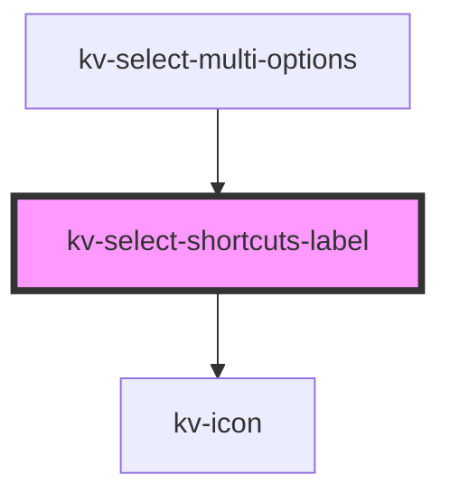

# _<kv-select-shortcuts-label>_

<!-- Auto Generated Below -->

## Properties

| Property         | Attribute         | Description                                                                          | Type      | Default |
| ---------------- | ----------------- | ------------------------------------------------------------------------------------ | --------- | ------- |
| `rangeSelection` | `range-selection` | (optional) If `true` the range selection shortcut hint is displayed. Default `false` | `boolean` | `false` |

## Dependencies

### Used by

 - [kv-select-multi-options](../select-multi-options)

### Depends on

- [kv-icon](../icon)

### Graph

----------------------------------------------

