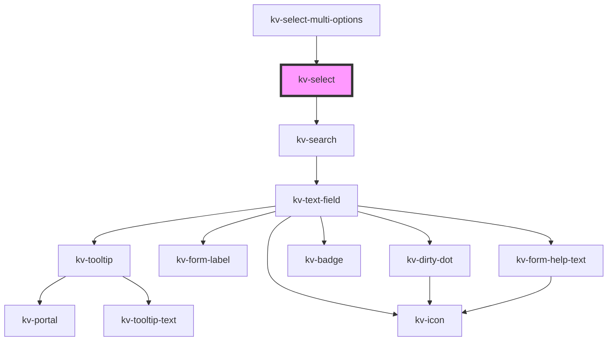

# _<kv-select>_

<!-- Auto Generated Below -->


## Usage

### React

```tsx
import React from 'react';
import { KvSelect } from '@kelvininc/react-ui-components';

export const KvSelectExample: React.FC = () => (
  <>
    <KvSelect searchable={true} selectionClearable={true}>
		<KvSelectOption
			label="Option 1"
			value="option1"
			togglable={true}>
		</KvSelectOption>
		<KvSelectOption
			label="Option 3"
			value="option3"
			togglable={true}>
		</KvSelect>
	</KvSelect>
  </>
);
```


## Properties

| Property                | Attribute                 | Description                                                       | Type      | Default                 |
| ----------------------- | ------------------------- | ----------------------------------------------------------------- | --------- | ----------------------- |
| `clearSelectionLabel`   | `clear-selection-label`   | (optional) The clear search action text                           | `string`  | `CLEAR_SELECTION_LABEL` |
| `maxHeight`             | `max-height`              | (optional) The dropdown's max-height                              | `string`  | `undefined`             |
| `maxWidth`              | `max-width`               | (optional) The dropdown's max-width                               | `string`  | `undefined`             |
| `minHeight`             | `min-height`              | (optional) The dropdown's min-height                              | `string`  | `undefined`             |
| `minWidth`              | `min-width`               | (optional) The dropdown's min-width                               | `string`  | `undefined`             |
| `searchPlaceholder`     | `search-placeholder`      | (optional) The list search text field placeholder                 | `string`  | `undefined`             |
| `searchValue`           | `search-value`            | (optional) The search value on the list                           | `string`  | `undefined`             |
| `searchable`            | `searchable`              | (optional) If `true` the list has a search text field             | `boolean` | `false`                 |
| `selectAllLabel`        | `select-all-label`        | (optional) The selection all action text                          | `string`  | `SELECT_ALL_LABEL`      |
| `selectionAll`          | `selection-all`           | (optional) If `true` the list has an action to select all items   | `boolean` | `false`                 |
| `selectionAllEnabled`   | `selection-all-enabled`   | (optional) If `true` the selection action is enabled              | `boolean` | `undefined`             |
| `selectionClearEnabled` | `selection-clear-enabled` | (optional) If `true` the list can be cleared                      | `boolean` | `undefined`             |
| `selectionClearable`    | `selection-clearable`     | (optional) If `true` the list has an action to unselect all items | `boolean` | `false`                 |


## Events

| Event            | Description                                                | Type                  |
| ---------------- | ---------------------------------------------------------- | --------------------- |
| `clearSelection` | Emitted when the user clears the selected items            | `CustomEvent<void>`   |
| `searchChange`   | Emitted when the user interacts with the search text field | `CustomEvent<string>` |
| `selectAll`      | Emitted when the user clicks on the all items              | `CustomEvent<void>`   |


## Shadow Parts

| Part       | Description           |
| ---------- | --------------------- |
| `"select"` | The select container. |


## CSS Custom Properties

| Name                        | Description                |
| --------------------------- | -------------------------- |
| `--select-background-color` | Select background color.   |
| `--select-border`           | Select border style.       |
| `--select-border-radius`    | Select border radius.      |
| `--select-inner-border`     | Select inner border style. |
| `--select-max-height`       | Select maximum height.     |
| `--select-min-height`       | Select minimum height.     |


## Dependencies

### Used by

 - [kv-select-multi-options](../select-multi-options)

### Depends on

- [kv-search](../search)

### Graph


----------------------------------------------


