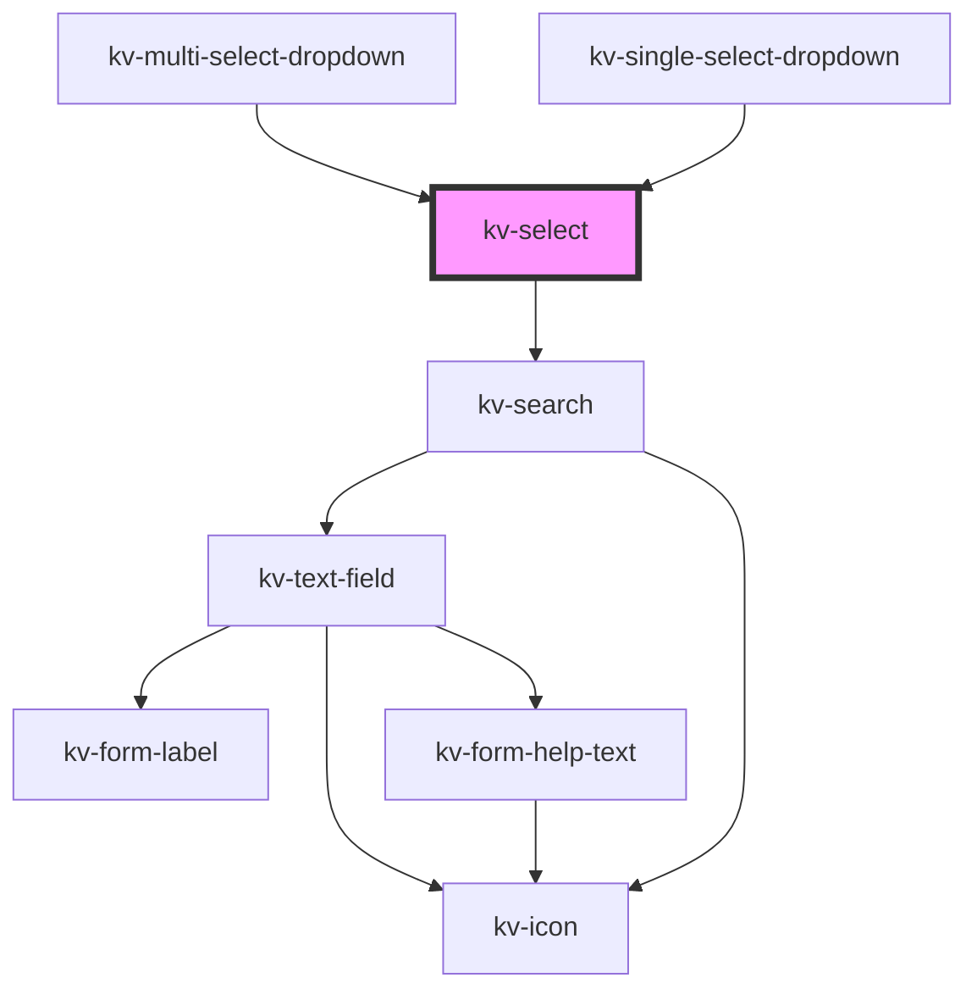

# *<kv-select>*


<!-- Auto Generated Below -->


## Usage

### Angular

```html
<kv-select searchable=true selectionClearable=true>
	<kv-select-option
		label="Option 1"
		value="option1"
		togglable=true>
	</kv-select-option>
	...
	<kv-select-option
		label="Option 3"
		value="option3"
		togglable=true>
	</kv-select-option>
</kv-select>
```


### React

```tsx
import React from 'react';
import { KvSelect } from '@kelvininc/react-ui-components';

export const KvSelectExample: React.FC = () => (
  <>
    <KvSelect searchable={true} selectionClearable={true}>
		<KvSelectOption
			label="Option 1"
			value="option1"
			togglable={true}>
		</KvSelectOption>
		<KvSelectOption
			label="Option 3"
			value="option3"
			togglable={true}>
		</KvSelect>
	</KvSelect>
  </>
);
```


## Properties

| Property                | Attribute                 | Description                                                       | Type      | Default                        |
| ----------------------- | ------------------------- | ----------------------------------------------------------------- | --------- | ------------------------------ |
| `clearSelectionLabel`   | `clear-selection-label`   | (optional) The clear search action text                           | `string`  | `SELECT_CLEAR_SELECTION_LABEL` |
| `searchPlaceholder`     | `search-placeholder`      | (optional) The list search text field placeholder                 | `string`  | `undefined`                    |
| `searchValue`           | `search-value`            | (optional) The search value on the list                           | `string`  | `undefined`                    |
| `searchable`            | `searchable`              | (optional) If `true` the list has a search text field             | `boolean` | `false`                        |
| `selectionClearEnabled` | `selection-clear-enabled` | (optional) If `true` the list can be cleared                      | `boolean` | `undefined`                    |
| `selectionClearable`    | `selection-clearable`     | (optional) If `true` the list has an action to unselect all items | `boolean` | `false`                        |


## Events

| Event            | Description                                                | Type                  |
| ---------------- | ---------------------------------------------------------- | --------------------- |
| `clearSelection` | Emitted when the user clears the selected items            | `CustomEvent<void>`   |
| `searchChange`   | Emitted when the user interacts with the search text field | `CustomEvent<string>` |


## CSS Custom Properties

| Name                        | Description              |
| --------------------------- | ------------------------ |
| `--select-background-color` | Select background color. |
| `--select-border`           | Select border style.     |
| `--select-border-radius`    | Select border radius.    |
| `--select-max-height`       | Select maximum height.   |


## Dependencies

### Used by

 - [kv-multi-select-dropdown](../multi-select-dropdown)
 - [kv-single-select-dropdown](../single-select-dropdown)

### Depends on

- [kv-search](../search)

### Graph


----------------------------------------------


