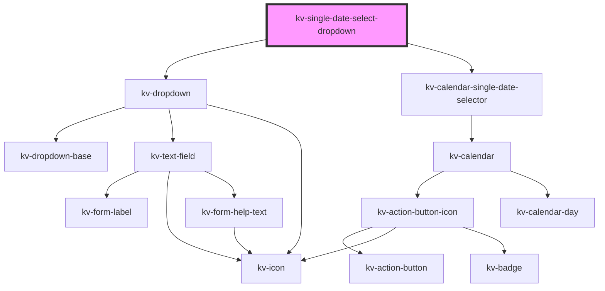

# kv-single-date-select-dropdown

<!-- Auto Generated Below -->


## Usage

### Angular

```html
<!-- Default -->
<kv-single-date-select-dropdown></kv-single-date-select-dropdown>

<!-- With input config -->
<kv-single-date-select-dropdown [dropdownConfig]="{ label: 'Birthday', placeholder: 'Select a date' }"></kv-single-date-select-dropdown>
```


### React

```tsx
import React from 'react';

import { KvSingleDateSelectDropdown } from '@kelvininc/react-ui-components';

export const KvSingleDateSelectDropdownExample: React.FC = () => (
	<>
		{/*-- Default --*/}
		<KvSingleDateSelectDropdown />

		{/*-- With input config --*/}
		<KvSingleDateSelectDropdown dropdownConfig={{ label: 'Birthday', placeholder: 'Select a date' }} />
	</>
);
```


## Properties

| Property         | Attribute       | Description                                              | Type                                                                                                                                                                                                                                                              | Default     |
| ---------------- | --------------- | -------------------------------------------------------- | ----------------------------------------------------------------------------------------------------------------------------------------------------------------------------------------------------------------------------------------------------------------- | ----------- |
| `dateMask`       | `date-mask`     | (optional) The text field date format mask               | `string`                                                                                                                                                                                                                                                          | `undefined` |
| `disabledDates`  | --              | (options) The disabled dates array                       | `string[]`                                                                                                                                                                                                                                                        | `[]`        |
| `dropdownConfig` | --              | (optional) The text field dropdown custom configurations | `{ placeholder?: string; loading?: boolean; label?: string; value?: string; icon?: EIconName \| EOtherIconName; errorState?: EValidationState; helpText?: string \| string[]; disabled?: boolean; required?: boolean; isOpen?: boolean; placement?: Placement; }` | `{}`        |
| `initialDate`    | `initial-date`  | (optional) Initial date                                  | `string`                                                                                                                                                                                                                                                          | `undefined` |
| `maxDate`        | `max-date`      | (optional) Maximum accepted date                         | `string`                                                                                                                                                                                                                                                          | `undefined` |
| `minDate`        | `min-date`      | (optional) Minimum accepted date                         | `string`                                                                                                                                                                                                                                                          | `undefined` |
| `selectedDate`   | `selected-date` | (optional) Currently selected date                       | `string`                                                                                                                                                                                                                                                          | `undefined` |


## Events

| Event             | Description                                            | Type                       |
| ----------------- | ------------------------------------------------------ | -------------------------- |
| `openStateChange` | Emitted when the calendar selector opens state changes | `CustomEvent<boolean>`     |
| `selectDate`      | Emitted when day is selected                           | `CustomEvent<ISelectDate>` |


## Dependencies

### Depends on

- [kv-dropdown](../dropdown)
- [kv-calendar-single-date-selector](../calendar-single-date-selector)

### Graph


----------------------------------------------


