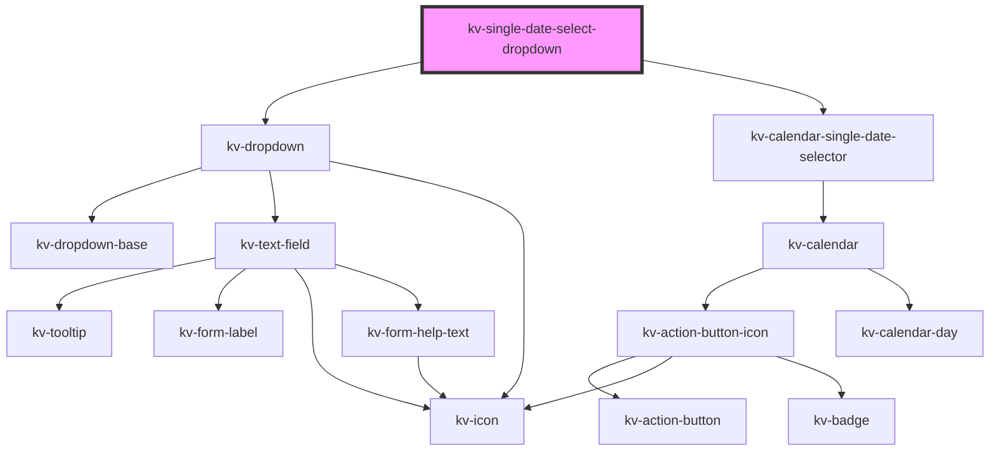

# kv-single-date-select-dropdown

<!-- Auto Generated Below -->


## Usage

### Angular

```html
<!-- Default -->
<kv-single-date-select-dropdown></kv-single-date-select-dropdown>

<!-- With input config -->
<kv-single-date-select-dropdown [dropdownConfig]="{ label: 'Birthday', placeholder: 'Select a date' }"></kv-single-date-select-dropdown>
```


### React

```tsx
import React from 'react';

import { KvSingleDateSelectDropdown } from '@kelvininc/react-ui-components';

export const KvSingleDateSelectDropdownExample: React.FC = () => (
	<>
		{/*-- Default --*/}
		<KvSingleDateSelectDropdown />

		{/*-- With input config --*/}
		<KvSingleDateSelectDropdown dropdownConfig={{ label: 'Birthday', placeholder: 'Select a date' }} />
	</>
);
```


## Properties

| Property        | Attribute       | Description                                                   | Type                                                                                                                                                                                                                                                                                                                                                                                                                                                                                                                 | Default     |
| --------------- | --------------- | ------------------------------------------------------------- | -------------------------------------------------------------------------------------------------------------------------------------------------------------------------------------------------------------------------------------------------------------------------------------------------------------------------------------------------------------------------------------------------------------------------------------------------------------------------------------------------------------------- | ----------- |
| `dateMask`      | `date-mask`     | (optional) The text field date format mask in ISO 8601 format | `string`                                                                                                                                                                                                                                                                                                                                                                                                                                                                                                             | `undefined` |
| `disabledDates` | --              | (options) The disabled dates array                            | `string[]`                                                                                                                                                                                                                                                                                                                                                                                                                                                                                                           | `[]`        |
| `initialDate`   | `initial-date`  | (optional) Initial date                                       | `string`                                                                                                                                                                                                                                                                                                                                                                                                                                                                                                             | `undefined` |
| `inputConfig`   | --              | (optional) The text field dropdown custom configurations      | `{ type?: EInputFieldType; label?: string; icon?: EIconName \| EOtherIconName; inputName?: string; examples?: string[]; placeholder?: string; maxLength?: number; minLength?: number; max?: string \| number; min?: string \| number; step?: string \| number; size?: EComponentSize; disabled?: boolean; required?: boolean; loading?: boolean; state?: EValidationState; helpText?: string \| string[]; value?: string \| number; readonly?: boolean; forcedFocus?: boolean; tooltipConfig?: Partial<ITooltip>; }` | `{}`        |
| `maxDate`       | `max-date`      | (optional) Maximum accepted date                              | `string`                                                                                                                                                                                                                                                                                                                                                                                                                                                                                                             | `undefined` |
| `minDate`       | `min-date`      | (optional) Minimum accepted date                              | `string`                                                                                                                                                                                                                                                                                                                                                                                                                                                                                                             | `undefined` |
| `selectedDate`  | `selected-date` | (optional) Currently selected date                            | `string`                                                                                                                                                                                                                                                                                                                                                                                                                                                                                                             | `undefined` |


## Events

| Event             | Description                                            | Type                       |
| ----------------- | ------------------------------------------------------ | -------------------------- |
| `openStateChange` | Emitted when the calendar selector opens state changes | `CustomEvent<boolean>`     |
| `selectDate`      | Emitted when day is selected                           | `CustomEvent<ISelectDate>` |


## Dependencies

### Depends on

- [kv-dropdown](../dropdown)
- [kv-calendar-single-date-selector](../calendar-single-date-selector)

### Graph


----------------------------------------------


