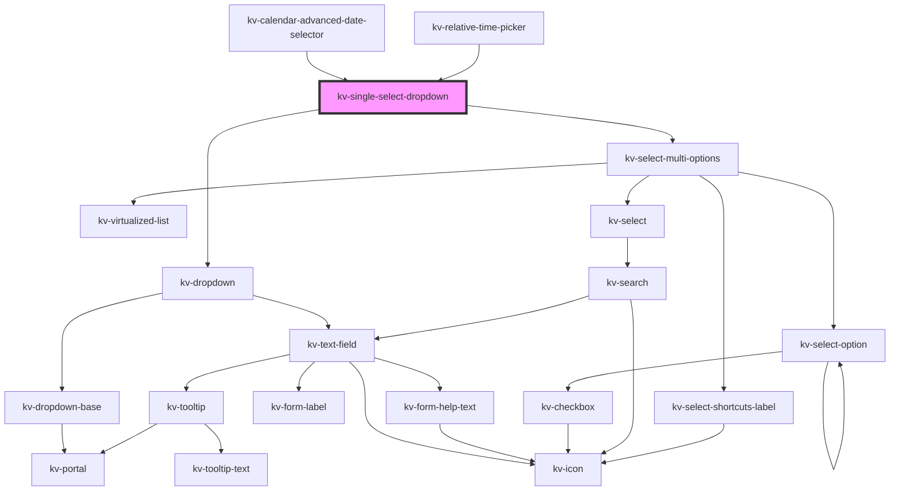

# _<kv-single-select-dropdown>_

<!-- Auto Generated Below -->


## Usage

### Angular

```html
<kv-single-select-dropdown
	placeholder="Select an option"
	label="Options"
	[icon]="EIconName.Layer"
	[options]="options"
	[selectedOption]="selectedOption">
</kv-single-select-dropdown>
```


### React

```tsx
import React from 'react';
import { KvSingleSelectDropdown } from '@kelvininc/react-ui-components';

export const KvSingleSelectDropdownExample: React.FC = (props) => (
  <>
    <KvSingleSelectDropdown 
		placeholder="Select an option"
		label="Options"
		icon={EIconName.Layer}
		options={props.options}
		selectedOption={props.selectedOption}>
	</KvSingleSelectDropdown>
  </>
);
```


## Properties

| Property               | Attribute                 | Description                                                                                                                                                                             | Type                                                                                                                                                                                                                                                                                                                                                                           | Default                                    |
| ---------------------- | ------------------------- | --------------------------------------------------------------------------------------------------------------------------------------------------------------------------------------- | ------------------------------------------------------------------------------------------------------------------------------------------------------------------------------------------------------------------------------------------------------------------------------------------------------------------------------------------------------------------------------ | ------------------------------------------ |
| `actionElement`        | --                        | (optional) A reference to the dropdown action element                                                                                                                                   | `HTMLElement`                                                                                                                                                                                                                                                                                                                                                                  | `null`                                     |
| `clearSelectionLabel`  | `clear-selection-label`   | (optional) The clear selection action text                                                                                                                                              | `string`                                                                                                                                                                                                                                                                                                                                                                       | `SINGLE_SELECT_CLEAR_SELECTION_LABEL`      |
| `clickOutsideClose`    | `click-outside-close`     | (optional) If `false` clicking outside the dropdown will not trigger state change. Default: true                                                                                        | `boolean`                                                                                                                                                                                                                                                                                                                                                                      | `true`                                     |
| `counter`              | `counter`                 | (optional) If `true` a selection counter is displayed                                                                                                                                   | `boolean`                                                                                                                                                                                                                                                                                                                                                                      | `undefined`                                |
| `customClass`          | `custom-class`            | (optional) Additional classes to apply for custom CSS. If multiple classes are provided they should be separated by spaces. It is also valid to provide CssClassMap with boolean logic. | `CssClassMap \| string \| string[]`                                                                                                                                                                                                                                                                                                                                            | `''`                                       |
| `disabled`             | `disabled`                | (optional) If `true` the dropdown is disabled                                                                                                                                           | `boolean`                                                                                                                                                                                                                                                                                                                                                                      | `false`                                    |
| `displayValue`         | `display-value`           | (optional) The text to display on the dropdown                                                                                                                                          | `string`                                                                                                                                                                                                                                                                                                                                                                       | `undefined`                                |
| `dropdownOptions`      | --                        | (optional) The dropdown position config options                                                                                                                                         | `{ placement?: Placement; strategy?: Strategy; middleware?: (false \| { name: string; options?: any; fn: (state: { x: number; y: number; initialPlacement: Placement; platform: Platform; placement: Placement; strategy: Strategy; middlewareData: MiddlewareData; rects: ElementRects; elements: Elements; }) => Promisable<MiddlewareReturn>; })[]; platform?: Platform; }` | `undefined`                                |
| `errorState`           | `error-state`             | (required) The error state for the dropdown                                                                                                                                             | `EValidationState.Invalid \| EValidationState.None \| EValidationState.Valid`                                                                                                                                                                                                                                                                                                  | `EValidationState.None`                    |
| `filteredOptions`      | --                        | (optional) The object with the dropdown options filtered                                                                                                                                | `{ [x: string]: ISelectSingleOption; }`                                                                                                                                                                                                                                                                                                                                        | `undefined`                                |
| `helpText`             | `help-text`               | (optional) The text to display as help text                                                                                                                                             | `string \| string[]`                                                                                                                                                                                                                                                                                                                                                           | `[]`                                       |
| `icon`                 | `icon`                    | (optional) The icon to display on the dropdown                                                                                                                                          | `EIconName \| EOtherIconName`                                                                                                                                                                                                                                                                                                                                                  | `undefined`                                |
| `inputSize`            | `input-size`              | (optional) The size of the input                                                                                                                                                        | `EComponentSize.Large \| EComponentSize.Small`                                                                                                                                                                                                                                                                                                                                 | `EComponentSize.Large`                     |
| `isOpen`               | `is-open`                 | (optional) If `true` the list is opened                                                                                                                                                 | `boolean`                                                                                                                                                                                                                                                                                                                                                                      | `false`                                    |
| `label`                | `label`                   | (optional) The text to display on the dropdown label                                                                                                                                    | `string`                                                                                                                                                                                                                                                                                                                                                                       | `undefined`                                |
| `loading`              | `loading`                 | (optional) If `true` the list dropdown is loading                                                                                                                                       | `boolean`                                                                                                                                                                                                                                                                                                                                                                      | `false`                                    |
| `maxHeight`            | `max-height`              | (optional) The dropdown's max-height                                                                                                                                                    | `string`                                                                                                                                                                                                                                                                                                                                                                       | `undefined`                                |
| `minHeight`            | `min-height`              | (optional) The dropdown's min-height                                                                                                                                                    | `string`                                                                                                                                                                                                                                                                                                                                                                       | `undefined`                                |
| `minSearchOptions`     | `min-search-options`      | (optional) The minimum amount of options required to display the search. Defaults to `8`.                                                                                               | `number`                                                                                                                                                                                                                                                                                                                                                                       | `MINIMUM_SEARCHABLE_OPTIONS`               |
| `noDataAvailableLabel` | `no-data-available-label` | (required) The text to display when there are no options                                                                                                                                | `string`                                                                                                                                                                                                                                                                                                                                                                       | `SINGLE_SELECT_DROPDOWN_NO_DATA_AVAILABLE` |
| `options`              | --                        | (optional) The object with the dropdown options                                                                                                                                         | `{ [x: string]: ISelectSingleOption; }`                                                                                                                                                                                                                                                                                                                                        | `{}`                                       |
| `placeholder`          | `placeholder`             | (optional) The text to display as the dropdown placeholder                                                                                                                              | `string`                                                                                                                                                                                                                                                                                                                                                                       | `undefined`                                |
| `required`             | `required`                | (optional) If `true` dropdown requires a value to be selected                                                                                                                           | `boolean`                                                                                                                                                                                                                                                                                                                                                                      | `false`                                    |
| `searchPlaceholder`    | `search-placeholder`      | (optional) The list search text field placeholder                                                                                                                                       | `string`                                                                                                                                                                                                                                                                                                                                                                       | `undefined`                                |
| `searchable`           | `searchable`              | (optional) If `true` the dropdown is searchable                                                                                                                                         | `boolean`                                                                                                                                                                                                                                                                                                                                                                      | `false`                                    |
| `selectAllLabel`       | `select-all-label`        | (optional) The selection all action text                                                                                                                                                | `string`                                                                                                                                                                                                                                                                                                                                                                       | `undefined`                                |
| `selectedOption`       | `selected-option`         | (optional) The value of the selected option                                                                                                                                             | `string`                                                                                                                                                                                                                                                                                                                                                                       | `undefined`                                |
| `selectionAll`         | `selection-all`           | (optional) If `true` the list has an action to select all items                                                                                                                         | `boolean`                                                                                                                                                                                                                                                                                                                                                                      | `undefined`                                |
| `selectionClearable`   | `selection-clearable`     | (optional) If `true` dropdown items can be cleared                                                                                                                                      | `boolean`                                                                                                                                                                                                                                                                                                                                                                      | `undefined`                                |
| `shortcuts`            | `shortcuts`               | (optional) If `true` the keyboard shortcuts can be used to navigate between the dropdown results. Default `false`                                                                       | `boolean`                                                                                                                                                                                                                                                                                                                                                                      | `false`                                    |
| `zIndex`               | `z-index`                 | (optional) the dropdown list z-index (default: 9004)                                                                                                                                    | `number`                                                                                                                                                                                                                                                                                                                                                                       | `9004`                                     |


## Events

| Event             | Description                                                | Type                   |
| ----------------- | ---------------------------------------------------------- | ---------------------- |
| `clearSelection`  | Emitted when the user clears the selected items            | `CustomEvent<void>`    |
| `dismiss`         | Emitted when the 'esc' key is pressed                      | `CustomEvent<void>`    |
| `openStateChange` | Emitted when the dropdown open state changes               | `CustomEvent<boolean>` |
| `optionSelected`  | Emitted when an option is selected                         | `CustomEvent<string>`  |
| `searchChange`    | Emitted when the user interacts with the search text field | `CustomEvent<string>`  |


## Shadow Parts

| Part       | Description           |
| ---------- | --------------------- |
| `"select"` | The select container. |


## CSS Custom Properties

| Name                    | Description                   |
| ----------------------- | ----------------------------- |
| `--dropdown-max-height` | Dropdown list maximum height. |
| `--dropdown-min-height` | Dropdown list minimum height. |


## Dependencies

### Used by

 - [kv-calendar-advanced-date-selector](../calendar-advanced-date-selector)
 - [kv-relative-time-picker](../relative-time-picker)

### Depends on

- [kv-dropdown](../dropdown)
- [kv-select-multi-options](../select-multi-options)

### Graph


----------------------------------------------


