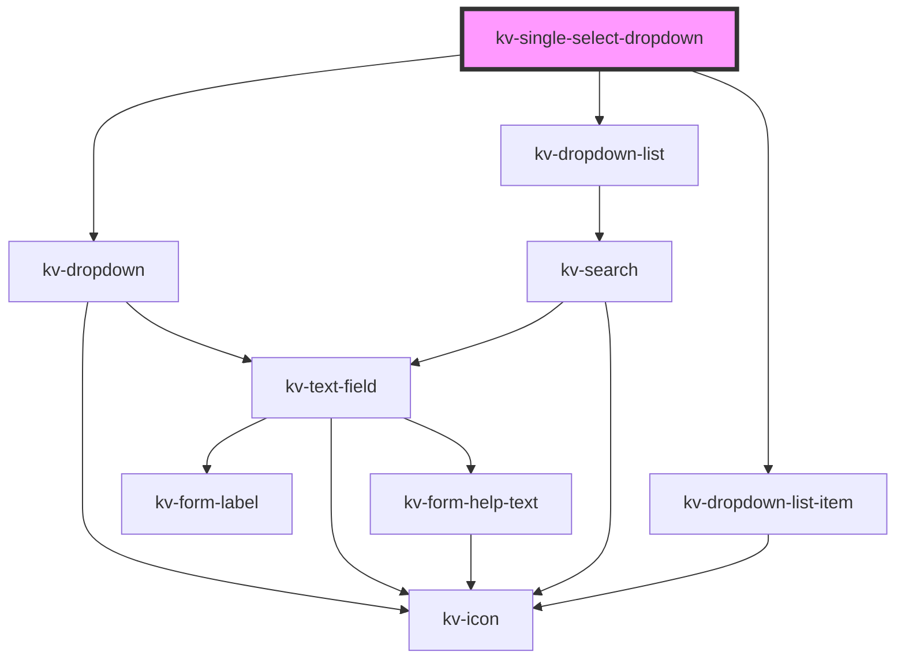

# *<kv-single-select-dropdown>*


<!-- Auto Generated Below -->


## Usage

### Angular

```html
<kv-single-select-dropdown
	placeholder="Select an option"
	label="Options"
	[icon]="EIconName.Layer"
	[options]="options"
	[selectedOption]="selectedOption">
</kv-single-select-dropdown>
```


### React

```tsx
import React from 'react';
import { KvSingleSelectDropdown } from '@kelvininc/react-ui-components';

export const KvSingleSelectDropdownExample: React.FC = (props) => (
  <>
    <KvSingleSelectDropdown 
		placeholder="Select an option"
		label="Options"
		icon={EIconName.Layer}
		options={props.options}
		selectedOption={props.selectedOption}>
	</KvSingleSelectDropdown>
  </>
);
```


## Properties

| Property               | Attribute                 | Description                                                   | Type                                                                          | Default                                    |
| ---------------------- | ------------------------- | ------------------------------------------------------------- | ----------------------------------------------------------------------------- | ------------------------------------------ |
| `disabled`             | `disabled`                | (optional) If `true` the dropdown is disabled                 | `boolean`                                                                     | `false`                                    |
| `displayValue`         | `display-value`           | (optional) The text to display on the dropdown                | `string`                                                                      | `undefined`                                |
| `errorState`           | `error-state`             | (required) The error state for the dropdown                   | `EValidationState.Invalid \| EValidationState.None \| EValidationState.Valid` | `EValidationState.None`                    |
| `helpText`             | `help-text`               | (optional) The text to display as help text                   | `string \| string[]`                                                          | `[]`                                       |
| `icon`                 | `icon`                    | (optional) The icon to display on the dropdown                | `EIconName \| EOtherIconName`                                                 | `undefined`                                |
| `isOpen`               | `is-open`                 | (optional) If `true` the list is opened                       | `boolean`                                                                     | `false`                                    |
| `label`                | `label`                   | (optional) The text to display on the dropdown label          | `string`                                                                      | `undefined`                                |
| `loading`              | `loading`                 | (optional) If `true` the list dropdown is loading             | `boolean`                                                                     | `false`                                    |
| `noDataAvailableLabel` | `no-data-available-label` | (required) The text to display when there are no options      | `string`                                                                      | `SINGLE_SELECT_DROPDOWN_NO_DATA_AVAILABLE` |
| `options`              | --                        | (optional) The object with the dropdown options               | `ISingleSelectDropdownOptions`                                                | `{}`                                       |
| `placeholder`          | `placeholder`             | (optional) The text to display as the dropdown placeholder    | `string`                                                                      | `undefined`                                |
| `required`             | `required`                | (optional) If `true` dropdown requires a value to be selected | `boolean`                                                                     | `false`                                    |
| `searchable`           | `searchable`              | (optional) If `true` the dropdown is searchable               | `boolean`                                                                     | `false`                                    |
| `selectedOption`       | `selected-option`         | (optional) The value of the selected option                   | `string`                                                                      | `undefined`                                |


## Events

| Event            | Description                             | Type                  |
| ---------------- | --------------------------------------- | --------------------- |
| `optionSelected` | Emitted when the selected option change | `CustomEvent<string>` |
| `searchChange`   | Emitted when the search term changes    | `CustomEvent<string>` |


## CSS Custom Properties

| Name                    | Description                   |
| ----------------------- | ----------------------------- |
| `--dropdown-max-height` | Dropdown list maximum height. |


## Dependencies

### Depends on

- [kv-dropdown](../dropdown)
- [kv-dropdown-list](../dropdown-list)
- [kv-dropdown-list-item](../dropdown-list-item)

### Graph


----------------------------------------------


