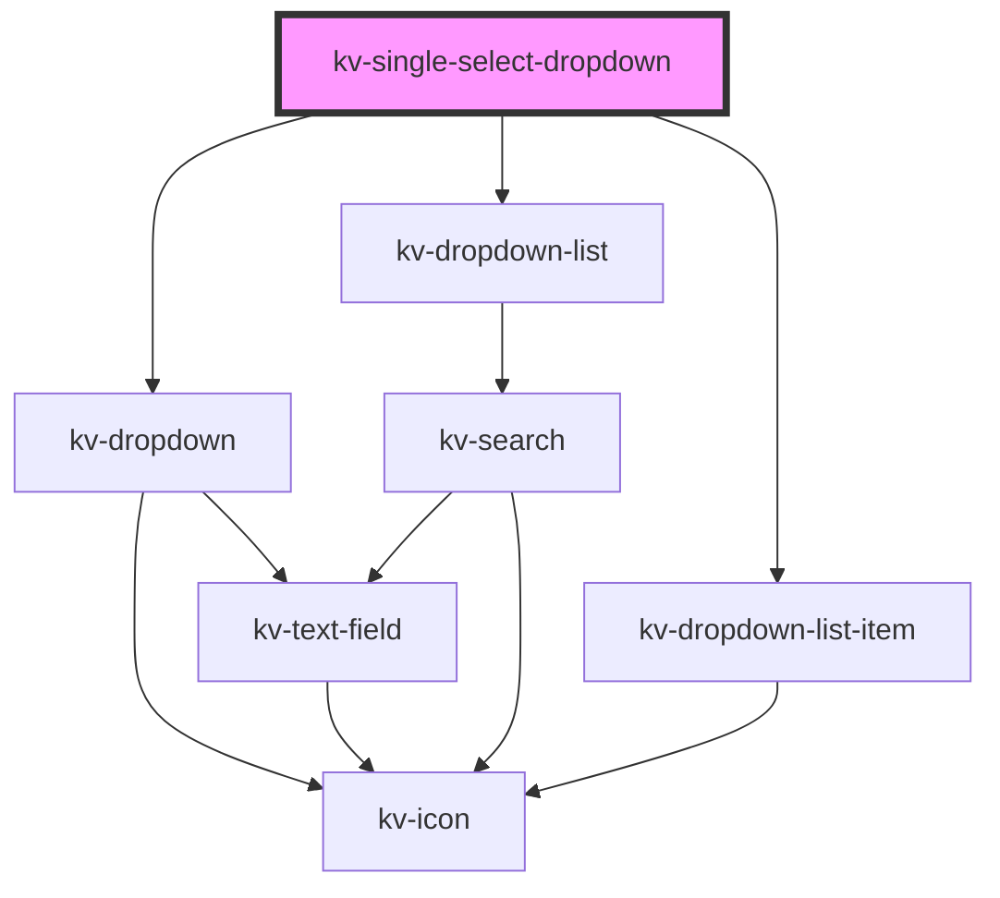

# *<kv-breadcrumb-list>*


<!-- Auto Generated Below -->


## Usage

### Angular

```html
<kv-breadcrumb-list separator='/'>
	<kv-breadcrumb-item
		label="First item"
		link="Your link here"
		[target]="EBreadcrumbItemTarget.NewTab">
	</kv-breadcrumb-item>
	...
	<kv-breadcrumb-item
		label="Last item"
		link="Your link here"
		[target]="EBreadcrumbItemTarget.NewTab"
		active>
	</kv-breadcrumb-item>
</kv-breadcrumb-list>
```


### Javascript

```html
<kv-breadcrumb-list separator='/'>
	<kv-breadcrumb-item
		label="First item"
		link="Your link here"
		target="_blank">
	</kv-breadcrumb-item>
	...
	<kv-breadcrumb-item
		label="Last item"
		link="Your link here"
		target="_blank"
		active>
	</kv-breadcrumb-item>
</kv-breadcrumb-list>
```


### React

```tsx
import React from 'react';
import { KvBreadcrumbList } from '@kelvininc/react-ui-components';

export const KvBreadcrumbListExample: React.FC = () => (
  <>
    <KvBreadcrumbList separator='/'>
		<KvBreadcrumbItem
			label="Your label here"
			link="Your link here"
			target={EBreadcrumbItemTarget.NewTab}
			active>
		</KvBreadcrumbItem>
	</KvBreadcrumbList>
  </>
);
```


### Stencil

```tsx
import { Component, h } from '@stencil/core';
@Component({
  tag: 'kv-link-example',
  styleUrl: 'kv-link-example.css',
  shadow: true,
})
export class SwichButtonExample {
  render() {
    return (
		<kv-breadcrumb-list separator='/'>
			<kv-breadcrumb-item
				label="First item"
				link="Your link here"
				target={EBreadcrumbItemTarget.NewTab}
				active>
			</kv-breadcrumb-item>
			...
			<kv-breadcrumb-item
				label="Last item"
				link="Your link here"
				target={EBreadcrumbItemTarget.NewTab}
				active>
			</kv-breadcrumb-item>
		</kv-breadcrumb-list>
	)
  }
}
```


## Properties

| Property               | Attribute                 | Description                                                   | Type                                                                          | Default                                    |
| ---------------------- | ------------------------- | ------------------------------------------------------------- | ----------------------------------------------------------------------------- | ------------------------------------------ |
| `disabled`             | `disabled`                | (optional) If `true` the dropdown is disabled                 | `boolean`                                                                     | `false`                                    |
| `errorState`           | `error-state`             | (required) The error state for the dropdown                   | `EValidationState.Invalid \| EValidationState.None \| EValidationState.Valid` | `EValidationState.None`                    |
| `helpText`             | `help-text`               | (optional) The text to display as help text                   | `string`                                                                      | `undefined`                                |
| `icon`                 | `icon`                    | (optional) The icon to display on the dropdown                | `EIconName \| EOtherIconName`                                                 | `undefined`                                |
| `isOpen`               | `is-open`                 | (optional) If `true` the list is opened                       | `boolean`                                                                     | `false`                                    |
| `label`                | `label`                   | (optional) The text to display on the dropdown label          | `string`                                                                      | `undefined`                                |
| `loading`              | `loading`                 | (optional) If `true` the list dropdown is loading             | `boolean`                                                                     | `false`                                    |
| `noDataAvailableLabel` | `no-data-available-label` | (required) The text to display when there are no options      | `string`                                                                      | `SINGLE_SELECT_DROPDOWN_NO_DATA_AVAILABLE` |
| `options`              | --                        | (optional) The object with the dropdown options               | `ISingleSelectDropdownOptions`                                                | `{}`                                       |
| `placeholder`          | `placeholder`             | (optional) The text to display as the dropdown placeholder    | `string`                                                                      | `undefined`                                |
| `required`             | `required`                | (optional) If `true` dropdown requires a value to be selected | `boolean`                                                                     | `false`                                    |
| `searchable`           | `searchable`              | (optional) If `true` the dropdown is searchable               | `boolean`                                                                     | `false`                                    |
| `selectedOption`       | `selected-option`         | (optional) The value of the selected option                   | `string`                                                                      | `undefined`                                |
| `value`                | `value`                   | (optional) The text to display on the dropdown                | `string`                                                                      | `undefined`                                |


## Events

| Event            | Description                             | Type                  |
| ---------------- | --------------------------------------- | --------------------- |
| `optionSelected` | Emitted when the selected option change | `CustomEvent<string>` |


## Dependencies

### Depends on

- [kv-dropdown](../dropdown)
- [kv-dropdown-list](../dropdown-list)
- [kv-dropdown-list-item](../dropdown-list-item)

### Graph

```mermaid
graph TD;
  kv-single-select-dropdown --> kv-dropdown
  kv-single-select-dropdown --> kv-dropdown-list
  kv-single-select-dropdown --> kv-dropdown-list-item
  kv-dropdown --> kv-text-field
  kv-dropdown --> kv-icon
  kv-text-field --> kv-icon
  kv-dropdown-list --> kv-search
  kv-search --> kv-text-field
  kv-search --> kv-icon
  kv-dropdown-list-item --> kv-icon
  style kv-single-select-dropdown fill:#f9f,stroke:#333,stroke-width:4px
```

----------------------------------------------


