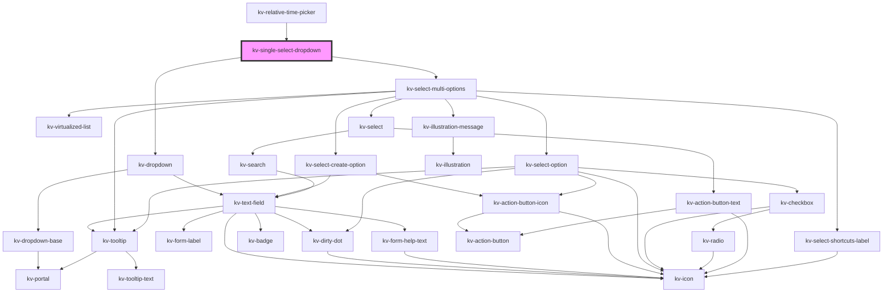

# _<kv-single-select-dropdown>_

<!-- Auto Generated Below -->


## Usage

### React

```tsx
import React from 'react';
import { KvSingleSelectDropdown } from '@kelvininc/react-ui-components/client';

export const KvSingleSelectDropdownExample: React.FC = (props) => (
  <>
    <KvSingleSelectDropdown 
		placeholder="Select an option"
		label="Options"
		icon={EIconName.Layer}
		options={props.options}
		selectedOption={props.selectedOption}>
	</KvSingleSelectDropdown>
  </>
);
```

### Empty states

`noDataAvailableConfig` is shown when there are no options, searching or not, and `noResultsFoundConfig` when the search matches none. A config with an `illustration` shows the illustration message in the list; one without it shows only its `header`, in the list header. By default, no options shows the "No Data Available" illustration, and no results shows `No results found` in the list header.

```tsx
<KvSingleSelectDropdown
	options={options}
	noDataAvailableConfig={{ header: 'No tags yet' }}
	noResultsFoundConfig={{ illustration: EIllustrationName.NoResultsFound, header: 'No tags found', description: 'Try another name' }}
/>
```

### Creating options

With `canAddItems` the list ends with an add option, labelled by `createOptionPlaceholder`, below any empty state. Picking it replaces the list with a create form, and `createFormToggle` reports the form opening (`true`, once it is rendered) and closing (`false`).

By default submitting the form emits `optionCreated` and then `optionSelected` with the typed value, and the dropdown closes. Add the new option to `options` from `optionCreated`.

```tsx
<KvSingleSelectDropdown
	options={options}
	selectedOption={selectedOption}
	canAddItems
	createOptionPlaceholder={searchTerm ? `Create “${searchTerm}”` : 'Create tag'}
	noResultsFoundConfig={{ header: 'No tags found' }}
	onSearchChange={({ detail }) => setSearchTerm(detail)}
	onOptionCreated={({ detail: name }) => addOption(name)}
	onOptionSelected={({ detail }) => setSelectedOption(detail)}
/>
```

### Creating options asynchronously

With a `createOptionState`, submitting only emits `optionCreated`: the form stays open and nothing is selected yet. Its `status` reports how the request goes:

-   `loading` while it runs: the form locks and shows the create action loading, and the dropdown stays open.
-   `error` if it fails: the form can be edited and submitted again, and shows `error` until the value is edited.
-   `success` once the option exists: the option with `optionKey`, or the submitted value without one, is selected as if it had been clicked, and the dropdown closes. Add it to `options` first.

```tsx
const [createState, setCreateState] = useState<ICreateOptionState>({ status: ECreateOptionStatus.Idle });

const onOptionCreated = async ({ detail: name }: KvSingleSelectDropdownCustomEvent<string>) => {
	setCreateState({ status: ECreateOptionStatus.Loading });

	try {
		const tag = await createTag(name);
		addOption(tag);
		setCreateState({ status: ECreateOptionStatus.Success, optionKey: tag.id });
	} catch {
		setCreateState({ status: ECreateOptionStatus.Error, error: 'A tag with this name already exists' });
	}
};

<KvSingleSelectDropdown
	options={options}
	selectedOption={selectedOption}
	canAddItems
	createOptionState={createState}
	onOptionCreated={onOptionCreated}
	onOptionSelected={({ detail }) => setSelectedOption(detail)}
/>;
```

The state describes the open form's latest submit, and `success` is read when the status changes to it: report `loading` while the request runs, so that a `success` left over from an earlier submit doesn't complete a new one. While `loading` the form can't be cancelled, so the form that succeeds is still the one that was submitted.

### Custom create forms

Content in the `create-new-option` slot replaces the default form, laid out edge to edge: give it its own inset, e.g. `padding: var(--spacing-xl)`. It drives the form with the same bubbling events as `kv-select-create-option`: `valueChanged` with the value, `clickCreate` to submit and `clickCancel` to go back to the list. The dropdown shows neither the loading nor the error of a slotted form, which shows them itself, e.g. by passing `loading` to its `kv-select-create-option`. A custom form that submits on its own finishes with a `success` state and its `optionKey`.

A form mounted when `createFormToggle` reports `true` appears a frame after the create form opens; keep it mounted and reset it on the event to avoid that. The dropdown focuses a `kv-select-create-option` or `kv-text-field` that is already slotted when the form opens; a form mounted later focuses itself.

A `loading` state holds the dropdown open against the trigger and a click outside, but `clickOutside` is still emitted: a consumer closing the dropdown from it should skip that while creating.


## Properties

| Property                  | Attribute                   | Description                                                                                                                                                                                                                                                                                                                                                                                                                                                                                                                                                                                                                                                                                                                                                                                                                                                                                                                                                                                                                          | Type                                                                                                                                                                                                                                                                                                                                                                                                                                                                                                                                                                                                                                                                                                                                     | Default                               |
| ------------------------- | --------------------------- | ------------------------------------------------------------------------------------------------------------------------------------------------------------------------------------------------------------------------------------------------------------------------------------------------------------------------------------------------------------------------------------------------------------------------------------------------------------------------------------------------------------------------------------------------------------------------------------------------------------------------------------------------------------------------------------------------------------------------------------------------------------------------------------------------------------------------------------------------------------------------------------------------------------------------------------------------------------------------------------------------------------------------------------ | ---------------------------------------------------------------------------------------------------------------------------------------------------------------------------------------------------------------------------------------------------------------------------------------------------------------------------------------------------------------------------------------------------------------------------------------------------------------------------------------------------------------------------------------------------------------------------------------------------------------------------------------------------------------------------------------------------------------------------------------- | ------------------------------------- |
| `actionElement`           | `action-element`            | (optional) A reference to the dropdown action element                                                                                                                                                                                                                                                                                                                                                                                                                                                                                                                                                                                                                                                                                                                                                                                                                                                                                                                                                                                | `HTMLElement`                                                                                                                                                                                                                                                                                                                                                                                                                                                                                                                                                                                                                                                                                                                            | `null`                                |
| `autoFocus`               | `auto-focus`                | (optional) If `false` the search text field is not auto-focused. Default `true`.                                                                                                                                                                                                                                                                                                                                                                                                                                                                                                                                                                                                                                                                                                                                                                                                                                                                                                                                                     | `boolean`                                                                                                                                                                                                                                                                                                                                                                                                                                                                                                                                                                                                                                                                                                                                | `true`                                |
| `badge`                   | `badge`                     | (optional) Text to display inside a badge on the right side of the displayed value                                                                                                                                                                                                                                                                                                                                                                                                                                                                                                                                                                                                                                                                                                                                                                                                                                                                                                                                                   | `string`                                                                                                                                                                                                                                                                                                                                                                                                                                                                                                                                                                                                                                                                                                                                 | `undefined`                           |
| `canAddItems`             | `can-add-items`             | (optional) If `true` an add option will appear at the bottom of options list. Default: `false`                                                                                                                                                                                                                                                                                                                                                                                                                                                                                                                                                                                                                                                                                                                                                                                                                                                                                                                                       | `boolean`                                                                                                                                                                                                                                                                                                                                                                                                                                                                                                                                                                                                                                                                                                                                | `false`                               |
| `clearSelectionLabel`     | `clear-selection-label`     | (optional) The clear selection action text                                                                                                                                                                                                                                                                                                                                                                                                                                                                                                                                                                                                                                                                                                                                                                                                                                                                                                                                                                                           | `string`                                                                                                                                                                                                                                                                                                                                                                                                                                                                                                                                                                                                                                                                                                                                 | `SINGLE_SELECT_CLEAR_SELECTION_LABEL` |
| `clickOutsideClose`       | `click-outside-close`       | (optional) If `false` clicking outside the dropdown will not trigger state change. Default: true                                                                                                                                                                                                                                                                                                                                                                                                                                                                                                                                                                                                                                                                                                                                                                                                                                                                                                                                     | `boolean`                                                                                                                                                                                                                                                                                                                                                                                                                                                                                                                                                                                                                                                                                                                                | `true`                                |
| `counter`                 | `counter`                   | (optional) If `true` a selection counter is displayed                                                                                                                                                                                                                                                                                                                                                                                                                                                                                                                                                                                                                                                                                                                                                                                                                                                                                                                                                                                | `boolean`                                                                                                                                                                                                                                                                                                                                                                                                                                                                                                                                                                                                                                                                                                                                | `undefined`                           |
| `createInputPlaceholder`  | `create-input-placeholder`  | (optional) The create form input placeholder                                                                                                                                                                                                                                                                                                                                                                                                                                                                                                                                                                                                                                                                                                                                                                                                                                                                                                                                                                                         | `string`                                                                                                                                                                                                                                                                                                                                                                                                                                                                                                                                                                                                                                                                                                                                 | `undefined`                           |
| `createOptionConfig`      | `create-option-config`      | (optional) The configuration of the default create form: `disabled` locks its input and create action, `size` sets its size and `inputConfig` its text field. An `inputConfig.placeholder` takes precedence over `createInputPlaceholder`.                                                                                                                                                                                                                                                                                                                                                                                                                                                                                                                                                                                                                                                                                                                                                                                           | `{ disabled?: boolean; size?: EComponentSize; inputConfig?: Partial<ITextField>; }`                                                                                                                                                                                                                                                                                                                                                                                                                                                                                                                                                                                                                                                      | `undefined`                           |
| `createOptionPlaceholder` | `create-option-placeholder` | (optional) The create new option placeholder. Default: `Add a new option`                                                                                                                                                                                                                                                                                                                                                                                                                                                                                                                                                                                                                                                                                                                                                                                                                                                                                                                                                            | `string`                                                                                                                                                                                                                                                                                                                                                                                                                                                                                                                                                                                                                                                                                                                                 | `undefined`                           |
| `createOptionState`       | `create-option-state`       | (optional) The state of the open create form's latest submit, for an option created asynchronously. When set, a submit only emits `optionCreated` and the form stays open: - `loading`: the form can be neither submitted again nor cancelled, and the dropdown stays open: neither its trigger nor a click outside closes it. The default form shows its create action loading and makes its input read-only; a slotted form shows this itself, e.g. by passing `loading` to its `kv-select-create-option`. - `error`: the form can be submitted again. The default form shows `error` on its text field until the value is edited. - `success`: the created option is selected, `optionKey` or the submitted value without one, as a click on it does: `optionSelected` is emitted and the dropdown closes. Add the option to `options` first.  `success` is read when the status changes to it, so report `loading` while the option is created. Unset, a submit emits `optionCreated` and selects the typed value straight away. | `ICreateOptionState`                                                                                                                                                                                                                                                                                                                                                                                                                                                                                                                                                                                                                                                                                                                     | `undefined`                           |
| `customClass`             | `custom-class`              | (optional) Additional classes to apply for custom CSS. If multiple classes are provided they should be separated by spaces. It is also valid to provide CssClassMap with boolean logic.                                                                                                                                                                                                                                                                                                                                                                                                                                                                                                                                                                                                                                                                                                                                                                                                                                              | `CssClassMap \| string \| string[]`                                                                                                                                                                                                                                                                                                                                                                                                                                                                                                                                                                                                                                                                                                      | `''`                                  |
| `disabled`                | `disabled`                  | (optional) If `true` the dropdown is disabled                                                                                                                                                                                                                                                                                                                                                                                                                                                                                                                                                                                                                                                                                                                                                                                                                                                                                                                                                                                        | `boolean`                                                                                                                                                                                                                                                                                                                                                                                                                                                                                                                                                                                                                                                                                                                                | `false`                               |
| `displayPrefix`           | `display-prefix`            | (optional) The text to display as a prefix to `displayValue`                                                                                                                                                                                                                                                                                                                                                                                                                                                                                                                                                                                                                                                                                                                                                                                                                                                                                                                                                                         | `string`                                                                                                                                                                                                                                                                                                                                                                                                                                                                                                                                                                                                                                                                                                                                 | `undefined`                           |
| `displayValue`            | `display-value`             | (optional) The text to display on the dropdown                                                                                                                                                                                                                                                                                                                                                                                                                                                                                                                                                                                                                                                                                                                                                                                                                                                                                                                                                                                       | `string`                                                                                                                                                                                                                                                                                                                                                                                                                                                                                                                                                                                                                                                                                                                                 | `undefined`                           |
| `dropdownOptions`         | `dropdown-options`          | (optional) The dropdown position config options                                                                                                                                                                                                                                                                                                                                                                                                                                                                                                                                                                                                                                                                                                                                                                                                                                                                                                                                                                                      | `{ strategy?: Strategy; placement?: Placement; middleware?: (false \| { name: string; options?: any; fn: (state: { x: number; y: number; initialPlacement: Placement; strategy: Strategy; platform: { detectOverflow: (state: MiddlewareState, options?: DetectOverflowOptions \| Derivable<DetectOverflowOptions>) => Promise<SideObject>; } & Platform; placement: Placement; middlewareData: MiddlewareData; rects: ElementRects; elements: Elements; }) => Promisable<MiddlewareReturn>; })[]; platform?: Platform; }`                                                                                                                                                                                                               | `undefined`                           |
| `errorState`              | `error-state`               | (required) The error state for the dropdown                                                                                                                                                                                                                                                                                                                                                                                                                                                                                                                                                                                                                                                                                                                                                                                                                                                                                                                                                                                          | `EValidationState.Invalid \| EValidationState.None \| EValidationState.Valid`                                                                                                                                                                                                                                                                                                                                                                                                                                                                                                                                                                                                                                                            | `EValidationState.None`               |
| `filteredOptions`         | `filtered-options`          | (optional) Externally filtered dropdown options. When defined, these override the default local search results.                                                                                                                                                                                                                                                                                                                                                                                                                                                                                                                                                                                                                                                                                                                                                                                                                                                                                                                      | `{ [x: string]: ISelectSingleOption; }`                                                                                                                                                                                                                                                                                                                                                                                                                                                                                                                                                                                                                                                                                                  | `undefined`                           |
| `helpText`                | `help-text`                 | (optional) The text to display as help text                                                                                                                                                                                                                                                                                                                                                                                                                                                                                                                                                                                                                                                                                                                                                                                                                                                                                                                                                                                          | `string \| string[]`                                                                                                                                                                                                                                                                                                                                                                                                                                                                                                                                                                                                                                                                                                                     | `[]`                                  |
| `icon`                    | `icon`                      | (optional) The icon to display on the dropdown                                                                                                                                                                                                                                                                                                                                                                                                                                                                                                                                                                                                                                                                                                                                                                                                                                                                                                                                                                                       | `EIconName`                                                                                                                                                                                                                                                                                                                                                                                                                                                                                                                                                                                                                                                                                                                              | `undefined`                           |
| `inputConfig`             | `input-config`              | (optional) The text field options                                                                                                                                                                                                                                                                                                                                                                                                                                                                                                                                                                                                                                                                                                                                                                                                                                                                                                                                                                                                    | `{ type?: EInputFieldType; label?: string; icon?: EIconName; actionIcon?: EIconName; inputName?: string; examples?: string[]; placeholder?: string; maxLength?: number; minLength?: number; max?: string \| number; min?: string \| number; step?: string \| number; size?: EComponentSize; inputDisabled?: boolean; inputRequired?: boolean; loading?: boolean; state?: EValidationState; helpText?: string \| string[]; value?: string \| number; valuePrefix?: string; badge?: string; inputReadonly?: boolean; forcedFocus?: boolean; tooltipConfig?: Partial<ITooltip>; useInputMask?: boolean; inputMaskRegex?: string; fitContent?: boolean; customStyle?: { [key: string]: string; }; isDirty?: boolean; hideBadge?: boolean; }` | `undefined`                           |
| `inputSize`               | `input-size`                | (optional) The size of the input                                                                                                                                                                                                                                                                                                                                                                                                                                                                                                                                                                                                                                                                                                                                                                                                                                                                                                                                                                                                     | `EComponentSize.Large \| EComponentSize.Small`                                                                                                                                                                                                                                                                                                                                                                                                                                                                                                                                                                                                                                                                                           | `EComponentSize.Large`                |
| `isOpen`                  | `is-open`                   | (optional) If `true` the dropdown is opened                                                                                                                                                                                                                                                                                                                                                                                                                                                                                                                                                                                                                                                                                                                                                                                                                                                                                                                                                                                          | `boolean`                                                                                                                                                                                                                                                                                                                                                                                                                                                                                                                                                                                                                                                                                                                                | `false`                               |
| `label`                   | `label`                     | (optional) The text to display on the dropdown label                                                                                                                                                                                                                                                                                                                                                                                                                                                                                                                                                                                                                                                                                                                                                                                                                                                                                                                                                                                 | `string`                                                                                                                                                                                                                                                                                                                                                                                                                                                                                                                                                                                                                                                                                                                                 | `undefined`                           |
| `loading`                 | `loading`                   | (optional) If `true` the dropdown is loading                                                                                                                                                                                                                                                                                                                                                                                                                                                                                                                                                                                                                                                                                                                                                                                                                                                                                                                                                                                         | `boolean`                                                                                                                                                                                                                                                                                                                                                                                                                                                                                                                                                                                                                                                                                                                                | `false`                               |
| `maxHeight`               | `max-height`                | (optional) The dropdown's max-height                                                                                                                                                                                                                                                                                                                                                                                                                                                                                                                                                                                                                                                                                                                                                                                                                                                                                                                                                                                                 | `string`                                                                                                                                                                                                                                                                                                                                                                                                                                                                                                                                                                                                                                                                                                                                 | `undefined`                           |
| `maxWidth`                | `max-width`                 | (optional) The dropdown's max-width                                                                                                                                                                                                                                                                                                                                                                                                                                                                                                                                                                                                                                                                                                                                                                                                                                                                                                                                                                                                  | `string`                                                                                                                                                                                                                                                                                                                                                                                                                                                                                                                                                                                                                                                                                                                                 | `undefined`                           |
| `minHeight`               | `min-height`                | (optional) The dropdown's min-height                                                                                                                                                                                                                                                                                                                                                                                                                                                                                                                                                                                                                                                                                                                                                                                                                                                                                                                                                                                                 | `string`                                                                                                                                                                                                                                                                                                                                                                                                                                                                                                                                                                                                                                                                                                                                 | `undefined`                           |
| `minSearchOptions`        | `min-search-options`        | (optional) The minimum amount of options required to display the search. Defaults to `15`.                                                                                                                                                                                                                                                                                                                                                                                                                                                                                                                                                                                                                                                                                                                                                                                                                                                                                                                                           | `number`                                                                                                                                                                                                                                                                                                                                                                                                                                                                                                                                                                                                                                                                                                                                 | `MINIMUM_SEARCHABLE_OPTIONS`          |
| `minWidth`                | `min-width`                 | (optional) The dropdown's min-width                                                                                                                                                                                                                                                                                                                                                                                                                                                                                                                                                                                                                                                                                                                                                                                                                                                                                                                                                                                                  | `string`                                                                                                                                                                                                                                                                                                                                                                                                                                                                                                                                                                                                                                                                                                                                 | `undefined`                           |
| `noDataAvailableConfig`   | `no-data-available-config`  | (optional) What is shown when there are no options, searching or not: with an `illustration`, the illustration message in the list; without one, only its `header`, in the list header. Default: the "No Data Available" illustration                                                                                                                                                                                                                                                                                                                                                                                                                                                                                                                                                                                                                                                                                                                                                                                                | `IIllustrationMessage`                                                                                                                                                                                                                                                                                                                                                                                                                                                                                                                                                                                                                                                                                                                   | `undefined`                           |
| `noResultsFoundConfig`    | `no-results-found-config`   | (optional) What is shown when the search matches no option: with an `illustration`, the illustration message in the list; without one, only its `header`, in the list header. Default: `No results found`, in the list header                                                                                                                                                                                                                                                                                                                                                                                                                                                                                                                                                                                                                                                                                                                                                                                                        | `IIllustrationMessage`                                                                                                                                                                                                                                                                                                                                                                                                                                                                                                                                                                                                                                                                                                                   | `undefined`                           |
| `options`                 | `options`                   | (optional) The object with the dropdown options                                                                                                                                                                                                                                                                                                                                                                                                                                                                                                                                                                                                                                                                                                                                                                                                                                                                                                                                                                                      | `{ [x: string]: ISelectSingleOption; }`                                                                                                                                                                                                                                                                                                                                                                                                                                                                                                                                                                                                                                                                                                  | `{}`                                  |
| `placeholder`             | `placeholder`               | (required) The text to display as the dropdown placeholder                                                                                                                                                                                                                                                                                                                                                                                                                                                                                                                                                                                                                                                                                                                                                                                                                                                                                                                                                                           | `string`                                                                                                                                                                                                                                                                                                                                                                                                                                                                                                                                                                                                                                                                                                                                 | `undefined`                           |
| `required`                | `required`                  | (optional) If `true` dropdown requires a value to be selected                                                                                                                                                                                                                                                                                                                                                                                                                                                                                                                                                                                                                                                                                                                                                                                                                                                                                                                                                                        | `boolean`                                                                                                                                                                                                                                                                                                                                                                                                                                                                                                                                                                                                                                                                                                                                | `false`                               |
| `searchDebounce`          | `search-debounce`           | (optional) The debounce, in milliseconds, applied to the search value before the options are filtered locally. Set to `0` to filter on every keystroke. Defaults to `300`.                                                                                                                                                                                                                                                                                                                                                                                                                                                                                                                                                                                                                                                                                                                                                                                                                                                           | `number`                                                                                                                                                                                                                                                                                                                                                                                                                                                                                                                                                                                                                                                                                                                                 | `DEFAULT_SEARCH_DEBOUNCE_IN_MS`       |
| `searchPlaceholder`       | `search-placeholder`        | (optional) The list search text field placeholder                                                                                                                                                                                                                                                                                                                                                                                                                                                                                                                                                                                                                                                                                                                                                                                                                                                                                                                                                                                    | `string`                                                                                                                                                                                                                                                                                                                                                                                                                                                                                                                                                                                                                                                                                                                                 | `undefined`                           |
| `searchable`              | `searchable`                | (optional) If `false` the dropdown is not searchable. Default `true`                                                                                                                                                                                                                                                                                                                                                                                                                                                                                                                                                                                                                                                                                                                                                                                                                                                                                                                                                                 | `boolean`                                                                                                                                                                                                                                                                                                                                                                                                                                                                                                                                                                                                                                                                                                                                | `true`                                |
| `selectAllLabel`          | `select-all-label`          | (optional) The selection all action text                                                                                                                                                                                                                                                                                                                                                                                                                                                                                                                                                                                                                                                                                                                                                                                                                                                                                                                                                                                             | `string`                                                                                                                                                                                                                                                                                                                                                                                                                                                                                                                                                                                                                                                                                                                                 | `undefined`                           |
| `selectedOption`          | `selected-option`           | (optional) The value of the selected option                                                                                                                                                                                                                                                                                                                                                                                                                                                                                                                                                                                                                                                                                                                                                                                                                                                                                                                                                                                          | `string`                                                                                                                                                                                                                                                                                                                                                                                                                                                                                                                                                                                                                                                                                                                                 | `undefined`                           |
| `selectionAll`            | `selection-all`             | (optional) If `true` the list has an action to select all items                                                                                                                                                                                                                                                                                                                                                                                                                                                                                                                                                                                                                                                                                                                                                                                                                                                                                                                                                                      | `boolean`                                                                                                                                                                                                                                                                                                                                                                                                                                                                                                                                                                                                                                                                                                                                | `undefined`                           |
| `selectionClearable`      | `selection-clearable`       | (optional) If `true` dropdown items can be cleared                                                                                                                                                                                                                                                                                                                                                                                                                                                                                                                                                                                                                                                                                                                                                                                                                                                                                                                                                                                   | `boolean`                                                                                                                                                                                                                                                                                                                                                                                                                                                                                                                                                                                                                                                                                                                                | `undefined`                           |
| `shortcuts`               | `shortcuts`                 | (optional) If `true` the keyboard shortcuts can be used to navigate between the dropdown results. Default `false`                                                                                                                                                                                                                                                                                                                                                                                                                                                                                                                                                                                                                                                                                                                                                                                                                                                                                                                    | `boolean`                                                                                                                                                                                                                                                                                                                                                                                                                                                                                                                                                                                                                                                                                                                                | `false`                               |
| `showShortcuts`           | `show-shortcuts`            |                                                                                                                                                                                                                                                                                                                                                                                                                                                                                                                                                                                                                                                                                                                                                                                                                                                                                                                                                                                                                                      | `boolean`                                                                                                                                                                                                                                                                                                                                                                                                                                                                                                                                                                                                                                                                                                                                | `false`                               |
| `zIndex`                  | `z-index`                   | (optional) the dropdown list z-index (default: 9004)                                                                                                                                                                                                                                                                                                                                                                                                                                                                                                                                                                                                                                                                                                                                                                                                                                                                                                                                                                                 | `number`                                                                                                                                                                                                                                                                                                                                                                                                                                                                                                                                                                                                                                                                                                                                 | `DEFAULT_DROPDOWN_Z_INDEX`            |


## Events

| Event              | Description                                                                                    | Type                      |
| ------------------ | ---------------------------------------------------------------------------------------------- | ------------------------- |
| `clearSelection`   | Emitted when the user clears the selected items                                                | `CustomEvent<void>`       |
| `clickOutside`     | Emitted when there's a click outside the dropdown's bondaries                                  | `CustomEvent<MouseEvent>` |
| `createFormToggle` | Emitted when the create form opens (`true`), once it is rendered, and when it closes (`false`) | `CustomEvent<boolean>`    |
| `dismiss`          | Emitted when the 'esc' key is pressed                                                          | `CustomEvent<void>`       |
| `openStateChange`  | Emitted when the dropdown open state changes                                                   | `CustomEvent<boolean>`    |
| `optionCreated`    | Emitted when a new option is created                                                           | `CustomEvent<string>`     |
| `optionSelected`   | Emitted when an option is selected                                                             | `CustomEvent<string>`     |
| `searchChange`     | Emitted when the user interacts with the search text field                                     | `CustomEvent<string>`     |


## Methods

### `focusSearch() => Promise<void>`

Focuses the search text field

#### Returns

Type: `Promise<void>`


## Shadow Parts

| Part       | Description           |
| ---------- | --------------------- |
| `"select"` | The select container. |


## CSS Custom Properties

| Name                    | Description                   |
| ----------------------- | ----------------------------- |
| `--dropdown-max-height` | Dropdown list maximum height. |
| `--dropdown-max-width`  | Dropdown list maximum width.  |
| `--dropdown-min-height` | Dropdown list minimum height. |
| `--dropdown-min-width`  | Dropdown list minimum width.  |


## Dependencies

### Used by

 - [kv-relative-time-picker](../relative-time-picker)

### Depends on

- [kv-dropdown](../dropdown)
- [kv-select-multi-options](../select-multi-options)

### Graph

```mermaid
graph TD;
  kv-single-select-dropdown --> kv-dropdown
  kv-single-select-dropdown --> kv-select-multi-options
  kv-dropdown --> kv-dropdown-base
  kv-dropdown --> kv-text-field
  kv-dropdown-base --> kv-portal
  kv-text-field --> kv-tooltip
  kv-text-field --> kv-form-label
  kv-text-field --> kv-icon
  kv-text-field --> kv-dirty-dot
  kv-text-field --> kv-badge
  kv-text-field --> kv-form-help-text
  kv-tooltip --> kv-portal
  kv-tooltip --> kv-tooltip-text
  kv-dirty-dot --> kv-icon
  kv-form-help-text --> kv-icon
  kv-select-multi-options --> kv-select-create-option
  kv-select-multi-options --> kv-virtualized-list
  kv-select-multi-options --> kv-select-option
  kv-select-multi-options --> kv-select
  kv-select-multi-options --> kv-tooltip
  kv-select-multi-options --> kv-illustration-message
  kv-select-multi-options --> kv-select-shortcuts-label
  kv-select-create-option --> kv-text-field
  kv-select-create-option --> kv-action-button-icon
  kv-action-button-icon --> kv-action-button
  kv-action-button-icon --> kv-icon
  kv-select-option --> kv-checkbox
  kv-select-option --> kv-tooltip
  kv-select-option --> kv-icon
  kv-select-option --> kv-dirty-dot
  kv-select-option --> kv-action-button-icon
  kv-checkbox --> kv-radio
  kv-checkbox --> kv-icon
  kv-radio --> kv-icon
  kv-select --> kv-search
  kv-select --> kv-action-button-text
  kv-search --> kv-text-field
  kv-action-button-text --> kv-action-button
  kv-action-button-text --> kv-icon
  kv-illustration-message --> kv-illustration
  kv-select-shortcuts-label --> kv-icon
  kv-relative-time-picker --> kv-single-select-dropdown
  style kv-single-select-dropdown fill:#f9f,stroke:#333,stroke-width:4px
```

----------------------------------------------


