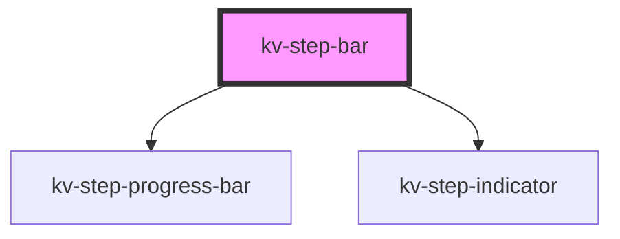

# _<kv-step-bar>_


<!-- Auto Generated Below -->


## Usage

### Angular

```html
<!-- Default -->
<kv-step-bar steps={STEPS} currentStep={1} progressPercentage={50}></kv-step-bar>
```


### React

```tsx
import React from 'react';

import { KvStepBar } from '@kelvininc/react-ui-components';

export const StepBarExample: React.FC = () => {
	const steps = [
		{
			enabled: true,
			active: true
		},
		{
			enabled: true,
			active: true
		},
		{
			enabled: false
		}
	];

	return (
		<>
			{/*-- Default --*/}
			<KvStepBar steps={steps} currentStep={1} progressPercentage={50}></KvStepBar>
		</>
	);
};
```


## Properties

| Property                          | Attribute             | Description                                                                                  | Type               | Default       |
| --------------------------------- | --------------------- | -------------------------------------------------------------------------------------------- | ------------------ | ------------- |
| `currentStep` _(required)_        | `current-step`        | (required) Defines the current step index                                                    | `number`           | `undefined`   |
| `hasError`                        | `has-error`           | (optional) Defines if the progress bar should be in an error state                           | `boolean`          | `undefined`   |
| `label`                           | `label`               | (optional) Defines the label to display next to the step counter (defaults to: "Progress: ") | `string`           | `'Progress:'` |
| `progressPercentage` _(required)_ | `progress-percentage` | (required) Defines the percentage of steps completed                                         | `number`           | `undefined`   |
| `steps` _(required)_              | --                    | (required) Defines the steps array to render                                                 | `IStepIndicator[]` | `undefined`   |


## Events

| Event         | Description                                      | Type                  |
| ------------- | ------------------------------------------------ | --------------------- |
| `stepClicked` | Fires when a step is clicked and emits the index | `CustomEvent<number>` |


## Dependencies

### Depends on

- [kv-step-progress-bar](../step-progress-bar)
- [kv-step-indicator](../step-indicator)

### Graph


----------------------------------------------


