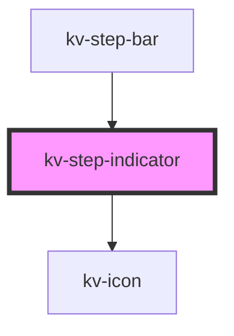

# _<kv-step-circle>_


<!-- Auto Generated Below -->


## Usage

### React

```tsx
import React from 'react';

import { KvStepIndicator } from '@kelvininc/react-ui-components';

export const StepIndicatorExample: React.FC = () => (
	<>
		{/*-- Default --*/}
		<KvStepIndicator></KvStepIndicator>
		{/*-- Enabled --*/}
		<KvStepIndicator enabled></KvStepIndicator>
		{/*-- Active --*/}
		<KvStepIndicator active></KvStepIndicator>
		{/*-- With Error --*/}
		<KvStepIndicator hasError></KvStepIndicator>
	</>
);
```


## Properties

| Property    | Attribute    | Description                                                                | Type      | Default     |
| ----------- | ------------ | -------------------------------------------------------------------------- | --------- | ----------- |
| `active`    | `active`     | (optional) Defines if the step is active                                   | `boolean` | `undefined` |
| `enabled`   | `enabled`    | (optional) Defines if the step is interactable and emits clicks            | `boolean` | `undefined` |
| `hasError`  | `has-error`  | (optional) Defines if the step has an error and applies the border styling | `boolean` | `undefined` |
| `isCurrent` | `is-current` | (optional) Defines if the step is the current step                         | `boolean` | `undefined` |


## Events

| Event              | Description                    | Type                      |
| ------------------ | ------------------------------ | ------------------------- |
| `indicatorClicked` | Fires when the step is clicked | `CustomEvent<MouseEvent>` |


## CSS Custom Properties

| Name                               | Description                                                                         |
| ---------------------------------- | ----------------------------------------------------------------------------------- |
| `--indicator-active-border-color`  | The border color to show when the indicator is active                               |
| `--indicator-active-color`         | The color to show when the indicator is active                                      |
| `--indicator-default-border-color` | The border color to show by default on the indicator                                |
| `--indicator-default-color`        | The color to show by default on the indicator                                       |
| `--indicator-error-border-color`   | The color to show on the border that highlights the indicator when there's an error |
| `--indicator-radius`               | The size of the circle drawn                                                        |


## Dependencies

### Used by

 - [kv-step-bar](../step-bar)

### Depends on

- [kv-icon](../icon)

### Graph


----------------------------------------------


