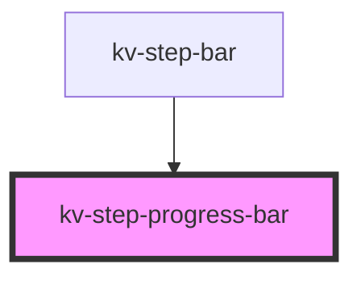

# kv-step-progress-bar


<!-- Auto Generated Below -->


## Usage

### Angular

```html
<!-- Default -->
<kv-step-progress-bar progressPercentage=50></kv-step-progress-bar>
```


### React

```tsx
import React from 'react';

import { KvStepProgressBar } from '@kelvininc/react-ui-components';

export const StepProgressBarExample: React.FC = () => (
	<>
		{/*-- Default --*/}
		<KvStepProgressBar progressPercentage={50}></KvStepProgressBar>
	</>
);
```


## Properties

| Property                          | Attribute             | Description                                                                                                                              | Type      | Default     |
| --------------------------------- | --------------------- | ---------------------------------------------------------------------------------------------------------------------------------------- | --------- | ----------- |
| `hasError`                        | `has-error`           | (optional) Defines if the bar should be in an error state, setting to `true` will change the background color to the defined error color | `boolean` | `undefined` |
| `progressPercentage` _(required)_ | `progress-percentage` | (required) Defines how much space the progress bar should fill                                                                           | `number`  | `undefined` |


## CSS Custom Properties

| Name                                  | Description                                        |
| ------------------------------------- | -------------------------------------------------- |
| `--progress-bar-background-color`     | The color of the progress bar container            |
| `--progress-bar-filler-error-color`   | The color of the progress bar filler when in error |
| `--progress-bar-filler-success-color` | The color of the progress bar filler               |
| `--progress-bar-height`               | The height of the progress bar                     |


## Dependencies

### Used by

 - [kv-step-bar](../step-bar)

### Graph


----------------------------------------------


