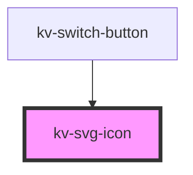

# *<kv-svg-icon>*

## Styling Svg Icon Element

The `kv-svg-icon` element consists only of an icon that is displayed on the view. To customize this, style using a combination of CSS and any of the [CSS custom properties](#css-custom-properties):

```css
kv-svg-icon {
  /* Applies to the icon color */
  --icon-color: #103d73;

  /* Set a different icon height value */
  --icon-heigh: 16px;
  
  /* Set a different icon width value */
  --icon-heigh: 16px;

  /* Set a different icon rotation */
  --icon-rotation: 90deg;
}
```

Alternatively, depending on the [browser support](https://caniuse.com/#feat=mdn-css_selectors_part) needed, CSS shadow parts can be used to style the select:

```css
/* Set the width and height of icon to the full container */
kv-svg-icon::part(icon) {
  width: 100%;
  height: 100%;
}

/* Set the icon color */
kv-svg-icon::part(icon) {
  fill: kv-color(success);
}
```
Notice that by using `::part`, any CSS property on the element can be targeted.  

Additionally, we already have some predefined classes that can be applied to scale and rotate the icon. 

**Sizes**: `icon-8`, `icon-12`, `icon-16`, `icon-20`, `icon-24`, `icon-40`, `icon-full-size` 

**Rotations**:  `rotate-0`, `rotate-45`, `rotate-90`, `rotate-135`, `rotate-180`, `rotate-225`, `rotate-270`, `rotate-315`

<!-- Auto Generated Below -->


## Usage

### Angular

```html
<!-- Default -->
<kv-svg-icon name="kv-logo-kelvin"></kv-svg-icon>

<!-- Custom CSS -->
<kv-svg-icon name="kv-logo-kelvin" customClass="icon-24 rotate-90"><kv-svg-icon>

<!-- Custom Color -->
<kv-svg-icon name="kv-logo-kelvin" customColor="#103d73"><kv-svg-icon>
```


### React

```tsx
import React from 'react';

import { KvSvgIcon } from '@kelvininc/react-ui-components';

export const SvgIconExample: React.FC = () => (
	<>
		{/*-- Default --*/}
		<KvSvgIcon name="kv-logo-kelvin" />

		{/*-- Custom CSS --*/}
		<KvSvgIcon name="kv-logo-kelvin" customClass="icon-24 rotate-90" />

		{/*-- Custom Color --*/}
		<KvSvgIcon name="kv-logo-kelvin" customColor="#103d73" />
	</>
);
```


## Properties

| Property            | Attribute      | Description                                                                                                                 | Type                 | Default     |
| ------------------- | -------------- | --------------------------------------------------------------------------------------------------------------------------- | -------------------- | ----------- |
| `assetsUrl`         | `assets-url`   | (required) Url where assets are public served                                                                               | `string`             | `'/'`       |
| `customClass`       | `custom-class` | (optional) Additional classes to apply for custom CSS. If multiple classes are provided they should be separated by spaces. | `string \| string[]` | `''`        |
| `customColor`       | `custom-color` | (optional) Icon custom color                                                                                                | `string`             | `''`        |
| `name` _(required)_ | `name`         | (required) Icon symbol name                                                                                                 | `string`             | `undefined` |


## Shadow Parts

| Part     | Description         |
| -------- | ------------------- |
| `"icon"` | The icon container. |


## CSS Custom Properties

| Name                            | Description                                        |
| ------------------------------- | -------------------------------------------------- |
| `--icon-color`                  | Color of the icon                                  |
| `--icon-height`                 | Height of icon                                     |
| `--icon-rotation`               | Rotation of icon                                   |
| `--icon-width`                  | Width of icon                                      |
| `--illustration-color`          | Base color used in the illustration                |
| `--illustration-color-dark-35`  | 35% darker version of the illustration base color  |
| `--illustration-color-dark-55`  | 55% darker version of the illustration base color  |
| `--illustration-color-light-80` | 80% lighter version of the illustration base color |
| `--illustration-color-light-90` | 90% lighter version of the illustration base color |
| `--illustration-success-color`  | Success color used in the illustration             |


## Dependencies

### Used by

 - [kv-switch-button](../switch-button)

### Graph


----------------------------------------------


