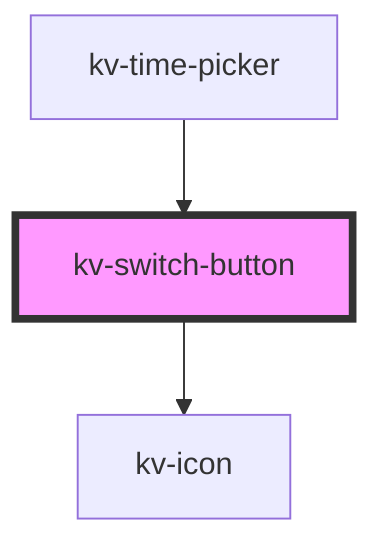

# *<kv-switch-button>*

<!-- Auto Generated Below -->


## Usage

### Javascript

```html
<!-- Default -->
<kv-switch-button></kv-switch-button>

<!-- Disabled -->
<kv-switch-button disabled></kv-switch-button>

<!-- ON/OFF -->
<kv-switch-button state="ON"></kv-switch-button>
<kv-switch-button state="OFF"></kv-switch-button>
```


### React

```tsx
import React from 'react';

import { KvSwitchButton } from '@kelvininc/react-ui-components/client';

export const SwitchButtonExample: React.FC = () => (
  <>
    {/*-- Default --*/}
    <KvSwitchButton/>

	{/*-- Disabled --*/}
	<KvSwitchButton disabled/>

	{/*-- ON/OFF --*/}
	<KvSwitchButton state="ON"/>
	<KvSwitchButton state="OFF"/>
  </>
);

```


### Stencil

```tsx
import { Component, h } from '@stencil/core';

@Component({
  tag: 'switch-button-example',
  styleUrl: 'switch-button-example.css',
  shadow: true,
})
export class SwichButtonExample {
  render() {
    return [
      	// Default
		<kv-switch-button></kv-switch-button>

		// Disabled
		<kv-switch-button disabled></kv-switch-button>

		// ON/OFF
		<kv-switch-button state="ON"></kv-switch-button>
		<kv-switch-button state="OFF"></kv-switch-button>
    ];
  }
}
```


## Properties

| Property   | Attribute  | Description                                                  | Type                                           | Default                |
| ---------- | ---------- | ------------------------------------------------------------ | ---------------------------------------------- | ---------------------- |
| `checked`  | `checked`  | (optional) If `true` the button is ON. Default `false`       | `boolean`                                      | `false`                |
| `disabled` | `disabled` | (optional) If `true` the button is disabled. Default `false` | `boolean`                                      | `false`                |
| `size`     | `size`     | (optional) Button's size. Default `EComponentSize.Large`     | `EComponentSize.Large \| EComponentSize.Small` | `EComponentSize.Large` |


## Events

| Event          | Description                         | Type                   |
| -------------- | ----------------------------------- | ---------------------- |
| `switchChange` | Emitted when switch's state changes | `CustomEvent<boolean>` |


## Shadow Parts

| Part            | Description                       |
| --------------- | --------------------------------- |
| `"button"`      | The switch button.                |
| `"icon-square"` | The switch icon square container. |
| `"icon-svg"`    | The switch icon.                  |


## CSS Custom Properties

| Name                           | Description                                           |
| ------------------------------ | ----------------------------------------------------- |
| `--disabled-background-color`  | Button background color when disabled.                |
| `--off-background-color`       | Button background color when OFF.                     |
| `--on-background-color`        | Button background color when ON.                      |
| `--switch-disabled-icon-color` | Icon square container background color when disabled. |
| `--switch-height-large`        | Switch height when size is large.                     |
| `--switch-height-small`        | Switch height when size is small.                     |
| `--switch-icon-color`          | Icon square container background color.               |
| `--switch-icon-size-large`     | Switch icon size when size is large.                  |
| `--switch-icon-size-small`     | Switch icon size when size is small.                  |
| `--switch-padding-large`       | Switch padding when size is large.                    |
| `--switch-padding-small`       | Switch padding when size is small.                    |
| `--switch-width-large`         | Switch width when size is large.                      |
| `--switch-width-small`         | Switch width when size is small.                      |


## Dependencies

### Used by

 - [kv-time-picker](../time-picker)

### Depends on

- [kv-icon](../icon)

### Graph

```mermaid
graph TD;
  kv-switch-button --> kv-icon
  kv-time-picker --> kv-switch-button
  style kv-switch-button fill:#f9f,stroke:#333,stroke-width:4px
```

----------------------------------------------


