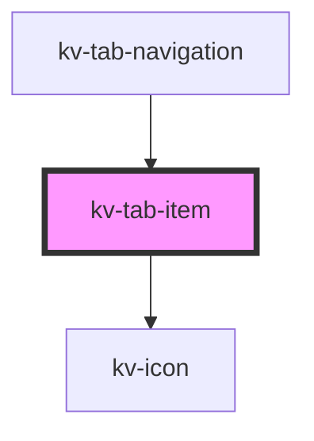

# *<kv-tab-item>*


<!-- Auto Generated Below -->


## Usage

### React

```tsx
import React from 'react';
import { KvTabItem } from '@kelvininc/react-ui-components';

export const TabItemExample: React.FC = () => (
	<>
		{/*-- With required props --*/}
		<KvTabItem tabKey="tab1" label="Tab 1" />

		{/*-- Disabled --*/}
		<KvTabItem tabKey="tab1" label="Tab 1" disabled></KvTabItem>

		{/*-- Selected --*/}
		<KvTabItem tabKey="tab1" label="Tab 1" selected></KvTabItem>

		{/*-- With Notification --*/}
		<KvTabItem tabKey="tab1" label="Tab 1" hasNotification></KvTabItem>

		{/*-- With Notification Color --*/}
		<KvTabItem tabKey="tab1" label="Tab 1" hasNotification notificationColor="#202020"></KvTabItem>
	</>
);
```


## Properties

| Property              | Attribute            | Description                                                                                                                                                                             | Type                                           | Default                |
| --------------------- | -------------------- | --------------------------------------------------------------------------------------------------------------------------------------------------------------------------------------- | ---------------------------------------------- | ---------------------- |
| `customClass`         | `custom-class`       | (optional) Additional classes to apply for custom CSS. If multiple classes are provided they should be separated by spaces. It is also valid to provide CssClassMap with boolean logic. | `CssClassMap \| string \| string[]`            | `''`                   |
| `customStyle`         | --                   | (optional) Additional style to apply for custom CSS.                                                                                                                                    | `{ [key: string]: string; }`                   | `undefined`            |
| `disabled`            | `disabled`           | (optional) To disable this tab                                                                                                                                                          | `boolean`                                      | `false`                |
| `hasNotification`     | `has-notification`   | (optional) To show/hide notification icon or not                                                                                                                                        | `boolean`                                      | `false`                |
| `icon`                | `icon`               | (optional) The tab's icon                                                                                                                                                               | `EIconName \| EOtherIconName`                  | `undefined`            |
| `label` _(required)_  | `label`              | (required) Name to show in UI for this tab                                                                                                                                              | `string`                                       | `undefined`            |
| `notificationColor`   | `notification-color` | (optional) The tab's notification color (hex value, rgb or css var format)                                                                                                              | `string`                                       | `''`                   |
| `selected`            | `selected`           | (optional) To set this tab as the selected one                                                                                                                                          | `boolean`                                      | `false`                |
| `size`                | `size`               | (optional) Sets this tab item to a different styling configuration                                                                                                                      | `EComponentSize.Large \| EComponentSize.Small` | `EComponentSize.Large` |
| `tabKey` _(required)_ | `tab-key`            | (required) A unique identifier for this tab                                                                                                                                             | `number \| string`                             | `undefined`            |


## Events

| Event         | Description                      | Type                            |
| ------------- | -------------------------------- | ------------------------------- |
| `tabSelected` | Emitted when the tab is selected | `CustomEvent<number \| string>` |


## Shadow Parts

| Part     | Description          |
| -------- | -------------------- |
| `"icon"` | The tab's item icon. |


## CSS Custom Properties

| Name                    | Description                       |
| ----------------------- | --------------------------------- |
| `--tab-item-icon-color` | The color of tab navigation icon; |
| `--tab-item-icon-size`  | The size of tab navigation icon;  |


## Dependencies

### Used by

 - [kv-tab-navigation](../tab-navigation)

### Depends on

- [kv-icon](../icon)

### Graph


----------------------------------------------


