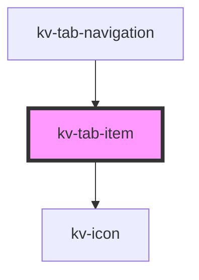

# *<kv-tab-item>*


<!-- Auto Generated Below -->


## Usage

### React

```tsx
import React from 'react';
import { KvTabItem } from '@kelvininc/react-ui-components/client';

export const TabItemExample: React.FC = () => (
	<>
		{/*-- With required props --*/}
		<KvTabItem tabKey="tab1" label="Tab 1" />

		{/*-- Disabled --*/}
		<KvTabItem tabKey="tab1" label="Tab 1" disabled></KvTabItem>

		{/*-- Selected --*/}
		<KvTabItem tabKey="tab1" label="Tab 1" selected></KvTabItem>

		{/*-- With Notification --*/}
		<KvTabItem tabKey="tab1" label="Tab 1" hasNotification></KvTabItem>

		{/*-- With Notification Color --*/}
		<KvTabItem tabKey="tab1" label="Tab 1" hasNotification notificationColor="#202020"></KvTabItem>
	</>
);
```


## Properties

| Property              | Attribute           | Description                                                                                                                                                                             | Type                                             | Default                |
| --------------------- | ------------------- | --------------------------------------------------------------------------------------------------------------------------------------------------------------------------------------- | ------------------------------------------------ | ---------------------- |
| `customAttributes`    | `custom-attributes` | (optional) Custom attributes to be applied to the tab element                                                                                                                           | `{ [x: string]: string; }`                       | `{}`                   |
| `customClass`         | `custom-class`      | (optional) Additional classes to apply for custom CSS. If multiple classes are provided they should be separated by spaces. It is also valid to provide CssClassMap with boolean logic. | `CssClassMap \| string \| string[]`              | `''`                   |
| `customStyle`         | `custom-style`      | (optional) Additional style to apply for custom CSS.                                                                                                                                    | `{ [key: string]: string; }`                     | `undefined`            |
| `disabled`            | `disabled`          | (optional) To disable this tab                                                                                                                                                          | `boolean`                                        | `false`                |
| `icon`                | `icon`              | (optional) Icon to show in UI for this tab                                                                                                                                              | `EIconName`                                      | `undefined`            |
| `label`               | `label`             | (optional) Name to show in UI for this tab                                                                                                                                              | `string`                                         | `undefined`            |
| `selected`            | `selected`          | (optional) To set this tab as the selected one                                                                                                                                          | `boolean`                                        | `false`                |
| `tabKey` _(required)_ | `tab-key`           | (required) A unique identifier for this tab                                                                                                                                             | `number \| string`                               | `undefined`            |
| `type`                | `type`              | (optional) Sets this tab item to a different styling configuration                                                                                                                      | `ETabItemType.Primary \| ETabItemType.Secondary` | `ETabItemType.Primary` |


## Events

| Event         | Description                      | Type                            |
| ------------- | -------------------------------- | ------------------------------- |
| `tabSelected` | Emitted when the tab is selected | `CustomEvent<number \| string>` |


## Dependencies

### Used by

 - [kv-tab-navigation](../tab-navigation)

### Depends on

- [kv-icon](../icon)

### Graph

```mermaid
graph TD;
  kv-tab-item --> kv-icon
  kv-tab-navigation --> kv-tab-item
  style kv-tab-item fill:#f9f,stroke:#333,stroke-width:4px
```

----------------------------------------------


