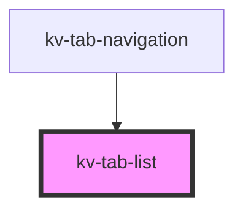

# *<kv-tab-navigation>*


<!-- Auto Generated Below -->


## Usage

### Angular

```html
<!-- With required props -->
<kv-tab-list selectedTabKey="tab1">
	<kv-tab-item tabKey="tab1" label="Tab 1" />
	<kv-tab-item tabKey="tab2" label="Tab 2" />
	<kv-tab-item tabKey="tab3" label="Tab 3" />
</kv-tab-list>
```


### React

```tsx
import React from 'react';
import { KvTabItem, KvTabList } from '@kelvininc/react-ui-components';

export const TabListExample: React.FC = () => (
	<>
		{/*-- With required props --*/}
		<KvTabList selectedTabKey="tab1">
			<KvTabItem tabKey="tab1" label="Tab 1" />
			<KvTabItem tabKey="tab2" label="Tab 2" />
			<KvTabItem tabKey="tab3" label="Tab 3" />
		</KvTabList>
	</>
);
```


## Properties

| Property                      | Attribute          | Description                                                                                   | Type                                           | Default                |
| ----------------------------- | ------------------ | --------------------------------------------------------------------------------------------- | ---------------------------------------------- | ---------------------- |
| `selectedTabKey` _(required)_ | `selected-tab-key` | (required) The currently selected tab's key (unique identifier)                               | `number \| string`                             | `undefined`            |
| `size`                        | `size`             | (optional) Sets the items on this tab list to use a different styling configuration           | `EComponentSize.Large \| EComponentSize.Small` | `EComponentSize.Large` |
| `tabs` _(required)_           | --                 | (required) The tab items to render in this component to force re-renders when the tabs change | `ITabNavigationItem[]`                         | `undefined`            |


## CSS Custom Properties

| Name                         | Description                  |
| ---------------------------- | ---------------------------- |
| `--tab-list-bg-color`        | Background color of the list |
| `--tab-list-indicator-color` | Tab indicator bar color      |


## Dependencies

### Used by

 - [kv-tab-navigation](../tab-navigation)

### Graph


----------------------------------------------


