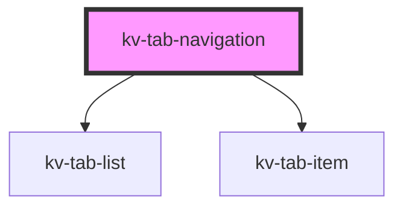

# kv-tab-navigation


<!-- Auto Generated Below -->


## Usage

### Angular

```html
<!-- With required props -->
<kv-tab-navigation [tabs]="myNavigationTabs" selectedTabKey="tab1"></kv-tab-navigation>

<!-- With required props and notification -->
<kv-tab-navigation [tabs]="myNavigationTabs" selectedTabKey="tab1" [notifications]="myNavigationTabsNotifications"></kv-tab-navigation>
```


### React

```tsx
import React from 'react';
import { KvTabNavigation } from '@kelvininc/react-ui-components';

export const TabNavigationExample: React.FC = () => (
	<>
		{/*-- With required props --*/}
		<KvTabNavigation tabs={myNavigationTabs} selectedTabKey="tab1"></KvTabNavigation>

		{/*-- With required props and notification --*/}
		<KvTabNavigation
			tabs={myNavigationTabs}
			selectedTabKey="tab1"
			notifications={myNavigationTabsNotifications}>
		</KvTabNavigation>
	</>
);
```


## Properties

| Property            | Attribute          | Description                                                                     | Type                                           | Default                |
| ------------------- | ------------------ | ------------------------------------------------------------------------------- | ---------------------------------------------- | ---------------------- |
| `notifications`     | --                 | (optional) To add a notification dot and its respective color to a specific tab | `ITabsNotificationDict`                        | `{}`                   |
| `selectedTabKey`    | `selected-tab-key` | (optional) The currently selected tab key                                       | `number \| string`                             | `undefined`            |
| `size`              | `size`             | (optional) Sets the items on this tab nav to use small styling configuration    | `EComponentSize.Large \| EComponentSize.Small` | `EComponentSize.Large` |
| `tabs` _(required)_ | --                 | (required) The tab items to render in this component                            | `ITabNavigationItem[]`                         | `undefined`            |


## Events

| Event       | Description                                                  | Type                  |
| ----------- | ------------------------------------------------------------ | --------------------- |
| `tabChange` | When the tab selection changes, emit the requested tab's key | `CustomEvent<string>` |


## Dependencies

### Depends on

- [kv-tab-list](../tab-list)
- [kv-tab-item](../tab-item)

### Graph


----------------------------------------------


