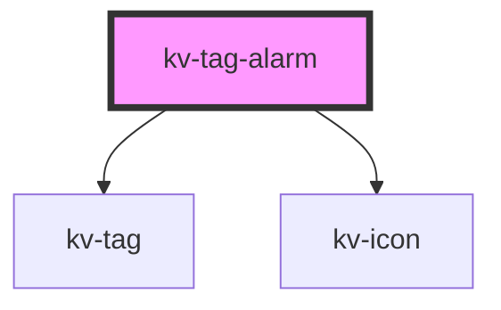

# kv-tag-alarm


<!-- Auto Generated Below -->


## Usage

### Angular

```html
<!-- Default -->
<kv-tag-alarm [severity]="EAlarmSeverity.One" size="small" />
<!-- Custom Label -->
<kv-tag-alarm [severity]="EAlarmSeverity.One" size="small" label="example"/>
<!-- Only with icon -->
<kv-tag-alarm [severity]="EAlarmSeverity.One" size="small" hideLabel="true"/>
```


### React

```tsx
import React from 'react';

import { KvTagAlarm } from '@kelvininc/react-ui-components';

export const TagLetterExample: React.FC = () => (
  <>
    {/*-- Default --*/}
	<KvTagAlarm severity={EAlarmSeverity.One} size={ETagAlarmSize.Normal}/>

	{/*-- Custom Label --*/}
	<KvTagAlarm severity={EAlarmSeverity.One} label="Example" size={ETagAlarmSize.Normal} />

	{/*-- Only with icon --*/}
	<KvTagAlarm severity={EAlarmSeverity.One} hideLabel={true} />
  </>
);

```


## Properties

| Property                | Attribute    | Description                   | Type                                                                                                                  | Default                |
| ----------------------- | ------------ | ----------------------------- | --------------------------------------------------------------------------------------------------------------------- | ---------------------- |
| `hideLabel`             | `hide-label` | (optional) Hide alarm label   | `boolean`                                                                                                             | `false`                |
| `label`                 | `label`      | (optional) Alarm custom label | `string`                                                                                                              | `''`                   |
| `severity` _(required)_ | `severity`   | (required) Alarm Severity     | `EAlarmSeverity.Five \| EAlarmSeverity.Four \| EAlarmSeverity.One \| EAlarmSeverity.Three \| EAlarmSeverity.Two`      | `undefined`            |
| `size`                  | `size`       | (optional) Tag Alarm Size     | `ETagAlarmSize.Large \| ETagAlarmSize.Normal \| ETagAlarmSize.Small \| ETagAlarmSize.XSmall \| ETagAlarmSize.XXSmall` | `ETagAlarmSize.Normal` |


## Dependencies

### Depends on

- [kv-tag](../tag)
- [kv-icon](../icon)

### Graph


----------------------------------------------


