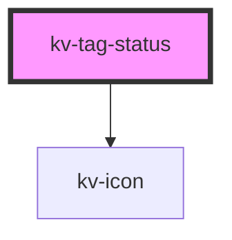

# kv-tag-status


<!-- Auto Generated Below -->


## Usage

### Angular

```html
<!-- Default -->
<kv-tag-status />

<!-- With Type -->
<kv-tag-status [type]="ETagStatusType.Running" />
```


### React

```tsx
import React from 'react';

import { KvTagStatus, ETagStatusType } from '@kelvininc/react-ui-components';

export const TagStatusExample: React.FC = () => (
	<>
		{/*-- Default --*/}
		<KvTagStatus />

		{/*-- With Type --*/}
		<KvTagStatus type={ETagStatusType.Running} />
	</>
);
```


## Properties

| Property | Attribute | Description                             | Type                                                                                                                                                                                 | Default                  |
| -------- | --------- | --------------------------------------- | ------------------------------------------------------------------------------------------------------------------------------------------------------------------------------------ | ------------------------ |
| `type`   | `type`    | (optional) Defines the status tag type. | `ETagStatusType.Failed \| ETagStatusType.Offline \| ETagStatusType.Online \| ETagStatusType.Partially \| ETagStatusType.Pending \| ETagStatusType.Running \| ETagStatusType.Unknown` | `ETagStatusType.Unknown` |


## Dependencies

### Depends on

- [kv-icon](../icon)

### Graph


----------------------------------------------


