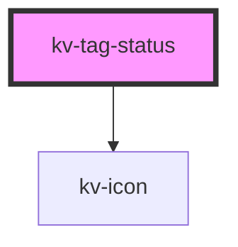

# kv-tag-status


<!-- Auto Generated Below -->


## Usage

### Angular

```html
<!-- Default -->
<kv-tag-status [state]="ETagState.Error" [icon]="EIconName.Error" label="Failed"/>

<!-- Without label -->
<kv-tag-status [state]="ETagState.Error" [icon]="EIconName.Error" />
```


### React

```tsx
import React from 'react';

import { KvTagStatus, ETagStatusType } from '@kelvininc/react-ui-components';

export const TagStatusExample: React.FC = () => (
	<>
		{/*-- Default --*/}
		<KvTagStatus state={ETagState.Error} icon={EIconName.Error} label="Failed"/>

		{/*-- Without label --*/}
		<KvTagStatus state={ETagState.Error} icon={EIconName.Error} />
	</>
);
```


## Properties

| Property             | Attribute | Description                                  | Type                                                                                               | Default     |
| -------------------- | --------- | -------------------------------------------- | -------------------------------------------------------------------------------------------------- | ----------- |
| `icon` _(required)_  | `icon`    | (required) Defines the icon to be displayed. | `EIconName \| EOtherIconName`                                                                      | `undefined` |
| `label`              | `label`   | (optional) Defines the content of the label. | `string`                                                                                           | `undefined` |
| `state` _(required)_ | `state`   | (required) Defines the color of the icon.    | `ETagState.Error \| ETagState.Info \| ETagState.Success \| ETagState.Unknown \| ETagState.Warning` | `undefined` |


## Dependencies

### Depends on

- [kv-icon](../icon)

### Graph


----------------------------------------------


