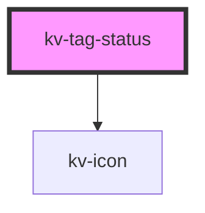

# kv-tag-status

<!-- Auto Generated Below -->


## Usage

### Angular

```html
<!-- Default -->
<kv-tag-status [state]="ETagState.Error" [icon]="EIconName.Error" label="Failed"/>

<!-- Without label -->
<kv-tag-status [state]="ETagState.Error" [icon]="EIconName.Error" />
```


### React

```tsx
import React from 'react';

import { KvTagStatus, ETagStatusType } from '@kelvininc/react-ui-components';

export const TagStatusExample: React.FC = () => (
	<>
		{/*-- Default --*/}
		<KvTagStatus state={ETagState.Error} icon={EIconName.Error} label="Failed"/>

		{/*-- Without label --*/}
		<KvTagStatus state={ETagState.Error} icon={EIconName.Error} />
	</>
);
```


## Properties

| Property             | Attribute | Description                                  | Type                                                                                               | Default     |
| -------------------- | --------- | -------------------------------------------- | -------------------------------------------------------------------------------------------------- | ----------- |
| `icon` _(required)_  | `icon`    | (required) Defines the icon to be displayed. | `EIconName \| EOtherIconName`                                                                      | `undefined` |
| `label`              | `label`   | (optional) Defines the content of the label. | `string`                                                                                           | `undefined` |
| `state` _(required)_ | `state`   | (required) Defines the color of the icon.    | `ETagState.Error \| ETagState.Info \| ETagState.Success \| ETagState.Unknown \| ETagState.Warning` | `undefined` |


## Shadow Parts

| Part      | Description        |
| --------- | ------------------ |
| `"label"` | The label element. |


## CSS Custom Properties

| Name                                         | Description                                      |
| -------------------------------------------- | ------------------------------------------------ |
| `--tag-status-gap`                           | Tag status gap between label and icon in pixels. |
| `--tag-status-icon-error-background-color`   | Tag status icon error background color.          |
| `--tag-status-icon-error-color`              | Tag status icon error color.                     |
| `--tag-status-icon-info-background-color`    | Tag status icon info background color.           |
| `--tag-status-icon-info-color`               | Tag status icon info color.                      |
| `--tag-status-icon-size`                     | Tag status icon width and height in pixels.      |
| `--tag-status-icon-success-background-color` | Tag status icon success background color.        |
| `--tag-status-icon-success-color`            | Tag status icon success color.                   |
| `--tag-status-icon-unknown-background-color` | Tag status icon unknown background color.        |
| `--tag-status-icon-unknown-color`            | Tag status icon unknown color.                   |
| `--tag-status-icon-warning-background-color` | Tag status icon warning background color.        |
| `--tag-status-icon-warning-color`            | Tag status icon warning color.                   |
| `--tag-status-label-color`                   | Tag status label text color.                     |


## Dependencies

### Depends on

- [kv-icon](../icon)

### Graph


----------------------------------------------


