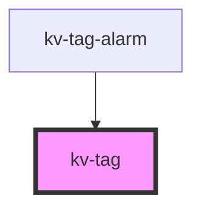

# kv-tag

<!-- Auto Generated Below -->


## Usage

### React

```tsx
import React from 'react';

import { KvTag } from '@kelvininc/react-ui-components';

export const TagExample: React.FC = () => (
  <>
    {/*-- Default --*/}
	<KvTag label="Tag Label" />
  </>
);

```


## Properties

| Property | Attribute | Description          | Type     | Default     |
| -------- | --------- | -------------------- | -------- | ----------- |
| `label`  | `label`   | (optional) Tag label | `string` | `undefined` |


## CSS Custom Properties

| Name                     | Description                |
| ------------------------ | -------------------------- |
| `--tag-background-color` | Tag Background Color.      |
| `--tag-border-color`     | Tag Border Color.          |
| `--tag-content-gap`      | Gap between text and slot. |
| `--tag-content-padding`  | Padding insise content     |
| `--tag-label-color`      | Tag Text Color.            |


## Dependencies

### Used by

 - [kv-tag-alarm](../tag-alarm)

### Graph


----------------------------------------------


