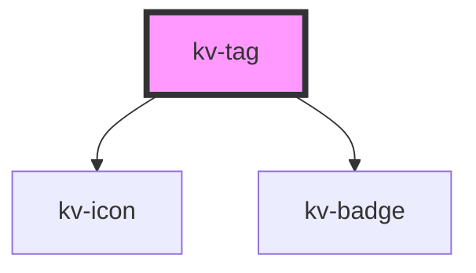

# kv-tag

<!-- Auto Generated Below -->


## Usage

### React

```tsx
import React from 'react';

import { KvTag } from '@kelvininc/react-ui-components/client';

export const TagExample: React.FC = () => (
  <>
    {/*-- Default --*/}
	<KvTag label="Tag Label" />
  </>
);

```


## Properties

| Property     | Attribute     | Description                                            | Type                                                                                                                                 | Default             |
| ------------ | ------------- | ------------------------------------------------------ | ------------------------------------------------------------------------------------------------------------------------------------ | ------------------- |
| `badgeLabel` | `badge-label` | (optional) Badge label displayed at the end of the tag | `string \| undefined`                                                                                                                | `undefined`         |
| `color`      | `color`       | (optional) Tag color variant                           | `ETagColor.Blue \| ETagColor.Brand \| ETagColor.Green \| ETagColor.Neutral \| ETagColor.Purple \| ETagColor.Red \| ETagColor.Yellow` | `ETagColor.Neutral` |
| `icon`       | `icon`        | (optional) Icon to display inside the tag              | `EIconName \| undefined`                                                                                                             | `undefined`         |
| `label`      | `label`       | (optional) Tag label                                   | `string \| undefined`                                                                                                                | `undefined`         |


## CSS Custom Properties

| Name                           | Description                        |
| ------------------------------ | ---------------------------------- |
| `--tag-background-color`       | Tag background color.              |
| `--tag-badge-background-color` | Tag badge background color.        |
| `--tag-badge-color`            | Tag badge text color.              |
| `--tag-border-color`           | Tag border color.                  |
| `--tag-content-gap`            | Gap between icon, label and badge. |
| `--tag-content-padding-x`      | Horizontal padding inside the tag. |
| `--tag-content-padding-y`      | Vertical padding inside the tag.   |
| `--tag-icon-color`             | Tag icon color.                    |
| `--tag-label-color`            | Tag label text color.              |


## Dependencies

### Depends on

- [kv-icon](../icon)
- [kv-badge](../badge)

### Graph

```mermaid
graph TD;
  kv-tag --> kv-icon
  kv-tag --> kv-badge
  style kv-tag fill:#f9f,stroke:#333,stroke-width:4px
```

----------------------------------------------


