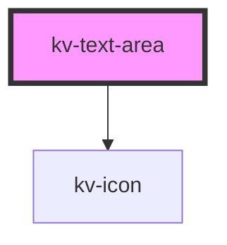

# _<kv-text-area>_


<!-- Auto Generated Below -->


## Usage

### Angular

```html
<!-- Default -->
<kv-text-area
	maxCharLength={100}
	onTextChange="handleTextChange($event)"
	onTextBlur="handleTextBlur($event)"
/>

<!-- With Icon -->
<kv-text-area
	[icon]="EIconName.Notes"
	maxCharLength=100
	onTextChange="handleTextChange($event)"
	onTextBlur="handleTextBlur($event)"
/>

<!-- With Text -->
<kv-text-area
	[text]="text"
	maxCharLength=100
	onTextChange="handleTextChange($event)"
	onTextBlur="handleTextBlur($event)"
/>

<!-- With Text and Placeholder -->
<kv-text-area
	[text]="text"
	placeholder="Add Description"
	maxCharLength=100
	onTextChange="handleTextChange($event)"
	onTextBlur="handleTextBlur($event)"
/>
```


### React

```tsx

import React from 'react';

import { KvTextArea } from '@kelvininc/react-ui-components';

export const TextAreaExample: React.FC = () => (
	<>
		{/**-- Default --*/}
		<KvTextArea
			maxCharLength={100}
			onTextChange={handleTextChange}
			onTextBlur={handleTextBlur}
		/>
		{/**-- With Icon --*/}
		<KvTextArea
			icon={EIconName.Notes}
			maxCharLength={100}
			onTextChange={handleTextChange}
			onTextBlur={handleTextBlur}
		/>
		{/**-- With Text --*/}
		<KvTextArea
			text={text}
			maxCharLength={100}
			onTextChange={handleTextChange}
			onTextBlur={handleTextBlur}
		/>
		{/**-- With Text and Placeholder --*/}
		<KvTextArea
			text={text}
			placeholder="Add Description"
			maxCharLength={100}
			onTextChange={handleTextChange}
			onTextBlur={handleTextBlur}
		/>
	</>
);
```


## Properties

| Property        | Attribute         | Description                                                        | Type                          | Default     |
| --------------- | ----------------- | ------------------------------------------------------------------ | ----------------------------- | ----------- |
| `counter`       | `counter`         | (optional) If `true` the chars counter is displayed. Default: true | `boolean`                     | `true`      |
| `icon`          | `icon`            | (optional) Icon to show to the left of the text field              | `EIconName \| EOtherIconName` | `undefined` |
| `maxCharLength` | `max-char-length` | (optional) The maximum number of characters allowed                | `number`                      | `undefined` |
| `placeholder`   | `placeholder`     | (optional) The placeholder to show in the text area                | `string`                      | `undefined` |
| `text`          | `text`            | (optional) The text to show inside the text area                   | `string`                      | `undefined` |


## Events

| Event        | Description                                  | Type                  |
| ------------ | -------------------------------------------- | --------------------- |
| `textChange` | Emits the current text when there's a change | `CustomEvent<string>` |


## CSS Custom Properties

| Name               | Description                                      |
| ------------------ | ------------------------------------------------ |
| `--height-active`  | The height of the text are when is focused.      |
| `--height-default` | The height of the text area when is not focused. |


## Dependencies

### Depends on

- [kv-icon](../icon)

### Graph


----------------------------------------------


