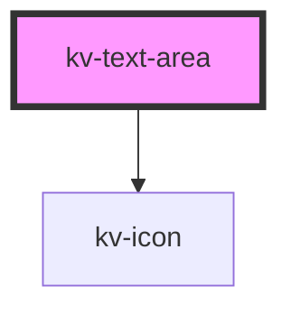

# _<kv-text-area>_


<!-- Auto Generated Below -->


## Usage

### React

The character count uses a reserved footer inside the control's bottom-right corner. The editable
content scrolls above it. `counter={false}` hides the count, and `counterAlwaysVisible` shows it without focus.

```tsx

import React from 'react';

import { KvTextArea } from '@kelvininc/react-ui-components/client';

export const TextAreaExample: React.FC = () => (
	<>
		{/**-- Default --*/}
		<KvTextArea
			maxCharLength={100}
			onTextChange={handleTextChange}
			onTextBlur={handleTextBlur}
		/>
		{/**-- With Icon --*/}
		<KvTextArea
			icon={EIconName.Notes}
			maxCharLength={100}
			onTextChange={handleTextChange}
			onTextBlur={handleTextBlur}
		/>
		{/**-- With Text --*/}
		<KvTextArea
			text={text}
			maxCharLength={100}
			onTextChange={handleTextChange}
			onTextBlur={handleTextBlur}
		/>
		{/**-- With Text and Placeholder --*/}
		<KvTextArea
			text={text}
			placeholder="Add Description"
			maxCharLength={100}
			onTextChange={handleTextChange}
			onTextBlur={handleTextBlur}
		/>
	</>
);
```


## Properties

| Property                        | Attribute                         | Description                                                                                                                                                  | Type                                                                          | Default                 |
| ------------------------------- | --------------------------------- | ------------------------------------------------------------------------------------------------------------------------------------------------------------ | ----------------------------------------------------------------------------- | ----------------------- |
| `accessibleDescriptionElements` | `accessible-description-elements` | Elements describing the editable area, including help in an ancestor tree. Clear with an empty array.                                                        | `readonly Element[]`                                                          | `undefined`             |
| `accessibleLabel`               | `accessible-label`                | (optional) Accessible name for the editable area. A visible label outside the component can't name it across the shadow root, so pass that label's text here | `string`                                                                      | `undefined`             |
| `counter`                       | `counter`                         | (optional) If `true` the chars counter is displayed. Default: `true`                                                                                         | `boolean`                                                                     | `true`                  |
| `counterAlwaysVisible`          | `counter-always-visible`          | (optional) If `true` the counter is always visible (not only on focus). Default: `false`                                                                     | `boolean`                                                                     | `false`                 |
| `disabled`                      | `disabled`                        | (optional) If `true` the text area is disabled. Default: `false`.                                                                                            | `boolean`                                                                     | `false`                 |
| `icon`                          | `icon`                            | (optional) Icon to show to the left of the text field                                                                                                        | `EIconName`                                                                   | `undefined`             |
| `maxCharLength`                 | `max-char-length`                 | (optional) The maximum number of characters allowed                                                                                                          | `number`                                                                      | `undefined`             |
| `placeholder`                   | `placeholder`                     | (optional) The placeholder to show in the text area                                                                                                          | `string`                                                                      | `undefined`             |
| `state`                         | `state`                           | (optional) The validation state. Default: `EValidationState.None`.                                                                                           | `EValidationState.Invalid \| EValidationState.None \| EValidationState.Valid` | `EValidationState.None` |
| `text`                          | `text`                            | (optional) The text to show inside the text area                                                                                                             | `string`                                                                      | `undefined`             |


## Events

| Event        | Description                                  | Type                  |
| ------------ | -------------------------------------------- | --------------------- |
| `textChange` | Emits the current text when there's a change | `CustomEvent<string>` |


## CSS Custom Properties

| Name                          | Description                                          |
| ----------------------------- | ---------------------------------------------------- |
| `--background-color-default`  | The background color of the text area.               |
| `--background-color-disabled` | The background color of the text area when disabled. |
| `--border-color-disabled`     | Border color when the text area is disabled.         |
| `--border-color-error`        | Border color when state is invalid.                  |
| `--height-active`             | The height of the text are when is focused.          |
| `--height-default`            | The height of the text area when is not focused.     |


## Dependencies

### Depends on

- [kv-icon](../icon)

### Graph

```mermaid
graph TD;
  kv-text-area --> kv-icon
  style kv-text-area fill:#f9f,stroke:#333,stroke-width:4px
```

----------------------------------------------


