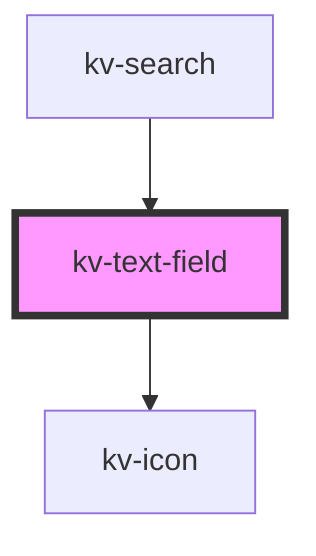

# *<kv-text-field>*


<!-- Auto Generated Below -->


## Usage

### Angular / javascript

```html
<!-- Default -->
<kv-text-field></kv-text-field>

<!-- Labeled -->
<kv-text-field label="Text Field"></kv-text-field>

<!-- Disabled -->
<kv-text-field disabled></kv-text-field>
```


### React

```tsx
import React from 'react';

import { KvTextField } from '@kelvininc/react-ui-components';

export const TextFieldExample: React.FC = () => (
	<>
		{/*-- Default --*/}
		<KvTextField />

		{/*-- Labeled --*/}
		<KvTextField label="Text Field" />

		{/*-- Disabled --*/}
		<KvTextField disabled />
	</>
);

```


### Stencil

```tsx
import { Component, h } from '@stencil/core';

@Component({
	tag: 'text-field-example',
	styleUrl: 'text-field-example.css',
	shadow: true,
})
export class TextFieldExample {
	render() {
		return [
			// Default
			<kv-text-field></kv-text-field>

			// Labeled
			<kv-text-field label="Text Field"></kv-text-field>

			// Disabled
			<kv-text-field disabled></kv-text-field>
		];
	}
}

```


## Properties

| Property            | Attribute     | Description                                                        | Type                                                                                                     | Default                 |
| ------------------- | ------------- | ------------------------------------------------------------------ | -------------------------------------------------------------------------------------------------------- | ----------------------- |
| `disabled`          | `disabled`    | (optional) Text field disabled                                     | `boolean`                                                                                                | `false`                 |
| `helpText`          | `help-text`   | (optional) Text field help text                                    | `string \| string[]`                                                                                     | `[]`                    |
| `icon`              | `icon`        | (optional) Text field's icon symbol name                           | `EIconName \| EOtherIconName`                                                                            | `undefined`             |
| `inputName`         | `input-name`  | (optional) Text field input name                                   | `string`                                                                                                 | `undefined`             |
| `label`             | `label`       | (optional) Text field label                                        | `string`                                                                                                 | `undefined`             |
| `loading`           | `loading`     | (optional) Text field loading state                                | `boolean`                                                                                                | `false`                 |
| `max`               | `max`         | (optional) Text field max characters                               | `number`                                                                                                 | `undefined`             |
| `placeholder`       | `placeholder` | (optional) Text field place holder                                 | `string`                                                                                                 | `undefined`             |
| `required`          | `required`    | (optional) Text field required                                     | `boolean`                                                                                                | `false`                 |
| `size`              | `size`        | (optional) Sets this tab item to a different styling configuration | `EComponentSize.Large \| EComponentSize.Small`                                                           | `EComponentSize.Large`  |
| `state`             | `state`       | (optional) Text field state                                        | `EValidationState.Invalid \| EValidationState.None \| EValidationState.Valid`                            | `EValidationState.None` |
| `type` _(required)_ | `type`        | (optional) Text field type                                         | `EInputFieldType.DateTime \| EInputFieldType.Number \| EInputFieldType.Password \| EInputFieldType.Text` | `undefined`             |
| `value`             | `value`       | Text field value                                                   | `string`                                                                                                 | `undefined`             |


## Events

| Event           | Description                             | Type                  |
| --------------- | --------------------------------------- | --------------------- |
| `textChange`    | Emitted when text field's value changes | `CustomEvent<string>` |
| `textFieldBlur` | Emitted when text field lost focus      | `CustomEvent<string>` |


## CSS Custom Properties

| Name                             | Description                              |
| -------------------------------- | ---------------------------------------- |
| `--background-color-default`     | Background color when state is default.  |
| `--background-color-disabled`    | Background color when state is disabled. |
| `--border-color-default`         | Border color when state is default.      |
| `--border-color-error`           | Border color when state is invalid.      |
| `--border-color-focused`         | Border color when state is focused.      |
| `--input-height-large`           | Text Field's large height.               |
| `--input-height-small`           | Text Field's small height.               |
| `--right-slot-width`             | right slot width.                        |
| `--text-color-help-text-default` | Help Text color when state is default.   |
| `--text-color-help-text-error`   | Help Text color when state is invalid.   |
| `--text-color-icon-default`      | Icon color when state is default.        |
| `--text-color-icon-disabled`     | Icon color when state is disabled.       |
| `--text-color-input-default`     | Input Text color when state is default.  |
| `--text-color-input-disabled`    | Input Text color when state is disabled. |
| `--text-color-input-focused`     | Input Text color when state is focused.  |
| `--text-color-label`             | Label Text color.                        |


## Dependencies

### Used by

 - [kv-search](../search)

### Depends on

- [kv-icon](../icon)

### Graph


----------------------------------------------


