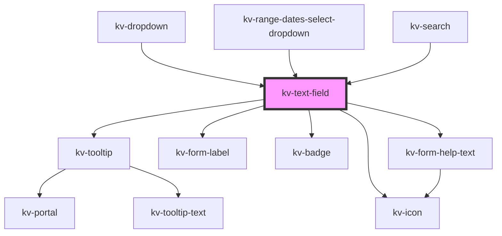

# _<kv-text-field>_

<!-- Auto Generated Below -->


## Usage

### Angular / javascript

```html
<!-- Default -->
<kv-text-field></kv-text-field>

<!-- Labeled -->
<kv-text-field label="Text Field"></kv-text-field>

<!-- Disabled -->
<kv-text-field disabled></kv-text-field>
```


### React

```tsx
import React from 'react';

import { KvTextField } from '@kelvininc/react-ui-components';

export const TextFieldExample: React.FC = () => (
	<>
		{/*-- Default --*/}
		<KvTextField />

		{/*-- Labeled --*/}
		<KvTextField label="Text Field" />

		{/*-- Disabled --*/}
		<KvTextField disabled />
	</>
);

```


### Stencil

```tsx
import { Component, h } from '@stencil/core';

@Component({
	tag: 'text-field-example',
	styleUrl: 'text-field-example.css',
	shadow: true,
})
export class TextFieldExample {
	render() {
		return [
			// Default
			<kv-text-field></kv-text-field>

			// Labeled
			<kv-text-field label="Text Field"></kv-text-field>

			// Disabled
			<kv-text-field disabled></kv-text-field>
		];
	}
}

```


## Properties

| Property         | Attribute          | Description                                                                        | Type                                                                                                                                                                                                                                                                                                                                                                                                                                                                                                                                                                                                                               | Default                 |
| ---------------- | ------------------ | ---------------------------------------------------------------------------------- | ---------------------------------------------------------------------------------------------------------------------------------------------------------------------------------------------------------------------------------------------------------------------------------------------------------------------------------------------------------------------------------------------------------------------------------------------------------------------------------------------------------------------------------------------------------------------------------------------------------------------------------- | ----------------------- |
| `actionIcon`     | `action-icon`      | (optional) Icon that is added on the right of the input. Its clickable.            | `EIconName \| EOtherIconName`                                                                                                                                                                                                                                                                                                                                                                                                                                                                                                                                                                                                      | `undefined`             |
| `badge`          | `badge`            | (optional) Text to display inside a badge on the right side of the displayed value | `string`                                                                                                                                                                                                                                                                                                                                                                                                                                                                                                                                                                                                                           | `undefined`             |
| `disabled`       | `disabled`         | (optional) Text field disabled                                                     | `boolean`                                                                                                                                                                                                                                                                                                                                                                                                                                                                                                                                                                                                                          | `false`                 |
| `examples`       | --                 | (optional) Text field example values                                               | `string[]`                                                                                                                                                                                                                                                                                                                                                                                                                                                                                                                                                                                                                         | `undefined`             |
| `forcedFocus`    | `forced-focus`     | (optional) Text field focus state                                                  | `boolean`                                                                                                                                                                                                                                                                                                                                                                                                                                                                                                                                                                                                                          | `false`                 |
| `helpText`       | `help-text`        | (optional) Text field help text                                                    | `string \| string[]`                                                                                                                                                                                                                                                                                                                                                                                                                                                                                                                                                                                                               | `[]`                    |
| `icon`           | `icon`             | (optional) Text field's icon symbol name                                           | `EIconName \| EOtherIconName`                                                                                                                                                                                                                                                                                                                                                                                                                                                                                                                                                                                                      | `undefined`             |
| `inputMaskRegex` | `input-mask-regex` | (optional) Input mask regex                                                        | `string`                                                                                                                                                                                                                                                                                                                                                                                                                                                                                                                                                                                                                           | `''`                    |
| `inputName`      | `input-name`       | (optional) Text field input name                                                   | `string`                                                                                                                                                                                                                                                                                                                                                                                                                                                                                                                                                                                                                           | `undefined`             |
| `label`          | `label`            | (optional) Text field label                                                        | `string`                                                                                                                                                                                                                                                                                                                                                                                                                                                                                                                                                                                                                           | `undefined`             |
| `loading`        | `loading`          | (optional) Text field loading state                                                | `boolean`                                                                                                                                                                                                                                                                                                                                                                                                                                                                                                                                                                                                                          | `false`                 |
| `max`            | `max`              | (optional) Text field maximum value                                                | `number \| string`                                                                                                                                                                                                                                                                                                                                                                                                                                                                                                                                                                                                                 | `undefined`             |
| `maxLength`      | `max-length`       | (optional) Text field maximum number of characters required                        | `number`                                                                                                                                                                                                                                                                                                                                                                                                                                                                                                                                                                                                                           | `undefined`             |
| `min`            | `min`              | (optional) Text field minimum value                                                | `number \| string`                                                                                                                                                                                                                                                                                                                                                                                                                                                                                                                                                                                                                 | `undefined`             |
| `minLength`      | `min-length`       | (optional) Text field minimum number of characters required                        | `number`                                                                                                                                                                                                                                                                                                                                                                                                                                                                                                                                                                                                                           | `undefined`             |
| `placeholder`    | `placeholder`      | (optional) Text field place holder                                                 | `string`                                                                                                                                                                                                                                                                                                                                                                                                                                                                                                                                                                                                                           | `''`                    |
| `readonly`       | `readonly`         | (optional) Text field is readonly                                                  | `boolean`                                                                                                                                                                                                                                                                                                                                                                                                                                                                                                                                                                                                                          | `false`                 |
| `required`       | `required`         | (optional) Text field required                                                     | `boolean`                                                                                                                                                                                                                                                                                                                                                                                                                                                                                                                                                                                                                          | `false`                 |
| `size`           | `size`             | (optional) Sets this tab item to a different styling configuration                 | `EComponentSize.Large \| EComponentSize.Small`                                                                                                                                                                                                                                                                                                                                                                                                                                                                                                                                                                                     | `EComponentSize.Large`  |
| `state`          | `state`            | (optional) Text field state                                                        | `EValidationState.Invalid \| EValidationState.None \| EValidationState.Valid`                                                                                                                                                                                                                                                                                                                                                                                                                                                                                                                                                      | `EValidationState.None` |
| `step`           | `step`             | (optional) Text field interval between legal numbers                               | `number \| string`                                                                                                                                                                                                                                                                                                                                                                                                                                                                                                                                                                                                                 | `undefined`             |
| `tooltipConfig`  | --                 | (optional) Text field tooltip configuration                                        | `{ text?: string; position?: ETooltipPosition; allowedPositions?: ETooltipPosition[]; options?: Partial<{ placement?: Placement; strategy?: Strategy; middleware?: (false \| { name: string; options?: any; fn: (state: { x: number; y: number; initialPlacement: Placement; platform: Platform; placement: Placement; strategy: Strategy; middlewareData: MiddlewareData; rects: ElementRects; elements: Elements; }) => Promisable<MiddlewareReturn>; })[]; platform?: Platform; }>; disabled?: boolean; contentElement?: HTMLElement; truncate?: boolean; delay?: number; withArrow?: boolean; customClass?: CustomCssClass; }` | `undefined`             |
| `type`           | `type`             | (optional) Text field type                                                         | `EInputFieldType.Date \| EInputFieldType.DateTime \| EInputFieldType.Email \| EInputFieldType.Number \| EInputFieldType.Password \| EInputFieldType.Radio \| EInputFieldType.Text`                                                                                                                                                                                                                                                                                                                                                                                                                                                 | `EInputFieldType.Text`  |
| `useInputMask`   | `use-input-mask`   | (optional) Use a input mask when the text field type is number (default true)      | `boolean`                                                                                                                                                                                                                                                                                                                                                                                                                                                                                                                                                                                                                          | `false`                 |
| `value`          | `value`            | (optional) Text field value                                                        | `number \| string`                                                                                                                                                                                                                                                                                                                                                                                                                                                                                                                                                                                                                 | `''`                    |
| `valuePrefix`    | `value-prefix`     | (optional) Defines the prefix that adds context to displayed values                | `string`                                                                                                                                                                                                                                                                                                                                                                                                                                                                                                                                                                                                                           | `undefined`             |


## Events

| Event              | Description                                  | Type                      |
| ------------------ | -------------------------------------------- | ------------------------- |
| `fieldClick`       | Emmited when there's a click on this element | `CustomEvent<MouseEvent>` |
| `rightActionClick` | Emitted when the right icon is clicked       | `CustomEvent<MouseEvent>` |
| `textChange`       | Emitted when a keyboard input occurred       | `CustomEvent<string>`     |
| `textFieldBlur`    | Emitted when text field lost focus           | `CustomEvent<string>`     |


## CSS Custom Properties

| Name                                | Description                                    |
| ----------------------------------- | ---------------------------------------------- |
| `--background-color-default`        | Background color when state is default.        |
| `--background-color-disabled`       | Background color when state is disabled.       |
| `--border-color-default`            | Border color when state is default.            |
| `--border-color-error`              | Border color when state is invalid.            |
| `--border-color-focused`            | Border color when state is focused.            |
| `--input-height-large`              | Text Field's large height.                     |
| `--input-height-small`              | Text Field's small height.                     |
| `--input-max-width`                 | Text Field's max width.                        |
| `--input-min-width`                 | Text Field's min width.                        |
| `--input-width`                     | Text Field's width.                            |
| `--text-color-help-text-default`    | Help Text color when state is default.         |
| `--text-color-help-text-error`      | Help Text color when state is invalid.         |
| `--text-color-icon-default`         | Icon color when state is default.              |
| `--text-color-icon-disabled`        | Icon color when state is disabled.             |
| `--text-color-input-default`        | Input text color when state is default.        |
| `--text-color-input-disabled`       | Input text color when state is disabled.       |
| `--text-color-input-focused`        | Input Text color when state is focused.        |
| `--text-color-label`                | Label Text color.                              |
| `--text-color-placeholder-default`  | Placeholder text color when state is default.  |
| `--text-color-placeholder-disabled` | Placeholder text color when state is disabled. |
| `--text-color-placeholder-focused`  | Placeholder text color when state is focused.  |


## Dependencies

### Used by

 - [kv-dropdown](../dropdown)
 - [kv-range-dates-select-dropdown](../range-dates-select-dropdown)
 - [kv-search](../search)

### Depends on

- [kv-tooltip](../tooltip)
- [kv-form-label](../form-label)
- [kv-icon](../icon)
- [kv-badge](../badge)
- [kv-form-help-text](../form-help-text)

### Graph


----------------------------------------------


