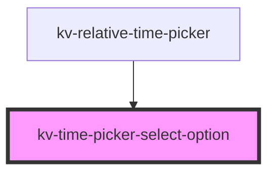

# kv-relative-time-select-option


<!-- Auto Generated Below -->


## Usage

### Angular

```html
<!-- With all properties (only label and value are mandatory) -->
<kv-time-picker-select-option
	label="Option 1"
	value="option1"
	selected=false>
</kv-time-picker-select-option>
```


### React

```tsx
import React from 'react';
import { KvTimePickerSelectOption } from '@kelvininc/react-ui-components';
export const KvTimePickerSelectOptionExample: React.FC = () => (
  <>
	{/*-- With all properties (only label and value are mandatory) --*/}
	<KvTimePickerSelectOption
		label="Option 1"
		link="option1"
		selected={false}
		>
	</KvTimePickerSelectOption>
  </>
);
```


## Properties

| Property             | Attribute     | Description                                      | Type      | Default     |
| -------------------- | ------------- | ------------------------------------------------ | --------- | ----------- |
| `description`        | `description` | (optional) The description of the text displayed | `string`  | `undefined` |
| `label` _(required)_ | `label`       | (required) The text to display on the item       | `string`  | `undefined` |
| `selected`           | `selected`    | (optional) If `true` the item is selected        | `boolean` | `false`     |
| `value` _(required)_ | `value`       | (required) The item value                        | `string`  | `undefined` |


## Events

| Event          | Description                              | Type                  |
| -------------- | ---------------------------------------- | --------------------- |
| `itemSelected` | Emitted when the user clicks on the item | `CustomEvent<string>` |


## CSS Custom Properties

| Name                                           | Description           |
| ---------------------------------------------- | --------------------- |
| `--time-picker-select-option-background-color` | Background color.     |
| `--time-picker-select-option-height`           | Select option height. |
| `--time-picker-select-option-padding`          | Select padding.       |


## Dependencies

### Used by

 - [kv-relative-time-picker](../relative-time-picker)

### Graph


----------------------------------------------


