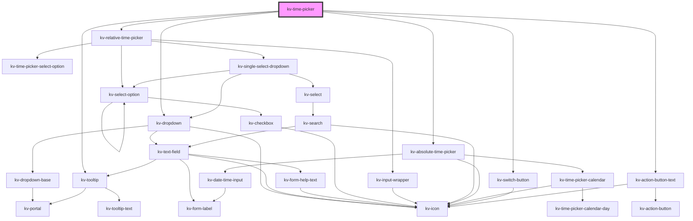

# kv-time-range-picker


<!-- Auto Generated Below -->


## Usage

### Angular

```html
<!-- Default -->
<kv-time-picker></kv-time-picker>
```


### React

```tsx
import React from 'react';

import { KvTimePicker } from '@kelvininc/react-ui-components';

export const KvTimePickerExample: React.FC = () => (
	<>
		{/*-- Default --*/}
		<KvTimePicker />
	</>
);
```


## Properties

| Property                    | Attribute                    | Description                                                             | Type                                                                                                                                                                                                                                                                                                                                                                                                                                                                                                                                                                                         | Default                                        |
| --------------------------- | ---------------------------- | ----------------------------------------------------------------------- | -------------------------------------------------------------------------------------------------------------------------------------------------------------------------------------------------------------------------------------------------------------------------------------------------------------------------------------------------------------------------------------------------------------------------------------------------------------------------------------------------------------------------------------------------------------------------------------------- | ---------------------------------------------- |
| `calendarInputMaxDate`      | `calendar-input-max-date`    | (optional) calendar maximum date to be navigated                        | `string`                                                                                                                                                                                                                                                                                                                                                                                                                                                                                                                                                                                     | `undefined`                                    |
| `calendarInputMinDate`      | `calendar-input-min-date`    | (optional) calendar minimum date to be navigated                        | `string`                                                                                                                                                                                                                                                                                                                                                                                                                                                                                                                                                                                     | `undefined`                                    |
| `disableTimezoneSelection`  | `disable-timezone-selection` | (optional) Lets the timezone visible but doens't let the user change it | `boolean`                                                                                                                                                                                                                                                                                                                                                                                                                                                                                                                                                                                    | `false`                                        |
| `disabled`                  | `disabled`                   | (optional) Defines if the dropdown is disabled                          | `boolean`                                                                                                                                                                                                                                                                                                                                                                                                                                                                                                                                                                                    | `false`                                        |
| `displayCustomizeInterval`  | `display-customize-interval` | (optional) Determines if the customize interval otion is visible        | `boolean`                                                                                                                                                                                                                                                                                                                                                                                                                                                                                                                                                                                    | `true`                                         |
| `displayTimezoneDropdown`   | `display-timezone-dropdown`  | (optional) Determines if the timezone dropdown is visible               | `boolean`                                                                                                                                                                                                                                                                                                                                                                                                                                                                                                                                                                                    | `true`                                         |
| `dropdownPositionOptions`   | --                           | (optional) Dropdown possible positions                                  | `{ placement?: Placement; strategy?: Strategy; middleware?: (false \| { name: string; options?: any; fn: (state: { x: number; y: number; initialPlacement: Placement; platform: Platform; placement: Placement; strategy: Strategy; middlewareData: MiddlewareData; rects: ElementRects; elements: Elements; }) => Promisable<MiddlewareReturn>; })[]; platform?: Platform; }`                                                                                                                                                                                                               | `DEFAULT_TIME_RANGE_DROPDOWN_POSITION_OPTIONS` |
| `inputConfig`               | --                           | (optional) Configuration of the dropdown input                          | `{ type?: EInputFieldType; label?: string; icon?: EIconName \| EOtherIconName; inputName?: string; examples?: string[]; placeholder?: string; maxLength?: number; minLength?: number; max?: string \| number; min?: string \| number; step?: string \| number; size?: EComponentSize; disabled?: boolean; required?: boolean; loading?: boolean; state?: EValidationState; helpText?: string \| string[]; value?: string \| number; readonly?: boolean; forcedFocus?: boolean; highlighted?: boolean; tooltipConfig?: Partial<ITooltip>; useInputMask?: boolean; inputMaskRegex?: string; }` | `{}`                                           |
| `relativeTimePickerOptions` | --                           | (optional) Relative time picker options                                 | `IRelativeTimePickerOption[][]`                                                                                                                                                                                                                                                                                                                                                                                                                                                                                                                                                              | `DEFAULT_RELATIVE_TIME_OPTIONS_GROUPS`         |
| `selectedTimeOption`        | --                           | (optional) Selected time key                                            | `ITimePickerTime`                                                                                                                                                                                                                                                                                                                                                                                                                                                                                                                                                                            | `undefined`                                    |
| `showCalendar`              | `show-calendar`              | (optional) Determines if the show calendar toggle is enabled            | `boolean`                                                                                                                                                                                                                                                                                                                                                                                                                                                                                                                                                                                    | `false`                                        |
| `timezones`                 | --                           | (optional) Timezones                                                    | `ITimezoneOffset[]`                                                                                                                                                                                                                                                                                                                                                                                                                                                                                                                                                                          | `buildTimezoneByOffset(getTimezonesNames())`   |


## Events

| Event                     | Description                                     | Type                                   |
| ------------------------- | ----------------------------------------------- | -------------------------------------- |
| `cancelClicked`           | Emitted when cancel button is clicked           | `CustomEvent<CustomEvent<MouseEvent>>` |
| `dropdownStateChange`     | Emitted when dropdown state changes             | `CustomEvent<boolean>`                 |
| `showCalendarStateChange` | Emitted when show calendar button state changes | `CustomEvent<boolean>`                 |
| `timeRangeChange`         | Emitted when time range changes                 | `CustomEvent<ITimePickerTime>`         |


## Dependencies

### Depends on

- [kv-dropdown](../dropdown)
- [kv-relative-time-picker](../relative-time-picker)
- [kv-absolute-time-picker](../absolute-time-picker)
- [kv-switch-button](../switch-button)
- [kv-action-button-text](../action-button-text)
- [kv-tooltip](../tooltip)

### Graph


----------------------------------------------


