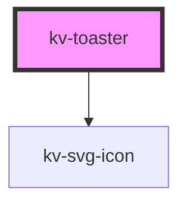

# *<kv-toaster>*

<!-- Auto Generated Below -->

## Properties

| Property          | Attribute          | Description                         | Type                                                                                                      | Default     |
| ----------------- | ------------------ | ----------------------------------- | --------------------------------------------------------------------------------------------------------- | ----------- |
| `descriptionText` | `description-text` | (optional) Description text toaster | `string`                                                                                                  | `undefined` |
| `messageText`     | `message-text`     | (optional) Message text toaster     | `string`                                                                                                  | `undefined` |
| `type`            | `type`             | (optional) Message type toaster     | `ToasterTypesEnum.error \| ToasterTypesEnum.info \| ToasterTypesEnum.success \| ToasterTypesEnum.warning` | `undefined` |

## Dependencies

### Depends on

- [kv-svg-icon](../svg-icon)

### Graph

----------------------------------------------

