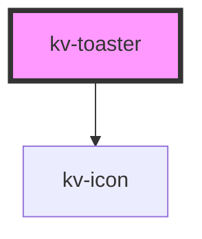

# kv-toaster


<!-- Auto Generated Below -->


## Usage

### Angular

```html
<!-- Error -->
<kv-toaster header="Main Message" [type]="EToasterType.Error"><kv-toaster>

<!-- Info -->
<kv-toaster header="Main Message" [type]="EToasterType.Info"><kv-toaster>

<!-- Success -->
<kv-toaster header="Main Message" [type]="EToasterType.Success"><kv-toaster>

<!-- Warning -->
<kv-toaster header="Main Message" [type]="EToasterType.Warning"><kv-toaster>
```


### React

```tsx
import React from 'react';

import { KvToaster, EToasterType } from '@kelvininc/react-ui-components';

export const ToasterExample: React.FC = () => (
	<>
		{/*-- Info --*/}
		<KvToaster header="Main Message" type={EToasterType.Info}></KvToaster>

		{/*--Error --*/}
		<KvToaster header="Main Message" type={EToasterType.Error}></KvToaster>

		{/*-- Success --*/}
		<KvToaster header="Main Message" type={EToasterType.Success}></KvToaster>
		
		{/*-- Warning --*/}
		<KvToaster header="Main Message" type={EToasterType.Warning}></KvToaster>
	</>
)
```


## Properties

| Property              | Attribute     | Description                             | Type                                                                                      | Default     |
| --------------------- | ------------- | --------------------------------------- | ----------------------------------------------------------------------------------------- | ----------- |
| `description`         | `description` | (optional) Secondary message to display | `string`                                                                                  | `undefined` |
| `header` _(required)_ | `header`      | (required) Main message to display      | `string`                                                                                  | `undefined` |
| `ttl`                 | `ttl`         | (optional) Time to live of the toaster  | `number`                                                                                  | `undefined` |
| `type` _(required)_   | `type`        | (required) Type of toaster              | `EToasterType.Error \| EToasterType.Info \| EToasterType.Success \| EToasterType.Warning` | `undefined` |


## Events

| Event              | Description                             | Type                      |
| ------------------ | --------------------------------------- | ------------------------- |
| `clickCloseButton` | Emitted when close button is clicked    | `CustomEvent<MouseEvent>` |
| `ttlExpired`       | Emitted when ttl is defined and expires | `CustomEvent<CloseEvent>` |


## CSS Custom Properties

| Name                         | Description                |
| ---------------------------- | -------------------------- |
| `--background-color-default` | Toaster background color.  |
| `--error-icon-color`         | Error color.               |
| `--info-icon-color`          | Info color.                |
| `--kv-color-neutral-2`       | Main message color.        |
| `--kv-color-neutral-4`       | Secondary message color.   |
| `--kv-color-neutral-6`       | Toaster border color.      |
| `--reset-button-focused`     | Close button focused.      |
| `--success-icon-color`       | Success color.             |
| `--toaster-icons-height`     | toaster icons height       |
| `--toaster-icons-width`      | toaster icons width        |
| `--toaster-large-height`     | Toaster with two messages. |
| `--toaster-small-height`     | Toaster with one message.  |
| `--toaster-width`            | Toaster width.             |
| `--warning-icon-color`       | Warning color.             |


## Dependencies

### Depends on

- [kv-icon](../icon)

### Graph


----------------------------------------------


