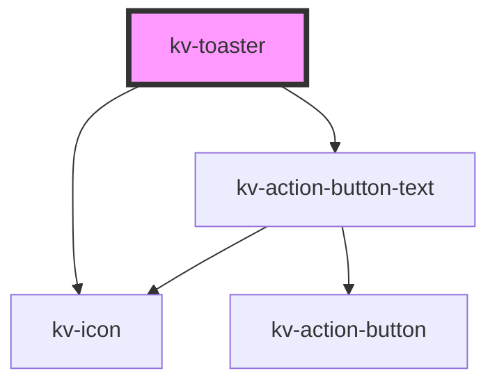

# kv-toaster


<!-- Auto Generated Below -->


## Usage

### React

```tsx
import React from 'react';

import { KvToaster, EToasterType } from '@kelvininc/react-ui-components/client';

export const ToasterExample: React.FC = () => (
	<>
		{/*-- Info --*/}
		<KvToaster header="Main Message" type={EToasterType.Info}></KvToaster>

		{/*--Error --*/}
		<KvToaster header="Main Message" type={EToasterType.Error}></KvToaster>

		{/*-- Success --*/}
		<KvToaster header="Main Message" type={EToasterType.Success}></KvToaster>
		
		{/*-- Warning --*/}
		<KvToaster header="Main Message" type={EToasterType.Warning}></KvToaster>
	</>
)
```


## Properties

| Property              | Attribute     | Description                                       | Type                                                                                      | Default     |
| --------------------- | ------------- | ------------------------------------------------- | ----------------------------------------------------------------------------------------- | ----------- |
| `closable`            | `closable`    | (optional) If true the toaster has a close button | `boolean`                                                                                 | `true`      |
| `description`         | `description` | (optional) Secondary message to display           | `string \| undefined`                                                                     | `undefined` |
| `header` _(required)_ | `header`      | (required) Main message to display                | `string`                                                                                  | `undefined` |
| `ttl`                 | `ttl`         | (optional) Time to live of the toaster            | `number \| undefined`                                                                     | `undefined` |
| `type` _(required)_   | `type`        | (required) Type of toaster                        | `EToasterType.Error \| EToasterType.Info \| EToasterType.Success \| EToasterType.Warning` | `undefined` |


## Events

| Event              | Description                             | Type                      |
| ------------------ | --------------------------------------- | ------------------------- |
| `afterClose`       | Emiited after the toaster has closed    | `CustomEvent<void>`       |
| `afterOpen`        | Emiited after the toaster has opened    | `CustomEvent<void>`       |
| `clickCloseButton` | Emitted when close button is clicked    | `CustomEvent<MouseEvent>` |
| `ttlExpired`       | Emitted when ttl is defined and expires | `CustomEvent<CloseEvent>` |


## CSS Custom Properties

| Name                         | Description                            |
| ---------------------------- | -------------------------------------- |
| `--background-color-default` | Toaster background color.              |
| `--toaster-icon-height`      | Toaster icon height.                   |
| `--toaster-icon-width`       | Toaster icon width.                    |
| `--toaster-large-height`     | Toaster height with two messages.      |
| `--toaster-small-height`     | Toaster height with one message.       |
| `--toaster-top-space`        | Space between Toaster and top of page. |
| `--toaster-width`            | Toaster width.                         |


## Dependencies

### Depends on

- [kv-icon](../icon)
- [kv-action-button-text](../action-button-text)

### Graph

```mermaid
graph TD;
  kv-toaster --> kv-icon
  kv-toaster --> kv-action-button-text
  kv-action-button-text --> kv-action-button
  kv-action-button-text --> kv-icon
  style kv-toaster fill:#f9f,stroke:#333,stroke-width:4px
```

----------------------------------------------


