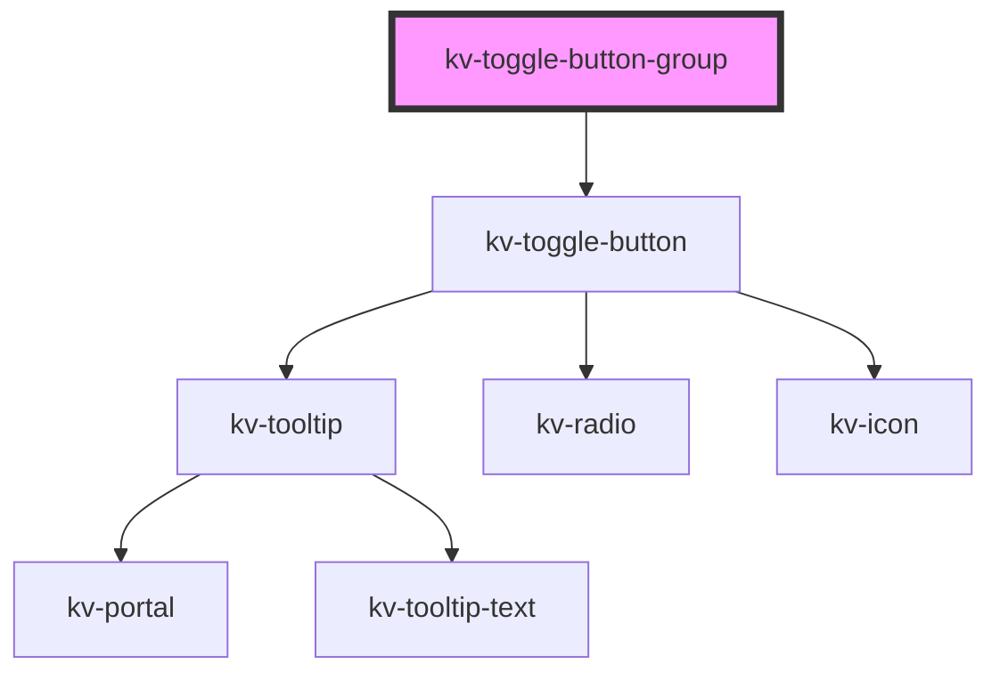

# _<kv-toggle-button-group>_

<!-- Auto Generated Below -->

## Properties

| Property          | Attribute          | Description                                                                                          | Type                                           | Default                |
| ----------------- | ------------------ | ---------------------------------------------------------------------------------------------------- | ---------------------------------------------- | ---------------------- |
| `buttons`         | `buttons`          | (optional) List of toggle buttons                                                                    | `IToggleButton<string \| number>[]`            | `[]`                   |
| `disabled`        | `disabled`         | (optional) Sets styling to be disabled and disables click events for all buttons                     | `boolean`                                      | `false`                |
| `disabledButtons` | `disabled-buttons` | (optional) A record with the button's label/value and the if the respective button is disabled       | `{ [x: string]: boolean; }`                    | `{}`                   |
| `radioButtons`    | `radio-buttons`    | (optional) A record with the button's label/value and the if the respective button is a radio button | `{ [x: string]: boolean; }`                    | `{}`                   |
| `selectedButtons` | `selected-buttons` | (optional) A record with the button's label/value and with if the selected value                     | `{ [x: string]: boolean; }`                    | `{}`                   |
| `size`            | `size`             | (optional) Sets the size for all toggle buttons                                                      | `EComponentSize.Large \| EComponentSize.Small` | `EComponentSize.Small` |
| `withRadio`       | `with-radio`       | (optional) If `true` all toggle buttons will have a radio button                                     | `boolean`                                      | `false`                |

## Events

| Event           | Description                                                            | Type                  |
| --------------- | ---------------------------------------------------------------------- | --------------------- |
| `checkedChange` | When the toggle button selection changes, emit the requested tab's key | `CustomEvent<string>` |

## Shadow Parts

| Part                        | Description                 |
| --------------------------- | --------------------------- |
| `"toggle-button-container"` | Container of toggle button. |

## Dependencies

### Depends on

- [kv-toggle-button](../toggle-button)

### Graph

----------------------------------------------

