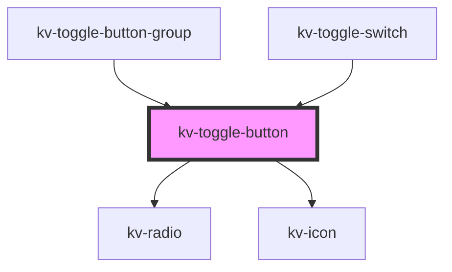

# _<kv-toggle-button>_

<!-- Auto Generated Below -->


## Usage

### React

```tsx
import React from 'react';

import { KvToggleButton, EIconName } from '@kelvininc/react-ui-components';

export const ToggleButtonExample: React.FC = () => (
	<>
		{/*-- Default --*/}
		<KvToggleButton label="Option 1" value="option-1" />

		{/*-- Disabled --*/}
		<KvToggleButton label="Option 1" value="option-1" disabled />

		{/*-- Checked --*/}
		<KvToggleButton label="Option 1" value="option-1" checked />

		{/*-- With Icon --*/}
		<KvToggleButton icon={EIconName.Add} label="Option 1" value="option-1" />

		{/*-- Only Icon --*/}
		<KvToggleButton icon={EIconName.Add} value="option-1" />
	</>
);
```


## Properties

| Property             | Attribute         | Description                                                                   | Type                                           | Default                |
| -------------------- | ----------------- | ----------------------------------------------------------------------------- | ---------------------------------------------- | ---------------------- |
| `checked`            | `checked`         | (optional) Sets the button as checked                                         | `boolean`                                      | `false`                |
| `disabled`           | `disabled`        | (optional) Sets the button's styling to be disabled and disables click events | `boolean`                                      | `false`                |
| `icon`               | `icon`            | (optional) The button's icon. Only valid for toggle button icon               | `EIconName \| EOtherIconName`                  | `undefined`            |
| `label`              | `label`           | (optional) The button's label. Only valid for toggle button text              | `string`                                       | `undefined`            |
| `preventDefault`     | `prevent-default` | (optional) Defines if the item click event should prevent default behaviour.  | `boolean`                                      | `false`                |
| `size`               | `size`            | (optional) Button's size                                                      | `EComponentSize.Large \| EComponentSize.Small` | `EComponentSize.Small` |
| `value` _(required)_ | `value`           | (required) The value to be emitted upon click events                          | `string`                                       | `undefined`            |
| `withRadio`          | `with-radio`      | (optional) Sets if the button is a radio button                               | `boolean`                                      | `false`                |


## Events

| Event           | Description                    | Type                  |
| --------------- | ------------------------------ | --------------------- |
| `checkedChange` | Emits when a button is clicked | `CustomEvent<string>` |


## Shadow Parts

| Part              | Description                          |
| ----------------- | ------------------------------------ |
| `"toggle-button"` | The toggle action.                   |
| `"toggle-icon"`   | The toggle button's icon container.  |
| `"toggle-label"`  | The toggle button's label container. |
| `"toggle-text"`   | The toggle button's text container.  |


## CSS Custom Properties

| Name                          | Description                                               |
| ----------------------------- | --------------------------------------------------------- |
| `--background-color-active`   | toggle button component's background color active.        |
| `--background-color-default`  | toggle button component's background color default.       |
| `--background-color-disabled` | toggle button component's background color disabled.      |
| `--border-color-active`       | toggle button component's border color active.            |
| `--border-color-default`      | toggle button component's border color default.           |
| `--border-color-disabled`     | toggle button component's border color disabled.          |
| `--button-height-large`       | toggle button component's height when size is large.      |
| `--button-height-small`       | toggle button component's height when size is small.      |
| `--button-icon-height-large`  | toggle button component's icon height when size is large. |
| `--button-icon-height-small`  | toggle button component's icon height when size is small. |
| `--button-icon-width-large`   | toggle button component's icon width when size is large.  |
| `--button-icon-width-small`   | toggle button component's icon width when size is small.  |
| `--button-padding-large`      | toggle button component's padding when size is large.     |
| `--button-padding-small`      | toggle button component's padding when size is small.     |
| `--text-color-active`         | toggle button component's text color active.              |
| `--text-color-default`        | toggle button component's text color default.             |
| `--text-color-disabled`       | toggle button component's text color disabled.            |


## Dependencies

### Used by

 - [kv-toggle-button-group](../toggle-button-group)
 - [kv-toggle-switch](../toggle-switch)

### Depends on

- [kv-radio](../radio)
- [kv-icon](../icon)

### Graph


----------------------------------------------


