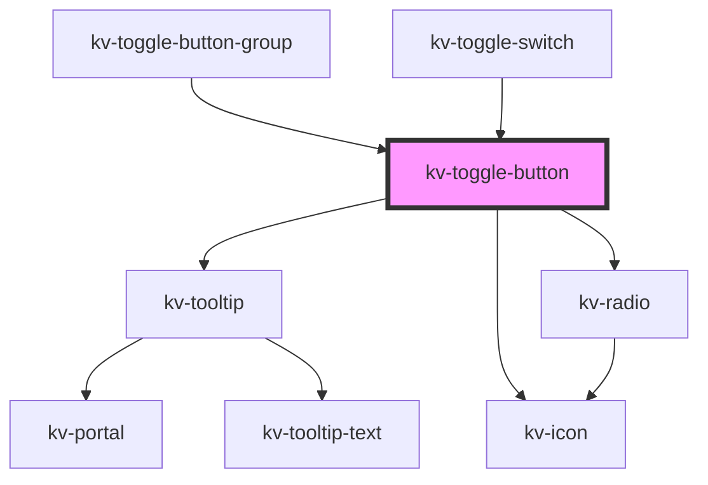

# _<kv-toggle-button>_

<!-- Auto Generated Below -->


## Usage

### React

```tsx
import React from 'react';

import { KvToggleButton, EIconName } from '@kelvininc/react-ui-components/client';

export const ToggleButtonExample: React.FC = () => (
	<>
		{/*-- Default --*/}
		<KvToggleButton label="Option 1" value="option-1" />

		{/*-- Disabled --*/}
		<KvToggleButton label="Option 1" value="option-1" disabled />

		{/*-- Checked --*/}
		<KvToggleButton label="Option 1" value="option-1" checked />

		{/*-- With Icon --*/}
		<KvToggleButton icon={EIconName.Add} label="Option 1" value="option-1" />

		{/*-- Only Icon --*/}
		<KvToggleButton icon={EIconName.Add} value="option-1" />
	</>
);
```


## Properties

| Property             | Attribute           | Description                                                                   | Type                                           | Default                |
| -------------------- | ------------------- | ----------------------------------------------------------------------------- | ---------------------------------------------- | ---------------------- |
| `checked`            | `checked`           | (optional) Sets the button as checked                                         | `boolean \| undefined`                         | `false`                |
| `customAttributes`   | `custom-attributes` | (optional) Custom attributes to be applied to the toggle button element       | `undefined \| { [x: string]: string; }`        | `{}`                   |
| `disabled`           | `disabled`          | (optional) Sets the button's styling to be disabled and disables click events | `boolean \| undefined`                         | `false`                |
| `icon`               | `icon`              | (optional) The button's icon. Only valid for toggle button icon               | `EIconName \| undefined`                       | `undefined`            |
| `label`              | `label`             | (optional) The button's label. Only valid for toggle button text              | `string \| undefined`                          | `undefined`            |
| `preventDefault`     | `prevent-default`   | (optional) Defines if the item click event should prevent default behaviour.  | `boolean \| undefined`                         | `false`                |
| `size`               | `size`              | (optional) Button's size                                                      | `EComponentSize.Large \| EComponentSize.Small` | `EComponentSize.Small` |
| `tooltip`            | `tooltip`           | (optional) Tooltip text                                                       | `string \| undefined`                          | `undefined`            |
| `value` _(required)_ | `value`             | (required) The value to be emitted upon click events                          | `number \| string`                             | `undefined`            |
| `withRadio`          | `with-radio`        | (optional) Sets if the button is a radio button                               | `boolean \| undefined`                         | `false`                |


## Events

| Event           | Description                    | Type                            |
| --------------- | ------------------------------ | ------------------------------- |
| `checkedChange` | Emits when a button is clicked | `CustomEvent<number \| string>` |


## Shadow Parts

| Part              | Description                          |
| ----------------- | ------------------------------------ |
| `"toggle-button"` | The toggle action.                   |
| `"toggle-icon"`   | The toggle button's icon container.  |
| `"toggle-label"`  | The toggle button's label container. |
| `"toggle-text"`   | The toggle button's text container.  |


## CSS Custom Properties

| Name                                 | Description                                              |
| ------------------------------------ | -------------------------------------------------------- |
| `--background-color-active`          | Toggle button background color when state is active.     |
| `--background-color-default`         | Toggle button background color when state is default.    |
| `--background-color-disabled`        | Toggle button background color when state is disabled.   |
| `--background-color-disabled-active` | Toggle button background color when disabled and active. |
| `--border-color-active`              | Toggle button border color when state is active.         |
| `--border-color-default`             | Toggle button border color when state is default.        |
| `--border-color-disabled`            | Toggle button border color when state is disabled.       |
| `--border-color-disabled-active`     | Toggle button border color when disabled and active.     |
| `--border-left-size`                 | Toggle button left border size.                          |
| `--border-radius-bottom-left`        | Toggle button bottom-left border radius.                 |
| `--border-radius-bottom-right`       | Toggle button bottom-right border radius.                |
| `--border-radius-top-left`           | Toggle button top-left border radius.                    |
| `--border-radius-top-right`          | Toggle button top-right border radius.                   |
| `--border-right-size`                | Toggle button right border size.                         |
| `--border-size`                      | Toggle button border size.                               |
| `--button-height-large`              | Toggle button height when size is large.                 |
| `--button-height-small`              | Toggle button height when size is small.                 |
| `--button-icon-height-large`         | Toggle button icon height when size is large.            |
| `--button-icon-height-small`         | Toggle button icon height when size is small.            |
| `--button-icon-width-large`          | Toggle button icon width when size is large.             |
| `--button-icon-width-small`          | Toggle button icon width when size is small.             |
| `--button-padding-large`             | Toggle button padding when size is large.                |
| `--button-padding-small`             | Toggle button padding when size is small.                |
| `--button-width`                     | Toggle button width.                                     |
| `--icon-color-active`                | Toggle button icon color when state is active.           |
| `--icon-color-default`               | Toggle button icon color when state is default.          |
| `--icon-color-disabled`              | Toggle button icon color when state is disabled.         |
| `--icon-color-disabled-active`       | Toggle button icon color when disabled and active.       |
| `--text-color-active`                | Toggle button text color when state is active.           |
| `--text-color-default`               | Toggle button text color when state is default.          |
| `--text-color-disabled`              | Toggle button text color when state is disabled.         |
| `--text-color-disabled-active`       | Toggle button text color when disabled and active.       |


## Dependencies

### Used by

 - [kv-toggle-button-group](../toggle-button-group)
 - [kv-toggle-switch](../toggle-switch)

### Depends on

- [kv-tooltip](../tooltip)
- [kv-radio](../radio)
- [kv-icon](../icon)

### Graph

```mermaid
graph TD;
  kv-toggle-button --> kv-tooltip
  kv-toggle-button --> kv-radio
  kv-toggle-button --> kv-icon
  kv-tooltip --> kv-portal
  kv-tooltip --> kv-tooltip-text
  kv-radio --> kv-icon
  kv-toggle-button-group --> kv-toggle-button
  kv-toggle-switch --> kv-toggle-button
  style kv-toggle-button fill:#f9f,stroke:#333,stroke-width:4px
```

----------------------------------------------


