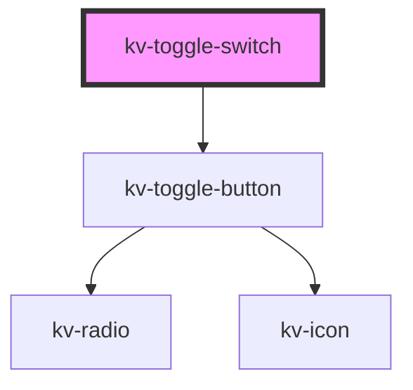

# _<kv-toggle-button-group>_

<!-- Auto Generated Below -->

## Properties

| Property          | Attribute         | Description                                              | Type                                           | Default                |
| ----------------- | ----------------- | -------------------------------------------------------- | ---------------------------------------------- | ---------------------- |
| `disabled`        | `disabled`        | (optional) If `true` all toggle buttons will be disabled | `boolean`                                      | `false`                |
| `disabledButtons` | --                |                                                          | `{ [x: string]: boolean; }`                    | `{}`                   |
| `options`         | --                | (optional) List of toggle switch options                 | `IToggleSwitchOption[]`                        | `[]`                   |
| `selectedOption`  | `selected-option` | (optional) Toggle switch selected option key             | `string`                                       | `''`                   |
| `size`            | `size`            | (optional) Sets the size for all toggle buttons          | `EComponentSize.Large \| EComponentSize.Small` | `EComponentSize.Small` |

## Events

| Event           | Description                                                        | Type                  |
| --------------- | ------------------------------------------------------------------ | --------------------- |
| `checkedChange` | When the toggle switch selection changes, emit the requested value | `CustomEvent<string>` |

## Shadow Parts

| Part                               | Description                  |
| ---------------------------------- | ---------------------------- |
| `"toggle-options-container"`       | Container of toggle options. |
| `"toggle-switch-option-container"` |                              |

## Dependencies

### Depends on

- [kv-toggle-button](../toggle-button)

### Graph

----------------------------------------------

