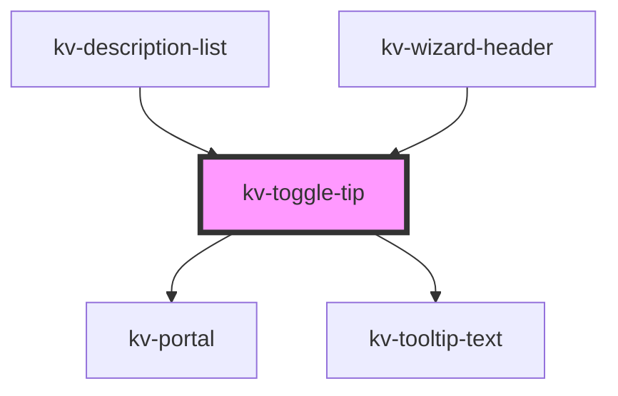

# _kv-toggle-tip_


<!-- Auto Generated Below -->


## Usage

### Angular

```html
<!-- Default -->
<kv-toggle-tip text="Toggle tip">
	<kv-icon slot="open-element-slot" name={EIconName.Info}/>
	<kv-action-button [type]="EActionButtonType.Primary" slot="content-slot">Learn More</kv-action-button>
</kv-toggle-tip>

<!-- With Fixed Position -->
<kv-toggle-tip text="Toggle tip" [position]="ETooltipPosition.Left">
	<kv-icon slot="open-element-slot" name={EIconName.Info}/>
	<kv-action-button [type]="EActionButtonType.Primary" slot="content-slot">Learn More</kv-action-button>
</kv-toggle-tip>

<!-- With Allowed Position -->
<kv-toggle-tip text="Toggle tip" [allowedPositions]="[ETooltipPosition.Top, ETooltipPosition.Bottom]">
	<kv-icon slot="open-element-slot" name={EIconName.Info}/>
	<kv-action-button [type]="EActionButtonType.Primary" slot="content-slot">Learn More</kv-action-button>
</kv-toggle-tip>
```


### React

```tsx
import React from 'react';

import { KvToggleTip, KvIcon, KvActionButton, EIconName, ETooltipPosition, EActionButtonType } from '@kelvininc/react-ui-components';

export const ToggleTipExample: React.FC = () => (
  <>
    {/*-- Default --*/}
	<KvToggleTip text="Toggle tip">
		<KvIcon slot="open-element-slot" name={EIconName.Info}/>
		<KvActionButton slot="content-slot" type={EActionButtonType.Primary}>Learn More</KvActionButton>
	</KvToggleTip>

	{/*-- With Fixed Position --*/}
	<KvToggleTip text="Toggle tip" position={ETooltipPosition.Left}>
		<KvIcon slot="open-element-slot" name={EIconName.Info}/>
		<KvActionButton slot="content-slot" type={EActionButtonType.Primary}>Learn More</KvActionButton>
	</KvToggleTip>

	{/*-- With Allowed Positions --*/}
	<KvToggleTip text="Toggle tip" allowedPositions={[ETooltipPosition.Top, ETooltipPosition.Bottom]}>
		<KvIcon slot="open-element-slot" name={EIconName.Info}/>
		<KvActionButton slot="content-slot" type={EActionButtonType.Primary}>Learn More</KvActionButton>
	</KvToggleTip>
  </>
);
```


## Properties

| Property           | Attribute      | Description                                                                                                                                                                             | Type                                                                                                                                                                                                                                                                                                                                                                           | Default                  |
| ------------------ | -------------- | --------------------------------------------------------------------------------------------------------------------------------------------------------------------------------------- | ------------------------------------------------------------------------------------------------------------------------------------------------------------------------------------------------------------------------------------------------------------------------------------------------------------------------------------------------------------------------------ | ------------------------ |
| `allowedPositions` | --             | (optional) Array of allowed positions of toggle tip (if defined the 'position' is ignored)                                                                                              | `ETooltipPosition[]`                                                                                                                                                                                                                                                                                                                                                           | `undefined`              |
| `customClass`      | `custom-class` | (optional) Additional classes to apply for custom CSS. If multiple classes are provided they should be separated by spaces. It is also valid to provide CssClassMap with boolean logic. | `CssClassMap \| string \| string[]`                                                                                                                                                                                                                                                                                                                                            | `''`                     |
| `disabled`         | `disabled`     | (optional) if true it will disable clicks to open toggle tip                                                                                                                            | `boolean`                                                                                                                                                                                                                                                                                                                                                                      | `false`                  |
| `isFixed`          | `is-fixed`     | (optional) if true it will ignore outside clicks to close the toggle tip                                                                                                                | `boolean`                                                                                                                                                                                                                                                                                                                                                                      | `false`                  |
| `isOpen`           | `is-open`      | (optional) Set open state of toggle tip, default false                                                                                                                                  | `boolean`                                                                                                                                                                                                                                                                                                                                                                      | `false`                  |
| `options`          | --             | (optional) Object with tooltip position options                                                                                                                                         | `{ placement?: Placement; strategy?: Strategy; middleware?: (false \| { name: string; options?: any; fn: (state: { x: number; y: number; initialPlacement: Placement; platform: Platform; placement: Placement; strategy: Strategy; middlewareData: MiddlewareData; rects: ElementRects; elements: Elements; }) => Promisable<MiddlewareReturn>; })[]; platform?: Platform; }` | `DEFAULT_TOOLTIP_CONFIG` |
| `position`         | `position`     | (optional) Position of toggletip                                                                                                                                                        | `ETooltipPosition.Bottom \| ETooltipPosition.BottomEnd \| ETooltipPosition.BottomStart \| ETooltipPosition.Left \| ETooltipPosition.LeftEnd \| ETooltipPosition.LeftStart \| ETooltipPosition.Right \| ETooltipPosition.RightEnd \| ETooltipPosition.RightStart \| ETooltipPosition.Top \| ETooltipPosition.TopEnd \| ETooltipPosition.TopStart`                               | `undefined`              |
| `text`             | `text`         | (optional) Text of toggletip                                                                                                                                                            | `string`                                                                                                                                                                                                                                                                                                                                                                       | `undefined`              |
| `withArrow`        | `with-arrow`   | (optional) if true it will render an arrow pointing to the opening element                                                                                                              | `boolean`                                                                                                                                                                                                                                                                                                                                                                      | `false`                  |


## Events

| Event             | Description                                   | Type                   |
| ----------------- | --------------------------------------------- | ---------------------- |
| `openStateChange` | Emitted when the dropdown opens state changes | `CustomEvent<boolean>` |


## Dependencies

### Used by

 - [kv-description-list](../description-list)
 - [kv-wizard-header](../wizard-header)

### Depends on

- [kv-portal](../portal)
- [kv-tooltip-text](../tooltip-text)

### Graph


----------------------------------------------


