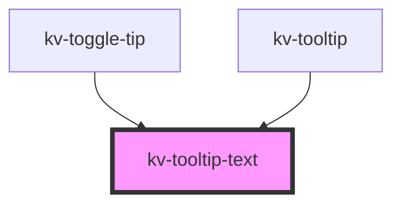

# _<kv-tooltip_text>_

<!-- Auto Generated Below -->


## Usage

### React

```tsx
import React from 'react';

import { KvTooltipText } from '@kelvininc/react-ui-components/client';

export const TooltipTextExample: React.FC = () => (
  <>
    {/*-- Default --*/}
	<KvTooltipText text="Tooltip" />
  </>
);
```


## Properties

| Property | Attribute | Description                | Type     | Default |
| -------- | --------- | -------------------------- | -------- | ------- |
| `text`   | `text`    | (optional) Text of tooltip | `string` | `''`    |


## Shadow Parts

| Part                     | Description               |
| ------------------------ | ------------------------- |
| `"tooltip-container"`    | The tooltip container.    |
| `"tooltip-slot-content"` | The tooltip slot content. |


## CSS Custom Properties

| Name                      | Description                                                           |
| ------------------------- | --------------------------------------------------------------------- |
| `--container-max-width`   | The max width for the tooltip container (default: 240px).             |
| `--container-white-space` | The white space strategy for the tooltip container (default: normal). |


## Dependencies

### Used by

 - [kv-toggle-tip](../toggle-tip)
 - [kv-tooltip](../tooltip)

### Graph


----------------------------------------------


