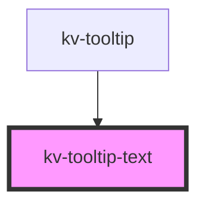

# _<kv-tooltip_text>_

<!-- Auto Generated Below -->


## Usage

### Angular

```html
<!-- Default -->
<kv-tooltip-text text="Tooltip" />

<!-- Visible -->
<kv-tooltip-text text="Tooltip" [visible]="true" />
```


### React

```tsx
import React from 'react';

import { KvTooltipText } from '@kelvininc/react-ui-components';

export const TooltipTextExample: React.FC = () => (
  <>
    {/*-- Default --*/}
	<KvTooltipText text="Tooltip" />

	{/*-- visible --*/}
	<KvTooltipText text="Tooltip" visible={true} />
  </>
);
```


## Properties

| Property  | Attribute | Description                                      | Type      | Default |
| --------- | --------- | ------------------------------------------------ | --------- | ------- |
| `text`    | `text`    | (optional) Text of tooltip                       | `string`  | `''`    |
| `visible` | `visible` | (optional) Visibility of tooltip (default false) | `boolean` | `false` |


## CSS Custom Properties

| Name                      | Description                                                           |
| ------------------------- | --------------------------------------------------------------------- |
| `--container-max-width`   | The max width for the tooltip container (default: 240px).             |
| `--container-white-space` | The white space strategy for the tooltip container (default: normal). |
| `--container-z-index`     | The z-index value for the tooltip container(default: 10).             |


## Dependencies

### Used by

 - [kv-tooltip](../tooltip)

### Graph


----------------------------------------------


