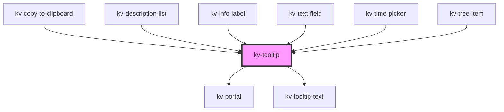

# _<kv-tooltip>_

<!-- Auto Generated Below -->


## Usage

### Angular

```html
<!-- Default -->
<kv-tooltip text="Tooltip">
	<kv-action-button [type]="EActionButtonType.Primary">Hover me!</kv-action-button>
</kv-tooltip>

<!-- With Fixed Position -->
<kv-tooltip text="Tooltip" [position]="ETooltipPosition.Left">
	<kv-action-button [type]="EActionButtonType.Primary">Hover me!</kv-action-button>
</kv-tooltip>

<!-- With Allowed Position -->
<kv-tooltip text="Tooltip" [allowedPositions]="[ETooltipPosition.Top, ETooltipPosition.Bottom]">
	<kv-action-button [type]="EActionButtonType.Primary">Hover me!</kv-action-button>
</kv-tooltip>
```


### React

```tsx
import React from 'react';

import { KvTooltip, KvActionButton, ETooltipPosition, EActionButtonType } from '@kelvininc/react-ui-components';

export const TooltipExample: React.FC = () => (
  <>
    {/*-- Default --*/}
	<KvTooltip text="Tooltip">
		<KvActionButton type={EActionButtonType.Primary}>Hover me!</KvActionButton>
	</KvTooltip>

	{/*-- With Fixed Position --*/}
	<KvTooltip text="Tooltip" position={ETooltipPosition.Left}>
		<KvActionButton type={EActionButtonType.Primary}>Hover me!</KvActionButton>
	</KvTooltip>

	{/*-- With Allowed Positions --*/}
	<KvTooltip text="Tooltip" allowedPositions={[ETooltipPosition.Top, ETooltipPosition.Bottom]}>
		<KvActionButton type={EActionButtonType.Primary}>Hover me!</KvActionButton>
	</KvTooltip>
  </>
);
```


## Properties

| Property           | Attribute      | Description                                                                                                                                                                             | Type                                                                                                                                                                                                                                                                                                                                                                           | Default                   |
| ------------------ | -------------- | --------------------------------------------------------------------------------------------------------------------------------------------------------------------------------------- | ------------------------------------------------------------------------------------------------------------------------------------------------------------------------------------------------------------------------------------------------------------------------------------------------------------------------------------------------------------------------------ | ------------------------- |
| `allowedPositions` | --             | (optional) Array of allowed positions of toggle tip (if defined the 'position' is ignored)                                                                                              | `ETooltipPosition[]`                                                                                                                                                                                                                                                                                                                                                           | `undefined`               |
| `contentElement`   | --             | (optional) Content element reference                                                                                                                                                    | `HTMLElement`                                                                                                                                                                                                                                                                                                                                                                  | `null`                    |
| `customClass`      | `custom-class` | (optional) Additional classes to apply for custom CSS. If multiple classes are provided they should be separated by spaces. It is also valid to provide CssClassMap with boolean logic. | `CssClassMap \| string \| string[]`                                                                                                                                                                                                                                                                                                                                            | `''`                      |
| `delay`            | `delay`        | (optional) Delay to show tooltip in milliseconds.                                                                                                                                       | `number`                                                                                                                                                                                                                                                                                                                                                                       | `DEFAULT_DELAY_CONFIG`    |
| `disabled`         | `disabled`     | (optional) Disables tooltip                                                                                                                                                             | `boolean`                                                                                                                                                                                                                                                                                                                                                                      | `false`                   |
| `options`          | --             | (optional) Object with tooltip position options                                                                                                                                         | `{ placement?: Placement; strategy?: Strategy; middleware?: (false \| { name: string; options?: any; fn: (state: { x: number; y: number; initialPlacement: Placement; platform: Platform; placement: Placement; strategy: Strategy; middlewareData: MiddlewareData; rects: ElementRects; elements: Elements; }) => Promisable<MiddlewareReturn>; })[]; platform?: Platform; }` | `DEFAULT_POSITION_CONFIG` |
| `position`         | `position`     | (optional) Position of tooltip                                                                                                                                                          | `ETooltipPosition.Bottom \| ETooltipPosition.BottomEnd \| ETooltipPosition.BottomStart \| ETooltipPosition.Left \| ETooltipPosition.LeftEnd \| ETooltipPosition.LeftStart \| ETooltipPosition.Right \| ETooltipPosition.RightEnd \| ETooltipPosition.RightStart \| ETooltipPosition.Top \| ETooltipPosition.TopEnd \| ETooltipPosition.TopStart`                               | `undefined`               |
| `text`             | `text`         | (optional) Text of tooltip                                                                                                                                                              | `string`                                                                                                                                                                                                                                                                                                                                                                       | `''`                      |
| `truncate`         | `truncate`     | (optional) Set `true` to display tooltip only when the content is truncated                                                                                                             | `boolean`                                                                                                                                                                                                                                                                                                                                                                      | `false`                   |
| `withArrow`        | `with-arrow`   | (optional) if true it will render an arrow pointing to the opening element (default false)                                                                                              | `boolean`                                                                                                                                                                                                                                                                                                                                                                      | `false`                   |


## Shadow Parts

| Part        | Description          |
| ----------- | -------------------- |
| `"content"` | The tooltip content. |


## Dependencies

### Used by

 - [kv-copy-to-clipboard](../copy-to-clipboard)
 - [kv-description-list](../description-list)
 - [kv-info-label](../info-label)
 - [kv-text-field](../text-field)
 - [kv-time-picker](../time-picker)
 - [kv-tree-item](../tree-item)

### Depends on

- [kv-portal](../portal)
- [kv-tooltip-text](../tooltip-text)

### Graph


----------------------------------------------


