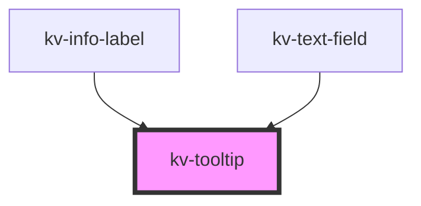

# *<kv-tooltip>*


<!-- Auto Generated Below -->


## Usage

### Angular

```html
<!-- Default -->
<kv-tooltip text="Tooltip">
	<kv-action-button [type]="EActionButtonType.Primary">Hover me!</kv-action-button>
</kv-tooltip>

<!-- With Fixed Position -->
<kv-tooltip text="Tooltip" [position]="ETooltipPosition.Left">
	<kv-action-button [type]="EActionButtonType.Primary">Hover me!</kv-action-button>
</kv-tooltip>

<!-- With Allowed Position -->
<kv-tooltip text="Tooltip" [allowedPositions]="[ETooltipPosition.Top, ETooltipPosition.Bottom]">
	<kv-action-button [type]="EActionButtonType.Primary">Hover me!</kv-action-button>
</kv-tooltip>
```


### React

```tsx
import React from 'react';

import { KvTooltip, KvActionButton, ETooltipPosition, EActionButtonType } from '@kelvininc/react-ui-components';

export const TagLetterExample: React.FC = () => (
  <>
    {/*-- Default --*/}
	<KvTooltip text="Tooltip">
		<KvActionButton type={EActionButtonType.Primary}>Hover me!</KvActionButton>
	</KvTooltip>

	{/*-- With Fixed Position --*/}
	<KvTooltip text="Tooltip" position={ETooltipPosition.Left}>
		<KvActionButton type={EActionButtonType.Primary}>Hover me!</KvActionButton>
	</KvTooltip>

	{/*-- With Allowed Positions --*/}
	<KvTooltip text="Tooltip" allowedPositions={[ETooltipPosition.Top, ETooltipPosition.Bottom]}>
		<KvActionButton type={EActionButtonType.Primary}>Hover me!</KvActionButton>
	</KvTooltip>
  </>
);
```


## Properties

| Property         | Attribute  | Description                                     | Type                                                                                                                                                                                                                                                                                                                                             | Default                   |
| ---------------- | ---------- | ----------------------------------------------- | ------------------------------------------------------------------------------------------------------------------------------------------------------------------------------------------------------------------------------------------------------------------------------------------------------------------------------------------------ | ------------------------- |
| `contentElement` | --         | (optional) Content element reference            | `HTMLElement`                                                                                                                                                                                                                                                                                                                                    | `null`                    |
| `disabled`       | `disabled` | (optional) Disables tooltip                     | `boolean`                                                                                                                                                                                                                                                                                                                                        | `false`                   |
| `options`        | --         | (optional) Object with tooltip position options | `{ platform?: Platform; placement?: Placement; strategy?: Strategy; middleware?: Middleware[]; }`                                                                                                                                                                                                                                                | `DEFAULT_POSITION_CONFIG` |
| `position`       | `position` | (optional) Position of tooltip                  | `ETooltipPosition.Bottom \| ETooltipPosition.BottomEnd \| ETooltipPosition.BottomStart \| ETooltipPosition.Left \| ETooltipPosition.LeftEnd \| ETooltipPosition.LeftStart \| ETooltipPosition.Right \| ETooltipPosition.RightEnd \| ETooltipPosition.RightStart \| ETooltipPosition.Top \| ETooltipPosition.TopEnd \| ETooltipPosition.TopStart` | `undefined`               |
| `text`           | `text`     | (optional) Text of tooltip                      | `string`                                                                                                                                                                                                                                                                                                                                         | `undefined`               |


## Shadow Parts

| Part          | Description            |
| ------------- | ---------------------- |
| `"container"` | The tooltip container. |
| `"content"`   | The tooltip content.   |


## CSS Custom Properties

| Name                  | Description                                  |
| --------------------- | -------------------------------------------- |
| `--container-z-index` | The z-index value for the tooltip container. |


## Dependencies

### Used by

 - [kv-info-label](../info-label)
 - [kv-text-field](../text-field)

### Graph


----------------------------------------------


