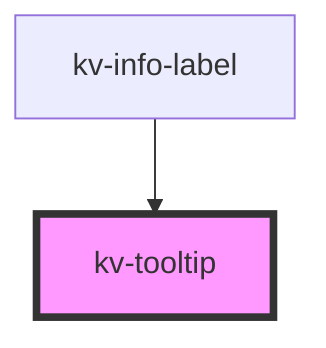

# *<kv-tooltip>*


<!-- Auto Generated Below -->


## Usage

### Angular

```html
<!-- Default -->
<kv-tooltip text="Tooltip">
	<kv-action-button [type]="EActionButtonType.Primary">Hover me!</kv-action-button>
</kv-tooltip>

<!-- With Fixed Position -->
<kv-tooltip text="Tooltip" [position]="TooltipPosition.Left">
	<kv-action-button [type]="EActionButtonType.Primary">Hover me!</kv-action-button>
</kv-tooltip>

<!-- With Allowed Position -->
<kv-tooltip text="Tooltip" [allowedPositions]="[TooltipPosition.Top, TooltipPosition.Bottom]">
	<kv-action-button [type]="EActionButtonType.Primary">Hover me!</kv-action-button>
</kv-tooltip>
```


### React

```tsx
import React from 'react';

import { KvTooltip, KvActionButton, TooltipPosition, EActionButtonType } from '@kelvininc/react-ui-components';

export const TagLetterExample: React.FC = () => (
  <>
    {/*-- Default --*/}
	<KvTooltip text="Tooltip">
		<KvActionButton type={EActionButtonType.Primary}>Hover me!</KvActionButton>
	</KvTooltip>
	
	{/*-- With Fixed Position --*/}
	<KvTooltip text="Tooltip" position={TooltipPosition.Left}>
		<KvActionButton type={EActionButtonType.Primary}>Hover me!</KvActionButton>
	</KvTooltip>

	{/*-- With Allowed Positions --*/}
	<KvTooltip text="Tooltip" allowedPositions={[TooltipPosition.Top, TooltipPosition.Bottom]}>
		<KvActionButton type={EActionButtonType.Primary}>Hover me!</KvActionButton>
	</KvTooltip>
  </>
);
```


## Properties

| Property            | Attribute  | Description                                                                             | Type                                                                                                                                                                                                                                                                                                                                 | Default     |
| ------------------- | ---------- | --------------------------------------------------------------------------------------- | ------------------------------------------------------------------------------------------------------------------------------------------------------------------------------------------------------------------------------------------------------------------------------------------------------------------------------------ | ----------- |
| `allowedPositions`  | --         | (optional) Array of allowed positions of tooltip (if defined the 'position' is ignored) | `TooltipPosition[]`                                                                                                                                                                                                                                                                                                                  | `undefined` |
| `position`          | `position` | (optional) Position of tooltip                                                          | `TooltipPosition.Bottom \| TooltipPosition.BottomEnd \| TooltipPosition.BottomStart \| TooltipPosition.Left \| TooltipPosition.LeftEnd \| TooltipPosition.LeftStart \| TooltipPosition.Right \| TooltipPosition.RightEnd \| TooltipPosition.RightStart \| TooltipPosition.Top \| TooltipPosition.TopEnd \| TooltipPosition.TopStart` | `undefined` |
| `text` _(required)_ | `text`     | (required) Text of tooltip                                                              | `string`                                                                                                                                                                                                                                                                                                                             | `undefined` |


## Dependencies

### Used by

 - [kv-info-label](../info-label)

### Graph


----------------------------------------------


