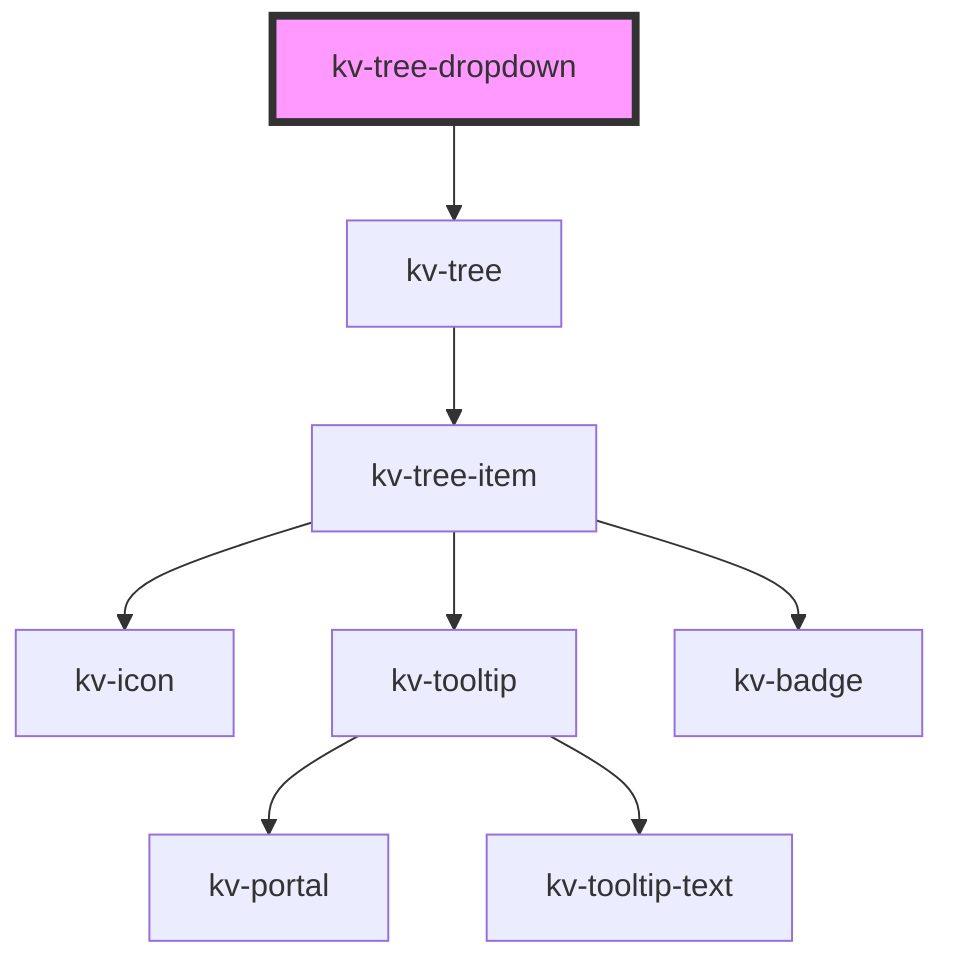

# kv-dropdown-tree

<!-- Auto Generated Below -->

## Properties

| Property             | Attribute        | Description                                                                                                                             | Type                          | Default     |
| -------------------- | ---------------- | --------------------------------------------------------------------------------------------------------------------------------------- | ----------------------------- | ----------- |
| `disabledNodes`      | `disabled-nodes` | (optional) Dictionary that defines whether the tree node is disabled.                                                                   | `{ [key: string]: boolean; }` | `undefined` |
| `expandedNodes`      | `expanded-nodes` | (optional) Dictionary that defines whether the tree node is expanded or collapsed. Only has visual effect for tree nodes with children. | `{ [key: string]: boolean; }` | `undefined` |
| `hiddenNodes`        | `hidden-nodes`   | (optional) Dictionary that defines whether the tree node is hidden.                                                                     | `{ [key: string]: boolean; }` | `undefined` |
| `loading`            | `loading`        | (optional) Defines whether the all tree nodes is loading.                                                                               | `boolean`                     | `false`     |
| `loadingNodes`       | `loading-nodes`  | (optional) Dictionary that defines whether the tree node is loading.                                                                    | `{ [key: string]: boolean; }` | `undefined` |
| `nodes` _(required)_ | `nodes`          | (required) The tree hierarchy items to render in this component                                                                         | `ITreeNodeItem[]`             | `undefined` |
| `selectedNode`       | `selected-node`  | (optional) The currently selected node id                                                                                               | `string`                      | `undefined` |
| `showTooltip`        | `show-tooltip`   | (optional) Defines whether the labels should be displayed as tooltip.                                                                   | `boolean`                     | `undefined` |
| `tooltipDelay`       | `tooltip-delay`  | (optional) Delay to show tooltip in milliseconds.                                                                                       | `number`                      | `undefined` |

## Events

| Event              | Description                                    | Type                         |
| ------------------ | ---------------------------------------------- | ---------------------------- |
| `nodeClick`        | Emitted when the tree node item is clicked     | `CustomEvent<ITreeNodeItem>` |
| `nodeToggleExpand` | Emitted when the node expand toggle is clicked | `CustomEvent<ITreeNodeItem>` |

## CSS Custom Properties

| Name                         | Description                        |
| ---------------------------- | ---------------------------------- |
| `--dropdown-children-offset` | Offset of the child nodes in px.   |
| `--dropdown-node-gap`        | Gap between child nodes in px.     |
| `--dropdown-padding-left`    | Left padding of option text in px. |
| `--dropdown-width`           | Container width in px;             |

## Dependencies

### Depends on

- [kv-tree](../tree)

### Graph

----------------------------------------------

