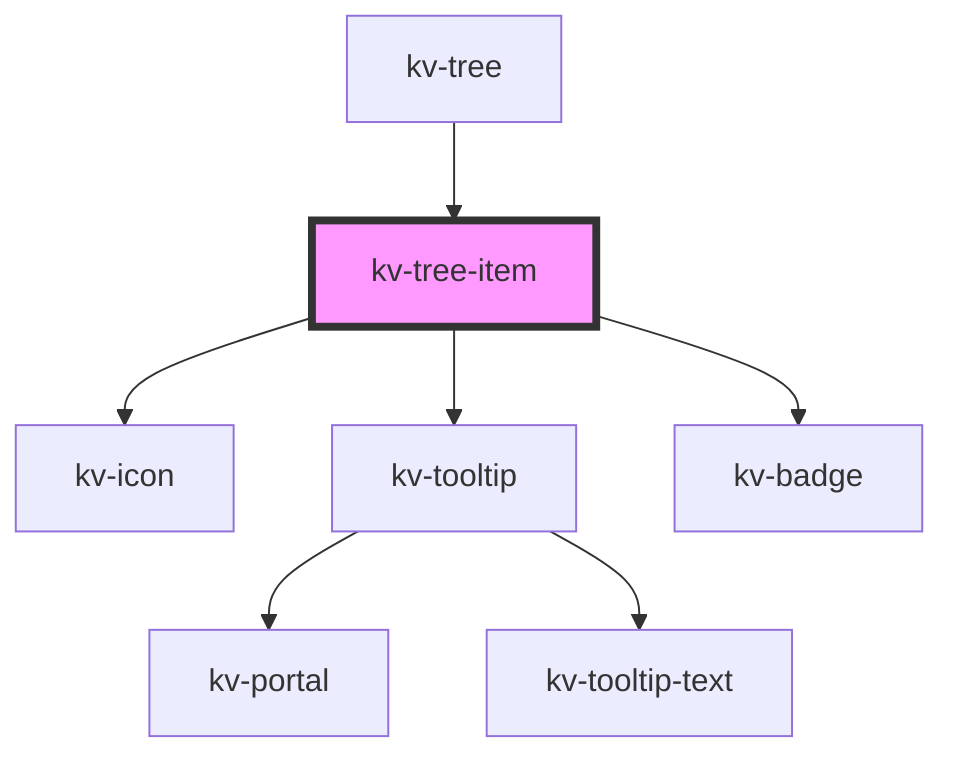

# _<kv-tree-item>_

<!-- Auto Generated Below -->


## Usage

### React

```tsx
import React from 'react';
import { KvTreeItem, EIconName, EBadgeState } from '@kelvininc/react-ui-components';

export const TreeItemExample: React.FC = () => (
	<>
		{/*-- Default --*/}
		<KvTreeItem label="Node name"></KvTreeItem>

		{/*-- Disabled --*/}
		<KvTreeItem label="Node name" disabled></KvTreeItem>

		{/*-- Selected --*/}
		<KvTreeItem label="Node name" selected></KvTreeItem>

		{/*-- Highlighted --*/}
		<KvTreeItem label="Node name" highlighted></KvTreeItem>

		{/*-- No Filled --*/}
		<KvTreeItem placeholder="Placeholder"></KvTreeItem>

		{/*-- With Icon --*/}
		<KvTreeItem label="Node name" icon={EIconName.AssetA}></KvTreeItem>

		{/*-- With Counter State --*/}
		<KvTreeItem label="Node name" counter="32" counterState={EBadgeState.Success}></KvTreeItem>

		{/*-- With Children --*/}
		<KvTreeItem label="Parent Node">
			<KvTreeItem label="Node 1" slot="child-slot">
				<KvTreeItem label="Node 1.1" slot="child-slot"></KvTreeItem>
				<KvTreeItem label="Node 1.2" slot="child-slot"></KvTreeItem>
			</KvTreeItem>
			<KvTreeItem label="Node 2" slot="child-slot"></KvTreeItem>
			<KvTreeItem label="Node 3" slot="child-slot"></KvTreeItem>
		</KvTreeItem>
	</>
);
```


## Properties

| Property          | Attribute          | Description                                                                                                                                                                                                                                                                                                                                                                                                                                                                           | Type                                                                                                                     | Default                    |
| ----------------- | ------------------ | ------------------------------------------------------------------------------------------------------------------------------------------------------------------------------------------------------------------------------------------------------------------------------------------------------------------------------------------------------------------------------------------------------------------------------------------------------------------------------------- | ------------------------------------------------------------------------------------------------------------------------ | -------------------------- |
| `additionalLabel` | `additional-label` | (optional) Defines the sub-title of the tree item, displayed under the title.                                                                                                                                                                                                                                                                                                                                                                                                         | `string`                                                                                                                 | `undefined`                |
| `counter`         | `counter`          | (optional) Defines the counter info of the tree item. If set, an badge will be displayed in the end of tree item.                                                                                                                                                                                                                                                                                                                                                                     | `number`                                                                                                                 | `undefined`                |
| `counterState`    | `counter-state`    | (optional) Defines the state of the counter.                                                                                                                                                                                                                                                                                                                                                                                                                                          | `EBadgeState.Error \| EBadgeState.Info \| EBadgeState.None \| EBadgeState.Success \| EBadgeState.Warning`                | `undefined`                |
| `disabled`        | `disabled`         | (optional) Defines whether the tree node is disabled.                                                                                                                                                                                                                                                                                                                                                                                                                                 | `boolean`                                                                                                                | `false`                    |
| `expandIcon`      | `expand-icon`      | (optional) Defines if icon to use for expanding, should be and arrow like icon pointing up.                                                                                                                                                                                                                                                                                                                                                                                           | `EIconName`                                                                                                              | `EIconName.ArrowDropUp`    |
| `expanded`        | `expanded`         | (optional) Defines whether the tree node is expanded or collapsed. Only has visual effect for tree nodes with children.                                                                                                                                                                                                                                                                                                                                                               | `boolean`                                                                                                                | `false`                    |
| `hasChildren`     | `has-children`     | (optional) Defines whether the tree node has children, even if currently no other tree nodes are slotted inside. This property is useful for showing big tree structures where not all nodes are initially loaded due to performance reasons. Set this to <code>true</code> for nodes you intend to load lazily, when the user clicks the expand button. It is not necessary to set this property otherwise. If a tree item has children, the expand button will be displayed anyway. | `boolean`                                                                                                                | `false`                    |
| `highlighted`     | `highlighted`      | (optional) Defines whether the tree node is highlighted.                                                                                                                                                                                                                                                                                                                                                                                                                              | `boolean`                                                                                                                | `false`                    |
| `icon`            | `icon`             | (optional) Defines the icon of the tree item. If set, an icon will be displayed before the label.                                                                                                                                                                                                                                                                                                                                                                                     | `EIconName`                                                                                                              | `undefined`                |
| `iconState`       | `icon-state`       | (optional) Defines the state of the icon.                                                                                                                                                                                                                                                                                                                                                                                                                                             | `ETreeItemState.Error \| ETreeItemState.Info \| ETreeItemState.None \| ETreeItemState.Success \| ETreeItemState.Warning` | `undefined`                |
| `label`           | `label`            | (optional) Defines the title of the tree item.                                                                                                                                                                                                                                                                                                                                                                                                                                        | `string`                                                                                                                 | `undefined`                |
| `labelsSize`      | `labels-size`      | (optional) Defines the font size of title and subtitle labels.                                                                                                                                                                                                                                                                                                                                                                                                                        | `ETreeItemLabelSize.Regular \| ETreeItemLabelSize.Small`                                                                 | `ETreeItemLabelSize.Small` |
| `loading`         | `loading`          | (optional) Defines whether the tree node is loading.                                                                                                                                                                                                                                                                                                                                                                                                                                  | `boolean`                                                                                                                | `false`                    |
| `placeholder`     | `placeholder`      | (optional) Defines the placeholder of the tree item, displayed when title is not filled.                                                                                                                                                                                                                                                                                                                                                                                              | `string`                                                                                                                 | `undefined`                |
| `preventDefault`  | `prevent-default`  | (optional) Defines if the item click event should prevent default behaviour.                                                                                                                                                                                                                                                                                                                                                                                                          | `boolean`                                                                                                                | `false`                    |
| `selected`        | `selected`         | (optional) Defines whether the tree node is selected by the user.                                                                                                                                                                                                                                                                                                                                                                                                                     | `boolean`                                                                                                                | `false`                    |
| `showTooltip`     | `show-tooltip`     | (optional) Defines whether the label should be displayed as tooltip.                                                                                                                                                                                                                                                                                                                                                                                                                  | `boolean`                                                                                                                | `false`                    |
| `spotlighted`     | `spotlighted`      | (optional) Defines whether the tree node is spotlight.                                                                                                                                                                                                                                                                                                                                                                                                                                | `boolean`                                                                                                                | `false`                    |
| `tooltipDelay`    | `tooltip-delay`    | (optional) Delay to show tooltip in milliseconds.                                                                                                                                                                                                                                                                                                                                                                                                                                     | `number`                                                                                                                 | `undefined`                |


## Events

| Event          | Description                               | Type                      |
| -------------- | ----------------------------------------- | ------------------------- |
| `itemClick`    | Emitted when the tree item is clicked     | `CustomEvent<MouseEvent>` |
| `toggleExpand` | Emitted when the expand toggle is clicked | `CustomEvent<MouseEvent>` |


## Slots

| Slot           | Description                                                                |
| -------------- | -------------------------------------------------------------------------- |
| `"child-slot"` | Content is placed in the child subgroup and can be expanded and collapsed. |


## Shadow Parts

| Part         | Description             |
| ------------ | ----------------------- |
| `"children"` | The children container. |


## CSS Custom Properties

| Name                             | Description                                         |
| -------------------------------- | --------------------------------------------------- |
| `--background-color-default`     | Background color when state is default.             |
| `--background-color-default`     | Background color when state is default.             |
| `--background-color-disabled`    | Background color when state is disabled.            |
| `--background-color-disabled`    | Background color when state is disabled.            |
| `--background-color-focused`     | Background color when state is focused.             |
| `--background-color-focused`     | Background color when state is focused.             |
| `--background-color-highlighted` | Background color when state is highlighted.         |
| `--background-color-highlighted` | Background color when state is highlighted.         |
| `--border-color-default`         | Border color when state is default.                 |
| `--border-color-default`         | Border color when state is default.                 |
| `--border-color-disabled`        | Border color when state is disabled.                |
| `--border-color-disabled`        | Border color when state is disabled.                |
| `--border-color-highlighted`     | Border color when state is highlighted.             |
| `--border-color-highlighted`     | Border color when state is highlighted.             |
| `--border-color-selected`        | Border color when state is selected.                |
| `--border-color-selected`        | Border color when state is selected.                |
| `--children-margin-left`         | Margin left of the children in px.                  |
| `--children-margin-left`         | Margin left of the children in px.                  |
| `--children-margin-top`          | Margin top of children in px.                       |
| `--children-margin-top`          | Margin top of children in px.                       |
| `--children-offset`              | Offset of the child nodes in px.                    |
| `--children-offset`              | Offset of the child nodes in px.                    |
| `--children-padding-left`        | Padding left of the children in px.                 |
| `--children-padding-left`        | Padding left of the children in px.                 |
| `--connector-lines-color`        | Line color of children's connectors.                |
| `--connector-lines-color`        | Line color of children's connectors.                |
| `--icon-color-default`           | Node icon color when node state is default.         |
| `--icon-color-default`           | Node icon color when node state is default.         |
| `--icon-color-disabled`          | Node icon color when node state is disabled.        |
| `--icon-color-disabled`          | Node icon color when node state is disabled.        |
| `--icon-color-no-filled`         | Node icon color when node state is no-filled.       |
| `--icon-color-no-filled`         | Node icon color when node state is no-filled.       |
| `--icon-color-selected`          | Node icon color when node state is selected.        |
| `--icon-color-selected`          | Node icon color when node state is selected.        |
| `--node-gap`                     | Gap between child nodes in px.                      |
| `--node-gap`                     | Gap between child nodes in px.                      |
| `--node-height`                  | Tree Node height.                                   |
| `--node-height`                  | Tree Node height.                                   |
| `--node-icon-height`             | Node icon height in px.                             |
| `--node-icon-height`             | Node icon height in px.                             |
| `--node-icon-width`              | Node icon width in px.                              |
| `--node-icon-width`              | Node icon width in px.                              |
| `--node-width`                   | Tree Node height.                                   |
| `--node-width`                   | Tree Node height.                                   |
| `--sub-title-color-default`      | Node sub-title color when node state is default.    |
| `--sub-title-color-default`      | Node sub-title color when node state is default.    |
| `--sub-title-color-disabled`     | Node sub-title color when node state is disabled.   |
| `--sub-title-color-disabled`     | Node sub-title color when node state is disabled.   |
| `--sub-title-color-no-filled`    | Node sub-title color when node state is not filled. |
| `--sub-title-color-no-filled`    | Node sub-title color when node state is not filled. |
| `--title-color-default`          | Node title color when node state is default.        |
| `--title-color-default`          | Node title color when node state is default.        |
| `--title-color-disabled`         | Node title color when node state is disabled.       |
| `--title-color-disabled`         | Node title color when node state is disabled.       |
| `--title-color-no-filled`        | Node title color when node state is not filled.     |
| `--title-color-no-filled`        | Node title color when node state is not filled.     |
| `--title-color-selected`         | Node title color when node state is selected.       |
| `--title-color-selected`         | Node title color when node state is selected.       |
| `--vertical-lines-height`        | Line height of children's connectors.               |
| `--vertical-lines-height`        | Line height of children's connectors.               |


## Dependencies

### Used by

 - [kv-tree](../tree)

### Depends on

- [kv-icon](../icon)
- [kv-tooltip](../tooltip)
- [kv-badge](../badge)

### Graph


----------------------------------------------


