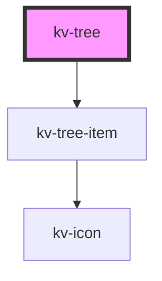

# *<kv-tree>*

<!-- Auto Generated Below -->


## Usage

### Angular

```html
<!-- With required props -->
<kv-tree [nodes]="myTreeNodes"></kv-tree>

<!-- With required props and all tree loading -->
<kv-tree [nodes]="myTreeNodes" loading></kv-tree>

<!-- With required props and selected node -->
<kv-tree [nodes]="myTreeNodes" selectedNode="node-id"></kv-tree>

<!-- With required props and hidden nodes dictionary -->
<kv-tree
	[nodes]="myTreeNodes"
	[hiddenNodes]="myHiddenNodes">
</kv-tree>

<!-- With required props and expanded nodes dictionary -->
<kv-tree
	[nodes]="myTreeNodes"
	[expandedNodes]="myExpandedNodes">
</kv-tree>

<!-- With required props and disabled nodes dictionary -->
<kv-tree
	[nodes]="myTreeNodes"
	[disabledNodes]="myDisabledNodes">
</kv-tree>

<!-- With required props and highlighted nodes dictionary -->
<kv-tree
	[nodes]="myTreeNodes"
	[highlightedNodes]="myHighlightedNodes">
</kv-tree>

<!-- With required props and loading nodes dictionary -->
<kv-tree
	[nodes]="myTreeNodes"
	[loadingNodes]="myLoadingNodes">
</kv-tree>
```


### React

```tsx
import React from 'react';
import { KvTree } from '@kelvininc/react-ui-components';

export const TreeExample: React.FC = () => (
	<>
		{/*-- With required props --*/}
		<KvTree nodes={myTreeNodes}></KvTree>
		
		{/*-- With required props and all tree loading --*/}
		<KvTree nodes={myTreeNodes} loading></KvTree>
		
		{/*-- With required props and selected node --*/}
		<KvTree nodes={myTreeNodes} selectedNode="node-id"></KvTree>

		{/*-- With required props and hidden nodes dictionary --*/}
		<KvTree
			nodes={myTreeNodes}
			hiddenNodes={myHiddenNodes}>
		</KvTree>
		
		{/*-- With required props and expanded nodes dictionary --*/}
		<KvTree
			nodes={myTreeNodes}
			expandedNodes={myExpandedNodes}>
		</KvTree>
		
		{/*-- With required props and disabled nodes dictionary --*/}
		<KvTree
			nodes={myTreeNodes}
			disabledNodes={myDisabledNodes}>
		</KvTree>
		
		{/*-- With required props and highlighted nodes dictionary --*/}
		<KvTree
			nodes={myTreeNodes}
			highlightedNodes={myHighlightedNodes}>
		</KvTree>
		
		{/*-- With required props and loading nodes dictionary --*/}
		<KvTree
			nodes={myTreeNodes}
			loadingNodes={myLoadingNodes}>
		</KvTree>
	</>
);
```


## Properties

| Property             | Attribute       | Description                                                                                                                             | Type                          | Default     |
| -------------------- | --------------- | --------------------------------------------------------------------------------------------------------------------------------------- | ----------------------------- | ----------- |
| `disabledNodes`      | --              | (optional) Dictionary that defines whether the tree node is disabled.                                                                   | `{ [key: string]: boolean; }` | `undefined` |
| `expandedNodes`      | --              | (optional) Dictionary that defines whether the tree node is expanded or collapsed. Only has visual effect for tree nodes with children. | `{ [key: string]: boolean; }` | `undefined` |
| `hiddenNodes`        | --              | (optional) Dictionary that defines whether the tree node is hidden.                                                                     | `{ [key: string]: boolean; }` | `undefined` |
| `highlightedNodes`   | --              | (optional) Dictionary that defines whether the tree node is highlighted.                                                                | `{ [key: string]: boolean; }` | `undefined` |
| `loading`            | `loading`       | (optional) Defines whether the all tree nodes is loading.                                                                               | `boolean`                     | `false`     |
| `loadingNodes`       | --              | (optional) Dictionary that defines whether the tree node is loading.                                                                    | `{ [key: string]: boolean; }` | `undefined` |
| `nodes` _(required)_ | --              | (required) The tree hierarchy items to render in this component                                                                         | `ITreeNodeItem[]`             | `undefined` |
| `selectedNode`       | `selected-node` | (optional) The currently selected node id                                                                                               | `string`                      | `undefined` |


## Events

| Event              | Description                                    | Type                         |
| ------------------ | ---------------------------------------------- | ---------------------------- |
| `nodeClick`        | Emitted when the tree node item is clicked     | `CustomEvent<ITreeNodeItem>` |
| `nodeToggleExpand` | Emitted when the node expand toggle is clicked | `CustomEvent<ITreeNodeItem>` |


## CSS Custom Properties

| Name                | Description                      |
| ------------------- | -------------------------------- |
| `--children-offset` | Offset of the child nodes in px. |
| `--node-gap`        | Gap between child nodes in px.   |
| `--node-height`     | Tree Node height.                |
| `--node-width`      | Tree Node height.                |


## Dependencies

### Depends on

- [kv-tree-item](../tree-item)

### Graph


----------------------------------------------


